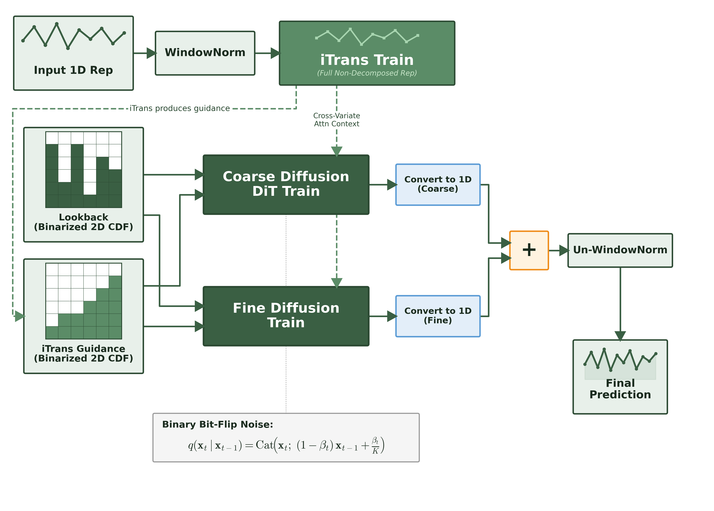
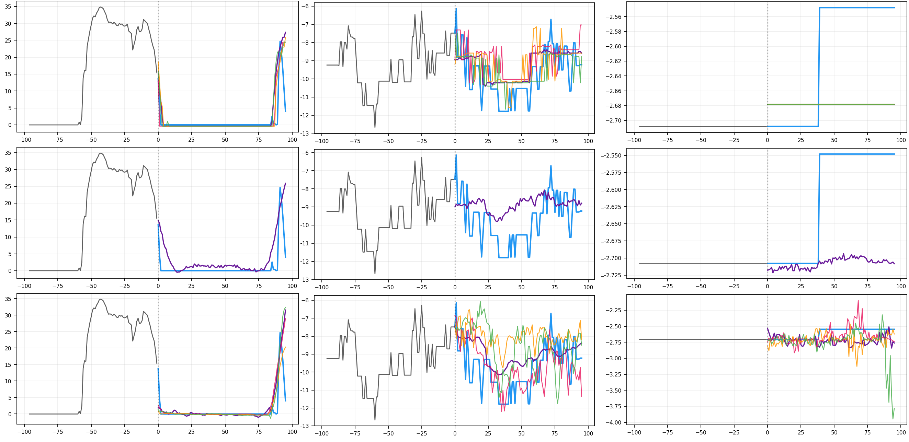

# Binary Anchor Diffusion for Time Series Forecasting
Some code in this repo was written with help from an AI coding agent (Claude/Gemini/Cursor).

## Architecture

*Architectural diagram*

## Probabilistic forecasts

Top: **our model** · Middle: **deterministic iTransformer** · Bottom: **baseline diffusion model from MMPD** (ICLR 2026).

Blue is ground truth, other colors are possible futures sampled from each model. Our model captures step functions and flatlines more faithfully than baselines.

## Benchmark comparison (anchor eval)

Benchmark vs. iTransformer, a SOTA baseline architecture.

| Dataset | Our MSE | Our MAE | iTransformer MSE | iTransformer MAE |
|---------|--------:|--------:|-----------------:|-----------------:|
| ECL | 0.2487 | **0.2604** | **0.178** | 0.270 |
| Exchange | **0.1041** | **0.2246** | 0.360 | 0.403 |
| Traffic | **0.3577** | **0.2603** | 0.428 | 0.282 |
| Weather | **0.1210** | **0.2334** | 0.258 | 0.278 |
| Solar-Energy | 0.2540 | **0.2507** | **0.233** | 0.262 |
