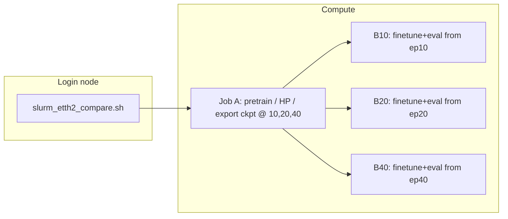

# Hyper-detailed walkthrough: dual-scale FactorizedDiT multivariate diffusion (ts-sandbox)

This document is **implementation-first**: it traces tensors, names every major submodule down to layer lists, walks the **FactorizedDiT** backbone block-by-block, and records defaults aligned with **`configs/binary_dual_scale.yaml`** (canonical experiment config).

**Scope:** Variate-factorized **FactorizedDiT** with **two-scale hard binary CDF images** (coarse full-range + fine within-bin residual), **XOR bit-flip diffusion** on both scales, **cross-scale attention** at the DiT bottleneck, **deterministic anchor loss** (`deterministic_anchor_lambda: 0.99`), and **anchor** eval sampling. YAML-driven runs set `use_dual_scale: true`, `image_height: 16`, `dual_scale_fine_weight: 0.75`, `dual_scale_independent_timesteps: true`, `cross_variate_context_bias: 0.0`, `lookback_length` / `forecast_length: 96`, and `use_window_normalization: true`.

When `use_dual_scale=False`, the model falls back to a **single** full-range CDF map at `image_height` (typically 32) — same XOR/anchor machinery, no scale embedding or cross-scale block. The legacy Gaussian + vertical-blur path and `model_type="unet"` remain for old checkpoints only and are not documented here.

---

## 0) Reading map (files ↔ roles)

| Area | Primary files |
|------|----------------|
| Slurm orchestration | `slurm_etth2_compare.sh`, `slurm_profile_one_epoch.sh`, repo-root `run.sh` (Killarney full-variate driver) |
| CLI / stages / data load | `models/diffusion_tsf/train_multivariate_pipeline.py` |
| End-to-end model | `models/diffusion_tsf/diffusion_model.py` |
| DiT backbone | `models/diffusion_tsf/dit.py` |
| Anchor loss / anchor sampler | `models/diffusion_tsf/diffusion_model.py` (§11) |
| Context tokens | `models/diffusion_tsf/unet.py` — **only** `iTransformerTokenAdapter` (filename is historical; not the U-Net denoiser) |
| Binary bit-flip schedule + reverse sampler | `models/diffusion_tsf/diffusion.py` (`BinaryDiffusionScheduler`) |
| 2D CDF encode/decode (no blur) | `models/diffusion_tsf/preprocessing.py` (`TimeSeriesTo2D`) |
| Hyperparameter dataclass | `models/diffusion_tsf/config.py` |
| Experiment YAML | `configs/binary_dual_scale.yaml`, loader in `models/diffusion_tsf/pipeline/config.py` |
| iTransformer wrapper | `models/diffusion_tsf/guidance.py` |
| iTransformer baseline | `models/iTransformer/model/iTransformer.py`, `layers/Transformer_EncDec.py`, `layers/SelfAttention_Family.py`, `layers/Embed.py` |
| Synthetic pretrain | `models/diffusion_tsf/dataset.py`, `realts.py`, `augmentation.py` |

---

## 1) Slurm: DAG, preamble, persistent venv under STORE

### 1.1 Effective job graph



Job A runs `python -u -m models.diffusion_tsf.train_multivariate_pipeline` with `--mode pretrain` and exports milestone checkpoints; B* jobs depend on A with `--mode finetune-subset` (or equivalent) for ETTh2.

### 1.2 Shared preamble (`$STORE/job_preamble.sh`)

Each batch job sources a generated preamble that:

1. Loads modules: `StdEnv/2023`, `python/3.11`, `cuda/12.2`, `cudnn/8.9`.
2. **Python venv at `$STORE/venv`:** path is baked into the preamble at submit time (same as `${STORE}`). If `venv/bin/python` and `activate` exist, the job **reuses** it; otherwise it runs `virtualenv --no-download "$STORE/venv"`. Subsequent `pip install` lines reconcile packages (usually cheap when already satisfied).
3. Installs torch (wheel cache first), `wandb` with `--no-index`, then `optuna`, `matplotlib`, `einops`, `reformer-pytorch==1.4.4`, and `requirements.txt`.

---

## 2) Modular Pipeline Interface and Stages

**Important Design Note for Developers:** The codebase uses an extensible, object-oriented pipeline design located in `models/diffusion_tsf/pipeline/`.
- **`PipelineState`**: A single dataclass (`state.py`) that acts as the source of truth for the entire run, holding device info, datasets, variates, and all checkpoint paths produced by phases.
- **`PipelinePhase`**: An abstract base class (`phase.py`) that all training or evaluation steps inherit from. Each phase implements `execute(state: PipelineState) -> PipelineState` and `should_skip(state: PipelineState) -> bool`.
- **Registry**: Phases are registered in `phases/__init__.py`. The `Pipeline` orchestrator (`orchestrator.py`) instantiates and runs them sequentially.
- **Adding new features**: To insert a new step (e.g., a new residual forecasting layer, a new data augmentation pass, or a specific evaluation), create a new file in `pipeline/phases/` inheriting from `PipelinePhase`, register it in `phases/__init__.py`, and add the phase name to the execution YAML configuration. Do **not** build monolithic shell scripts or chain arguments manually.

**Synthetic pretrain** (`run_pretrain_mode`, Slurm `run.sh`, or manifest `--mode full` before dataset loops) is two Optuna phases whose **best checkpoints are promoted directly**—there is no extra multi-epoch “full synthetic pretrain” after either HP search unless a legacy cache has JSON params without the paired `*_hp_best.pt` file.

**Per-dataset finetune** (`--mode finetune`, pipeline phases, or `run.sh`) runs the YAML `phases` list. For **`binary_dual_scale.yaml`**:

```
── PRETRAIN (synthetic) ─────────────────────────────────────────────────────
  itrans_hp_pretrain      │ 10 trials, max 10 epochs → itrans_hp_best.pt
  diffusion_hp_pretrain   │ 8 trials, max 5 epochs, patience 4 → diff_hp_best.pt
── FINETUNE (per dataset/subset, capped to ~ETTh1 size when data_subset on) ─
  itrans_finetune_hp      │ 10 trials, max 10 epochs, cold_start: true
  diffusion_finetune_hp   │ 5 trials, max 20 epochs, patience 15
  eval                    │ n_samples: 30 (anchor sampler from experiment.eval_sampler)
─────────────────────────────────────────────────────────────────────────────
```

Legacy monolithic names (Phase 1A/1B/2A/2B/2C) map to the same logic in `train_multivariate_pipeline.py`; new work should register phases in `models/diffusion_tsf/pipeline/phases/` and drive them from YAML.

### Phase codes and log format

Pipeline logs use `[LEVEL] MM-DD HH:MM:SS [TAG] message` (no year, no milliseconds). The orchestrator sets a phase tag for every line emitted during that phase.

**Staged pipeline** (e.g. `binary_dual_scale_staged*.yaml`):

| Tag | YAML `phase` | Role |
|-----|--------------|------|
| `P0` | `staged_diffusion_pretrain` | Synthetic coarse/fine pretrain |
| `P1` | `itrans_finetune_hp` | iTransformer finetune HP |
| `P2A` | `diffusion_coarse_finetune_hp` | Coarse diffusion finetune HP |
| `P2B` | `diffusion_fine_finetune_hp` | Fine diffusion finetune HP |
| `P2C` | `diffusion_finer_finetune_hp` | Finer stage (triple-scale only) |
| `P3` | `staged_eval` | Chained staged eval |

**Classic pipeline**:

| Tag | YAML `phase` |
|-----|--------------|
| `P0A` | `itrans_hp_pretrain` |
| `P0B` | `diffusion_hp_pretrain` |
| `P1A` | `itrans_finetune_hp` |
| `P1B` | `diffusion_finetune_hp` |
| `P2` | `eval` |

Implementation: `models/diffusion_tsf/pipeline/logging_utils.py` (`PHASE_CODES`, `phase_context`).

Diffusion training batch size defaults to **32** (`DIFFUSION_BATCH_SIZE` in `pipeline_config.py`); override per phase via YAML `batch_size:`.

### Phase 1A — iTransformer HP tuning on synthetic data

- **Entry:** `run_itransformer_hp_tuning()`, called from `run_pretrain_mode` / manifest `run_pipeline`
- **Trials:** `N_ITRANS_HP_TRIALS = 7`, Optuna `TPESampler`, `MedianPruner(n_startup_trials=2)`
- **Search space:** `learning_rate` (log-uniform 1e-5–1e-3), `batch_size` (categorical), `dropout` (0–0.3)
- **Per-trial training:** up to 30 epochs, early-stop patience=5
- **Best-state tracking:** `best_state` dict shared across trials; whenever a trial val loss beats all previous, the model `state_dict` is cloned to CPU and stored
- **Output:** `itrans_hp.json` (best params, cached so reruns skip this phase); **`itrans_hp_best.pt`** is promoted to **`itransformer.pt`** / `pretrained_itransformer.pt` — **no** separate synthetic full-pretrain block after HP (only a fallback `pretrain_itransformer` if an **old** run cached JSON without `itrans_hp_best.pt`)

### Phase 1B — Diffusion HP tuning on synthetic data

- **Entry:** `run_diffusion_hp_tuning()`, called from `run_pretrain_mode` and `run_pipeline`
- **Trials:** `N_DIFFUSION_HP_TRIALS = 3`, same Optuna setup as iTrans HP
- **Search space:** `learning_rate` (log-uniform 1e-5–5e-4); `batch_size` fixed at 32 (`DIFFUSION_BATCH_SIZE`)
- **Per-trial training:** up to `PRETRAIN_DIFFUSION_MAX_EPOCHS = 15` epochs (early stop)
- **Guidance:** frozen Phase **1A** iTransformer checkpoint (promoted from HP best)
- **Best-state tracking:** cross-trial clone → `diff_hp_best.pt`
- **Output:** `diff_hp.json` + `diff_hp_best.pt` → copied to `diffusion.pt` / `pretrained_diffusion.pt`. Fallback: full `pretrain_diffusion` up to `PRETRAIN_DIFFUSION_MAX_EPOCHS` only if no `diff_hp_best.pt` exists

### Phase 2A — iTransformer HP finetune on real data

- **Entry:** `run_itransformer_finetune_hp_tuning()`, called from `_finetune_and_eval_one_subset`
- **Trials:** `N_ITRANS_HP_TRIALS = 7`, same Optuna/pruner setup as Phase 1A
- **Search space:** identical to Phase 1A (`learning_rate`, `batch_size`, `dropout`)
- **Per-trial training:** 30 epochs, patience=5
- **Warm-start:** every trial loads pretrained `itransformer.pt` from Phase **1A** before training
- **Data:** real dataset (70%/10%/20% train/val/test split)
- **Best-state tracking:** cross-trial clone, same mechanism
- **Output:** `{subset_id}_itrans_ft_hp.json` (cached) + `{subset_id}_itrans_ft_hp_best.pt`

### Phase 2B — Diffusion HP finetune on real data

- **Entry:** `finetune_hp_objective` via Optuna in `_finetune_and_eval_one_subset` (and equivalent loop in `run_pipeline`)
- **Trials:** `N_FINETUNE_HP_TRIALS` (defaults to **3** in code — distinct from pretrain diffusion HP trials); logs explicitly label this as finetune-phase tuning so it is not confused with `N_DIFFUSION_HP_TRIALS`
- **Search space:** `learning_rate` only (log-uniform on `[FINETUNE_HP_LR_MIN, FINETUNE_HP_LR_MAX]` in `pipeline_config.py`, currently **3e‑6–2e‑4**) — batch size fixed at 32 (`DIFFUSION_BATCH_SIZE`)
- **Starting model:** pretrained `diffusion.pt` from Phase **1B**
- **Guidance:** `{subset_id}_itransformer_finetuned.pt` from Phase 2A (not the pretrained one)
- **Per-trial training:** `HP_TUNE_EPOCHS` with early stop
- **Output:** best HP params dict (in-memory)

### Phase 2C — Diffusion full finetune on real data

- **Entry:** `finetune_on_dataset()`, called from `_finetune_and_eval_one_subset`
- **Epochs:** `FINETUNE_EPOCHS = 10`, patience `FINETUNE_PATIENCE = 5`
- **Starting model:** `diffusion.pt` from Phase **1B**, with best 2C params applied
- **Guidance:** same finetuned iTransformer as 2C
- **Output:** `{subset_id}_diffusion_finetuned.pt`

### Evaluation

After Phase 2C, `_finetune_and_eval_one_subset` runs two evaluations:

1. **Diffusion model** on the test split, guided by the finetuned iTransformer.
2. **Finetuned iTransformer baseline** (`evaluate_itransformer_baseline`) for direct comparison.

Both use `{subset_id}_itransformer_finetuned.pt` — not the pretrained one — to keep the comparison fair. Results are saved via `save_eval_results`.

### Implementation parity (`run_pretrain_mode` vs `run_pipeline`)

The manifest **`run_pipeline`** path (`--mode full`) matches **`run_pretrain_mode`** (Slurm `run.sh` Phase 1) for synthetic stages:

- `run_diffusion_hp_tuning(..., checkpoint_dir=…)` writes **`diff_hp_best.pt`** next to **`diff_hp.json`**.
- That file is **copied to `pretrained_diffusion.pt`** (full-mode checkpoint dir) or **`diffusion.pt`** (`pretrained_dim{V}/`), replacing the older behavior that always ran **`pretrain_diffusion`** after HP search.

Filenames differ by entrypoint (`pretrained_itransformer.pt` in manifest layout vs `itransformer.pt` under `pretrained_dim{V}/`), but the rule is the same: **HP-best weights are the canonical pretrained checkpoint.**

### Caching and resume

Existence checks skip work when artifacts are already present. Typical synthetic-pretrain artifacts:

- **`itrans_hp.json`**, **`itrans_hp_best.pt`** → promoted **`itransformer.pt`** / **`pretrained_itransformer.pt`**
- **`diff_hp.json`**, **`diff_hp_best.pt`** → promoted **`diffusion.pt`** / **`pretrained_diffusion.pt`**

Finetune caches under `CHECKPOINT_DIR` include **`{subset_id}_itrans_ft_hp.json`**, **`{subset_id}_itransformer_finetuned.pt`**, and diffusion fine-tuned checkpoints written by **`finetune_on_dataset`**.

When clearing a Slurm smoke run (`.smoke_test` flag), **`run_pretrain_mode`** also deletes **`itrans_hp_best.pt`** and **`diff_hp_best.pt`** so the next real run cannot silently reuse partial HP checkpoints.

---
## 3) Data: dataset loader vs model normalization (two layers)

### 3.1 `load_dataset` (real CSV benchmarks)

- Chronological split **70% / 10% / 20%** for train / val / test windows.
- **Z-score** each variate using **train slice only** (`mean`, `std` on `data[:train_end]`), then apply to the full series before windowing. This removes validation/test leakage from global stats.
- `TimeSeriesDataset` builds sliding windows: `lookback`, `horizon`, `stride`, `lookback_overlap`.

### 3.2 `_normalize_sequence` inside `DiffusionTSF`

When `use_window_normalization: true` (default in `binary_dual_scale.yaml`), each batch **past** (and **future** during training) is normalized using **per-window** statistics from the **past** only:

- `mean = past.mean(dim=-1, keepdim=True)`, `std = past.std(dim=-1, keepdim=True) + 1e-8`
- `past_norm`, `future_norm = (past - mean)/std`, `(future - mean)/std`

With `use_window_normalization: false`, mean=0 and std=1 (identity). Dual-scale runs keep window norm on so coarse/fine binning sees locally stationary values even after dataset z-score.

### 3.3 Synthetic pretrain

- `get_synthetic_dataloader` → `RealTS` dataset: mixed generator families (RWB, PWB, LGB, TWDB, IFFTB, STB, seasonal), optional disk cache, multivariate coupling via `augmentation.py`.
- **Reproducibility caveat:** stochastic sampling / cache index behavior can weaken strict “epoch N is always the same samples” unless seeds and sampler semantics are pinned end-to-end.

---

## 4) Representation: hard binary CDF (`TimeSeriesTo2D`)

Binary diffusion uses **sharp occupancy maps** — no vertical Gaussian blur, no scaling to `[-1, 1]`.

### 4.1 Single-scale CDF occupancy map (`TimeSeriesTo2D.forward`)

Used when `use_dual_scale=False`. **Parameters:** `height` = `config.image_height` (often **32**), `max_scale` = **3.5**.

**Forward (`encode_to_2d_binary` → `to_2d`):**

1. Input `x`: `(B, V, L)` or `(B, L)` → promoted to `(B, V, L)`.
2. Clip values to `[-max_scale, max_scale]`.
3. Bin index per value:  
   `bin = clamp(floor((x + max_scale) / (2*max_scale) * height), 0, height-1)`.
4. For each column (time step), set rows `0..bin` to **1** and rows above to **0**: monotone “filled from bottom” CDF staircase in the value dimension.

**Output:** `(B, V, height, L)` with values in **`{0, 1}`** — the diffusion state space.

**Inverse (`inverse` / `decode_from_2d`):**

- `cdf_decoder="mean"` (default): column sum → normalized height → map back to approximately `[-max_scale, max_scale]`.
- `cdf_decoder="expectation"` / `"pdf_expectation"`: discrete PDF from vertical finite differences of the occupancy map, optional temperature sharpening, expectation over bin indices.
- Binary inference passes `from_diffusion=False` so decoded maps are treated as hard `{0,1}` occupancy, not remapped from `[-1,1]`.

Registered buffer `bin_centers` supports median/mode/beam decoders and diagnostics.

### 4.2 Dual-scale decomposition (`encode_dual` / `decode_dual`)

**Enabled when** `use_dual_scale=True` (requires `image_height=16` per `DiffusionTSFConfig.__post_init__`). Each normalized value becomes **two** binary CDF maps at the same `H×W` resolution; effective value precision is finer than a single 16-bin ladder over `[-max_scale, max_scale]`.

**Coarse map** — full-range binning (same rule as §4.1):

1. Clip to `[-max_scale, max_scale]`, assign `coarse_bin ∈ [0, H-1]`.
2. Fill rows `0..coarse_bin` → **coarse** occupancy in `{0,1}`.

**Fine map** — residual **within** the coarse bin:

1. `coarse_center` = center of the coarse bin in value space; `residual = x - coarse_center`.
2. Clip residual to `±(max_scale / H)` (one coarse bin width).
3. Re-bin residual into `H` sub-bins → **fine** occupancy map (another CDF staircase, but over the local range only).

**Decode (`decode_dual`):** decode coarse with range `max_scale`, decode fine with range `max_scale / H`, **add** the two scalar fields, clamp to `[-max_scale, max_scale]`. Inference uses this after both scales are denoised.

**Diffusion targets:** XOR noise and BCE apply **separately** to coarse and fine maps. Combined training loss:

`regular_loss = (1 - w) * L_coarse + w * L_fine` with `w = dual_scale_fine_weight` (**0.75** in `binary_dual_scale.yaml`).

### 4.2.1 Staged coarse/fine alternative

The staged variant keeps the same dual representation but trains two separate
single-scale denoisers instead of one joint coarse+fine denoiser:

1. **Coarse stage:** GT lookback coarse+fine maps → future coarse CDF map.
2. **Fine stage:** GT lookback coarse+fine maps + GT future coarse CDF map →
   future fine residual CDF map.

During training, every conditioning tensor is encoded from ground truth. The fine
stage is never conditioned on the coarse model's prediction while it is being
trained. At inference/eval, the stages are chained: sample one future coarse map
with the coarse model, feed that sampled coarse map into the fine model, then
decode with `decode_dual(coarse_hat, fine_hat)` and score the final summed
forecast. Probabilistic eval pairs draw `i` from the coarse stage with draw `i`
from the fine stage; it does not take a coarse×fine cross-product.

### 4.3 What we removed from the old Gaussian path

The legacy `encode_to_2d` path still exists in `diffusion_model.py`: `to_2d` → `VerticalGaussianBlur` → clamp/scale to `[-1, 1]` for continuous DDPM. **Current production binary runs skip blur entirely** via `encode_to_2d_binary`.

---

## 5) Binary diffusion scheduler (`BinaryDiffusionScheduler`)

**Construction:**

- `num_steps` = `config.binary_num_steps` (default **1000**).
- Per-step flip probabilities `beta_t` on a **sqrt-linear** ramp from `binary_beta_start` (default **1e-5**) to `binary_beta_end` (default **0.5**):  
  `betas = (sqrt(beta_start) + t·(sqrt(beta_end) - sqrt(beta_start)))^2` for `t ∈ [0,1]`.

**Forward process (training) — XOR bit-flip:**

For clean binary image `x0 ∈ {0,1}` and timestep `t`:

1. Sample flip mask `z_t ~ Bernoulli(beta_t)` (same shape as `x0`, broadcast per batch item).
2. Corrupted state: **`x_t = x0 ⊕ z_t`** (boolean XOR, stored as float).

Returns `(x_t, z_t)`. Each pixel flips independently with probability `beta_t`; at `t → T−1`, `beta_t` is large so the image is nearly random bits.

**Training targets (FactorizedDiT, `out_channels=2` per forward row):**

- Channel 0: logits for **clean** `x0` (CDF bits at that scale).
- Channel 1: logits for **flip mask** `z_t`.
- Per scale: `BCE(x0) + BCE(zt)`. Dual-scale combines coarse and fine with `dual_scale_fine_weight` (§4.2).

**Reverse process (inference) — `sample()`:**

1. Start from **`x_T ~ Bernoulli(0.5)`** (uniform random bits).
2. Subsample timesteps linearly from `T−1` down to `0` (`binary_sample_steps`, default **20**).
3. At each step: model predicts `x0_hat = 1[σ(x0_logits) > 0.5]`.
4. Re-noise toward the next lower `t` with fresh Bernoulli flips at `beta_{t_next}`: `x_{t_next} = x0_hat ⊕ z_new`.
5. Last step: output `x0_hat` as the clean binary CDF image.

Classifier-free guidance uses the same `cfg_dropout` training mask on cond / ctx / ghost; iterative binary sampling calls the model through `_chunked_model_fn` without a separate DDIM schedule.

**Config knobs:** `binary_num_steps`, `binary_sample_steps`, `binary_beta_start`, `binary_beta_end`, `cfg_dropout`, `cfg_scale`.

---


## 6) `DiffusionTSF` assembly (dual-scale factorized DiT path), slowly

This section explains how the main model object is assembled for **binary** image diffusion with `model_type="dit"` (`FactorizedDiT`). With `use_dual_scale=True` (production default per `binary_dual_scale.yaml`), training/inference route to `_forward_binary_dual_scale` / `_generate_binary_dual_scale`. Otherwise: `_forward_binary_factorized` / `_generate_binary_factorized` (single CDF map).

Important current behavior:
- We do **not** stack all variates as extra input channels on one forward pass.
- In factorized multivariate mode, the denoiser runs on `(BV, C_in, H, W)` per scale — **shared weights** across variates and across coarse/fine.
- **Dual-scale batch layout:** coarse and fine maps for each `(b, v)` are **interleaved** as adjacent batch rows: `BV*2` items with ordering `[coarse₀, fine₀, coarse₁, fine₁, …]` via `_stack_dual_scale_flat`. `scale_indices` is `[0,1,0,1,…]` so `FactorizedDiT` knows which scale each row represents.
- The DiT backbone has **no internal cross-variate mixing**. Cross-variate coupling is via (a) frozen iTransformer guidance, (b) bottleneck **cross-attention** to `V` context tokens, and (c) when dual-scale is on, bottleneck **cross-scale attention** between the paired coarse/fine token sequences.

### 6.0 Multivariate context: what mixes, what does not

| Mechanism | Attention / mixing axis | Cross-variate? |
|-----------|-------------------------|----------------|
| **DiT self-attention** | Patch tokens on one variate’s `(H, W_fut)` canvas (`cond` patches ∥ `x` patches) | **No** — only spatial patches for the **target** variate in this forward |
| **DiT bottleneck cross-attention** | Spatial patch queries → `V` iTransformer context tokens | **Yes** — each forward sees all `V` keys/values |
| **DiT bottleneck cross-scale attention** | Patch queries on one scale → keys/values from **paired** other scale (coarse↔fine) | **Yes** — only when `use_dual_scale=True`; requires adjacent `[coarse, fine]` batch pairs |
| **Scale embedding** | Added to timestep AdaLN input `t_emb` | **Yes** — `nn.Embedding(2, embed_dim)` distinguishes coarse (0) vs fine (1) |
| **Variate embedding** | Added to **all** cond+x patch tokens from layer 0 | **Yes** — `variate_embed(variate_indices)` when `use_variate_embedding` and `V>1` |
| **iTransformer (guidance)** | Self-attention over `V` variate tokens on lookback | **Yes** — happens **before** DiT, inside frozen `get_encoder_tokens` / `get_forecast` |
| **Guidance ghost channel(s)** | Extra `canvas` channels: iTrans forecast CDF(s) | **No** cross-variate pixels — dual-scale: **both** coarse+fine ghosts on every row |
| **Visual cond (`cond`)** | Past-tail CDF map(s), patchified into token prefix | **No** cross-variate — dual-scale: **both** coarse+fine past channels on every row |

So: there is **no** “multivariate self-attention” inside DiT (no attention over a variate index). Multivariate structure enters as **(1)** iTransformer’s variate-token encoder, projected to `(B, V, ctx_dim)` and consumed at **one** cross-attention site, and **(2)** optional per-variate ghost images on the input canvas.

Set `disable_cross_attention=True` in config to drop (1); guidance pixels in (2) can remain if `use_guidance_channel=True`.

### 6.1 Backbone: `FactorizedDiT` (`model_type="dit"`)

`DiffusionTSF.__init__` builds **`FactorizedDiT`** from `dit.py` when `config.model_type == "dit"`. That is the **current** denoiser for multivariate training and eval in this repo.

| Setting | Value |
|---------|--------|
| Class | `FactorizedDiT` (`models/diffusion_tsf/dit.py`) |
| Config / CLI | `configs/binary_dual_scale.yaml` or `--config configs/binary_dual_scale.yaml`; `model_type: dit` |
| `pipeline_config.py` | `MODEL_TYPE = "unet"` is a **stale default** for untouched local imports; override with CLI |

A legacy **`ConditionalUNet2D`** path (`model_type="unet"`) still exists in `unet.py` for old checkpoints. New work should not use it.

### 6.2 Channel accounting from `DiffusionTSFConfig` (what each channel means)

In variate-factorized multivariate mode (common ETTh2 style), each variate is treated almost like its own mini-image diffusion problem, while still allowing cross-variate context.

Core config flags:
- `variate_factorized=True`: process each variate map as a separate sample in the denoiser forward (required for multivariate).
- `num_variables=V`: number of variates (features) in the time series.

Now define channel counts carefully:

1. `backbone_in_channels`  
   Formula: `1 + num_aux_channels + guidance_channels`.
   - Base `1`: the noisy future occupancy map for one variate (still **one** scale per row when dual-scale).
   - `num_aux_channels`: optional helper channels (coordinate ramp, time ramp, value hints, etc.).
   - `guidance_channels`: `2` when `use_dual_scale` + guidance (coarse+fine ghosts); else `1` or `0`.

2. `visual_cond_channels` → DiT `cond_channels`  
   `1` per scale (optional +1 value channel); **`×2` when `use_dual_scale`** so each row’s `cond` is `[past_coarse, past_fine]`. Guidance is **not** in `cond`; it is concatenated onto `canvas`.

3. `out_channels`  
   **2** for binary diffusion: clean-bit logits + flip-mask logits per variate map.

Why so much bookkeeping:
- In diffusion models, a wrong channel count usually does not fail immediately in a readable way; it often appears later as shape mismatch.
- Reading this section first makes debugging much easier.

### 6.3 Context encoder (`iTransformerTokenAdapter`)

Implemented in `unet.py` for historical import paths only (not the U-Net denoiser). Used by **FactorizedDiT** at the bottleneck cross-attention block.

- `iTransformerTokenAdapter(d_model=itrans_d_model, context_dim=context_embedding_dim)`.
- Input: `enc_tokens` from `guidance_model.get_encoder_tokens(past_raw)` → `(B, V, d_model)`.
- Output: `(B, V, context_dim)` after linear proj, per-variate `nn.Embedding`, dropout, LayerNorm.

Why this exists:
- Patch self-attention on one variate’s map cannot see other variates.
- Bottleneck cross-attention injects iTransformer’s **already cross-mixed** lookback summaries (one token per variate).
- Complements the ghost image, which carries **forecast** geometry for the target variate only.

### 6.4 `_forward_binary_dual_scale`: full tensor trail (production)

Symbols: `B` batch, `V` variates, `H` = **16** (`image_height`), `W_fut` = `forecast_length` (96 in yaml), `T` = `binary_num_steps`, `BV = B·V`, `BVS = BV·2`.

1. **`_normalize_sequence(past, future)`** → per-window z-score when `use_window_normalization=True`.

2. **`encode_dual_to_2d_binary(future_norm)`** → `future_coarse`, `future_fine` each `(B, V, H, W_fut)`.

3. **Timesteps:** sample `t` per batch item for **coarse**; if `dual_scale_independent_timesteps=True` (yaml default), sample a **second** `t_fine` for the fine scale. Flatten to `t_bvs` of shape `(BVS,)`.

4. **XOR noise** independently on coarse and fine flats; stack with `_stack_dual_scale_flat` → `xt_flat` `(BVS, 1, H, W_fut)`.

5. **Guidance:** iTransformer forecast → dual encode → `_merge_dual_scale_channels` → **2** ghost channels on **every** coarse/fine row (same coarse+fine pair per `(b,v)`).

6. **`ctx_flat`:** `(B, V, ctx_dim)` → `_expand_ctx_to_dual_scale` → `(BVS, V, ctx_dim)` (same cross-variate memory for both scales).

7. **Visual cond:** past tail dual-encoded → `_merge_dual_scale_channels` → **2** cond channels on every row, bilinear-resized to `(H, W_fut)`; CFG dropout masks `BV*2` rows together per batch item.

8. **DiT forward** with `scale_indices` + `variate_indices`; noisy `xt` still interleaved one scale per row via `_stack_dual_scale_flat`; output reshaped to separate coarse/fine `x0` and `zt` logits.

9. **Loss:** per-scale `BCE(x0)+BCE(zt)`, then `(1-w)*coarse + w*fine` with `w=dual_scale_fine_weight` (**0.75**); optional anchor (§11) on both scales’ x₀ heads.

Chunking: `unet_max_chunk_size` is rounded to an **even** number so coarse/fine pairs stay in the same chunk.

### 6.5 `_forward_binary_factorized` (single-scale fallback)

Same as the dual path but one `encode_to_2d_binary` map, batch `BV` (not `BVS`), no `scale_indices`, no cross-scale block. See git history or `diffusion_model.py` for the full single-scale tensor trail.

EMD / monotonicity / Gaussian ε-MSE are **not** used on the binary path (`emd_loss` is logged as 0).

---

## 7) `FactorizedDiT` internals

`FactorizedDiT` (`dit.py`) is the production patchified Diffusion Transformer (DiT-style AdaLN-Zero) behind `DiffusionTSF._predict_noise_chunked`. Contract:

```python
out = FactorizedDiT(x, t, cond, encoder_hidden_states=ctx_flat,
                    scale_indices=scale_indices, variate_indices=variate_indices)
# Dual-scale: x (BVS, C_in, H, W), cond (BVS, 2, H, W), scale_indices + variate_indices (BVS,)
# Single-scale: scale_indices=None, batch (B*V, ...)
```

### 7.1 Constructor defaults (`pipeline_config.py` / `DiffusionTSFConfig`)

| Knob | Typical default | Role |
|------|-----------------|------|
| `dit_patch_size` | `(8, 8)` | Conv patch embed stride; `image_height` must be divisible by patch height |
| `dit_embed_dim` | `384` | Token width `D` |
| `dit_depth` | `8` | Number of transformer blocks |
| `dit_num_heads` | `6` | MHA heads (`D` divisible by heads) |
| `dit_mlp_ratio` | `4.0` | FFN hidden = `4·D` |
| `dit_dropout` | `0.0` | Attention/MLP dropout |
| `context_embedding_dim` | `256` | iTrans token dim before `ctx_proj` → `D` |
| `use_gradient_checkpointing` | often `True` on cluster | Per-block `checkpoint(..., use_reentrant=False)` |

`bottleneck_idx = depth // 2` (default depth 8 → block index **4**). Only that block is `_DiTCrossAttnBlock`; all others are `_DiTBlock` (self-attn + MLP only).

### 7.2 Forward: patchify, sequence layout, time

1. **Reflect-pad** `x` and `cond` so `H`, `W_fut` are multiples of `patch_size` (crop output back at the end).
2. **Patch embed:** separate `Conv2d` stems `x_embed`, `cond_embed` → tokens `(BV, Nx, D)` and `(BV, Nc, D)` with `Nx = gh·gw`, `Nc` from cond grid.
3. **Positional embeddings:** learned `pos_x`, `pos_cond` (trunc-normal init) so cond vs noisy slots are distinguishable on the shared sequence axis.
4. **Concatenate sequence:** `tokens = [c_tok | x_tok]` along length `Nc + Nx`. Self-attention mixes **past cond patches and noisy future patches** for this variate only.
5. **Variate embedding (optional):** `tokens += variate_embed(variate_indices).unsqueeze(1)` on all slots when enabled.
6. **Timestep:** sinusoidal embedding → MLP `t_embed` → vector `c` `(BV, D)` used in **AdaLN-Zero** in every block and the final head.

AdaLN-Zero (standard DiT block): for each sublayer, `shift, scale, gate = adaLN(c)` modulate LayerNorm’d tokens; `gate` is zero-init so blocks start as identity.

### 7.3 Block types

**`_DiTBlock` (all indices except `bottleneck_idx`):**

```
x ← x + g1 · SelfAttn(AdaLN(norm1(x), c))
x ← x + g2 · MLP(AdaLN(norm2(x), c))
```

Self-attention is multi-head over the **patch sequence** (length `Nc+Nx`), not over variates.

**`_DiTCrossAttnBlock` (bottleneck only):**

```
x ← x + g1 · SelfAttn(...)
x ← x + gx · CrossAttn(queries=x, keys/values=ctx_proj)   # skipped if ctx is None
x ← x + gs · CrossScaleAttn(queries=x, keys/values=other_scale)  # dual-scale only
x ← x + g2 · MLP(...)
```

- `ctx_proj = LayerNorm(Linear(encoder_hidden_states))` → `(BV, V, D)` (or `BVS` in dual-scale).
- Cross-attention: **queries** from spatial tokens, **keys/values** from the `V` iTransformer tokens — cross-**variate** coupling. When `cross_variate_context_bias > 0`, the target variate token receives an additive attention-logit bias from `variate_indices`.
- **Cross-scale attention** (`enable_cross_scale_attention=True`): reshape batch as pairs `(coarse, fine)`; each scale’s tokens attend to the **other** scale’s tokens from the same `(b,v)`. Requires `scale_indices` ordering `[0,1,0,1,…]`.
- Timestep embedding adds **`scale_embed(scale_indices)`** when dual-scale is enabled.
- Twelve AdaLN gates when cross-scale is on (self, cross-variate, cross-scale, MLP); all zero-init.

### 7.4 Output head

After all blocks, **drop cond tokens**: `x_out = tokens[:, Nc:]` (noisy-future slots only).

Final AdaLN on `x_out`, then linear `head` → patch pixels → `_unpatchify` → `(BV, out_channels, H, W_fut)`.

Head weights are **zero-init** so training starts near a neutral prediction without a large random jump.

### 7.5 How conditioning enters (no channel concat inside DiT)

DiT keeps conditioning roles separate (no early-fusion conv stack):

| Signal | Path into DiT |
|--------|----------------|
| Noisy future + aux + ghost | `x` → `x_embed` → tail of token sequence |
| Past visual cond | `cond` → `cond_embed` → **prefix** of token sequence |
| Diffusion step | AdaLN vector `c` from `t` |
| Cross-variate lookback | `encoder_hidden_states` → bottleneck cross-attn only |
| Coarse vs fine identity | `scale_indices` → `scale_embed` on `t_emb`; cross-scale attn at bottleneck |
| Which variate this row is | `variate_indices` → `variate_embed` on all patch tokens (Plan A) |
| Both scales’ past / guidance | Dual-scale: `cond` has 2 ch; `canvas` guidance has 2 ch — **same** pair on coarse and fine rows |

Guidance ghost is **not** passed in `cond`; `DiffusionTSF` concatenates it onto `canvas` channels before calling `FactorizedDiT`.

### 7.6 Complexity and memory notes

- Cost scales with `(Nc+Nx)²` per self-attn block (default `H=32`, `W_fut≈96`, patch 8×8 → on the order of tens of patches per axis).
- `unet_max_chunk_size` chunks the `BV` dimension in `_predict_noise_chunked` to cap activation memory.
- Wider time dimension increases `gw` and grows `Nx`; watch `max_pos_tokens` (default 8192) — forward raises if `Nx` or `Nc` exceeds the table.

---

## 8) Context encoder: tokens for bottleneck cross-attention

The DiT bottleneck cross-attention in §7.3 needs a sequence to attend *to*. That sequence comes from the frozen iTransformer encoder plus `iTransformerTokenAdapter`. This section walks through that path step by step.

### 8.1 `iTransformerTokenAdapter` — default for guided multivariate runs

**What problem it is solving.**
In the factorized setup there are `BV` separate DiT forwards (one per variate). Each pass only sees that variate's occupancy patches. The adapter's job is to give every pass a read-only summary of **all** variates' lookbacks. The forecast ghost image (§9.2 Place 1) already carries horizon geometry for the **target** variate; these tokens carry **encoder** state after iTransformer's own cross-variate attention on lookback.

The new approach taps the iTransformer's internal encoder output directly, before its linear projector collapses to the horizon dimension.

**Input.** Raw (un-normalized) past `(B, V, L)`. This is passed straight to `iTransformerGuidance.get_encoder_tokens()`.

**Step 1 — iTransformer internal normalization + embedding.**
```python
x_enc = past.permute(0, 2, 1)                     # (B, L, V) — iTransformer axis order
# iTransformer does per-time-step instance norm internally if use_norm=True
enc_out = model.enc_embedding(x_enc, None)         # (B, V, d_model)
enc_out, _ = model.encoder(enc_out, attn_mask=None)  # (B, V, d_model)
```
This is the same computation iTransformer runs in `get_forecast()` — but we stop before the `projector` linear. Each variate now has a `d_model=512`-dimensional token that reflects its full lookback, and the multi-head self-attention across V variates has already mixed cross-variate information.

**Step 2 — project to `context_dim`.**
```python
x = nn.Linear(d_model, context_dim)(enc_out)       # (B, V, 256)
```
Reduces from `d_model=512` to `context_dim=256`, then DiT's `ctx_proj` maps to `embed_dim` (e.g. 384).

**Step 3 — add per-variate identity embedding.**
```python
ids = torch.arange(V, device=x.device)
x = x + variate_embed(ids)                         # (B, V, 256)
```
A learned `nn.Embedding(max_variates=512, context_dim)`. Since each factorized forward targets one variate index, without this embedding all `V` context keys would be exchangeable up to iTrans content. The identity lets DiT learn variate-specific refinements at cross-attn.

**Step 4 — Dropout + LayerNorm and done.**
Output: `(B, V, 256)` — one 256-d token per variate, carrying rich iTransformer lookback structure plus identity.

**What DiT does with this.**
Before the denoiser, the code replicates so every item in the `BV` batch sees all `V` tokens:
```python
ctx_flat = ctx.unsqueeze(1).expand(-1, V, -1, -1).reshape(BV, V, -1)
# (BV, V, context_dim) — each variate's DiT pass cross-attends to all V tokens at the bottleneck
```
Patch tokens (after self-attn in the bottleneck block) are queries; `ctx_proj` supplies keys/values.

**When `get_encoder_tokens` is called.**
Training and inference call `_get_cross_variate_context(past)` once before the reverse loop; `ctx_flat` is reused for every binary sampling step (or the single anchor forward).

### 8.2 Summary: what the tokens actually represent

| Encoder | Token sequence length | What one token represents |
|---|---|---|
| `iTransformerTokenAdapter` | V | iTransformer lookback embedding projected to 256-d, plus variate identity |


---

## 9) iTransformer guidance stack

### 9.1 What problem it solves and when it is active

In the current training path, iTransformer guidance is **always on**.

There is no user-facing guidance toggle in `train_multivariate_pipeline.py` anymore. Model creation in this pipeline now hard-enables `use_guidance_channel=True`, so every train/infer run through this path uses iTransformer guidance by default.

Operationally, an iTransformer is run first on every batch to produce a **coarse deterministic forecast**. That forecast becomes a "ghost" occupancy image concatenated on the **noisy canvas** (`x` channels). DiT also receives past visual structure via the separate `cond` tensor (patch prefix). The denoiser learns to refine the ghost while respecting past geometry and cross-variate tokens.

### 9.2 The two ways the iTransformer feeds into the pipeline

With guidance enabled, iTransformer output is used in **two separate places**:

**Place 1 — extra channel on the noisy canvas ("ghost image")**

The coarse forecast `(B, V, forecast_length)` is normalized with the same per-window stats as the diffusion target. **Dual-scale:** `encode_dual_to_2d_binary` → stacked coarse/fine ghosts on `canvas` `(BVS, 1, H, W_fut)`. **Single-scale:** one `encode_to_2d_binary` map per `(BV, …)` row. Ghost is always on `canvas`, not `cond`:

```python
if guidance_2d is not None:
    canvas = torch.cat([canvas, guidance_2d.reshape(BV, 1, H, W_fut)], dim=1)
```

`backbone_in_channels` counts this channel. DiT patch-embeds it as part of `x`, not as `cond`.

**Place 2 — input to `iTransformerTokenAdapter` (cross-attention tokens)**

`_get_cross_variate_context` detects the encoder type and routes accordingly:

```python
if isinstance(self.context_encoder, iTransformerTokenAdapter):
    enc_tokens = self.guidance_model.get_encoder_tokens(past_raw)  # (B, V, d_model)
    return self.context_encoder(enc_tokens)                         # (B, V, context_dim)
```

The raw past is fed through the iTransformer's frozen encoder (normalization + embedding + multi-head attention), and the resulting `enc_out` — before the horizon projector — is passed to the adapter. The tokens encode "what the lookback looks like per variate, after deep cross-variate attention" rather than "what the forecast will be". The forecast is already present pixel-wise as the ghost image (Place 1); these tokens are complementary, carrying lookback structure that pixels cannot convey.

### 9.3 The iTransformer itself

The iTransformer is wrapped in `iTransformerGuidance`, which:
- Keeps the weights **frozen** (`.requires_grad_(False)` at construction; `torch.no_grad()` at every call). It is never co-trained with the diffusion model.
- Exposes `get_forecast(past, forecast_length) → (B, V, forecast_length)` for the ghost-image path.
- Exposes `get_encoder_tokens(past) → (B, V, d_model)` for the cross-attention token path. Runs the same internal normalization + `enc_embedding` + `encoder` as `get_forecast`, but stops before `projector`.

Internally, the iTransformer uses an **inverted embedding**: instead of treating time steps as tokens (as a standard Transformer would), it treats **variates as tokens**. Each variate's full lookback is embedded as one token; the transformer then runs multi-head attention across those V tokens. This gives `enc_out` its cross-variate-aware structure before any horizon-specific projection is applied.

### 9.4 At inference

The same two-place injection happens at inference. Both the forecast (for the ghost image) and `get_encoder_tokens` (for context tokens) are computed **once before sampling** — `_get_cross_variate_context` is called a single time and `ctx_flat` is captured by closure and reused across all `binary_sample_steps` reverse steps (or the one anchor step).

### 9.5 Summary

```
Current pipeline behavior:
  1. iTransformer on raw past → enc_out (B, V, d_model) + coarse forecast (B, V, F)
  2. Forecast → 2D ghost → extra channel on canvas (x)  [Place 1, per variate]
  3. enc_out → iTransformerTokenAdapter → bottleneck cross-attn memory  [Place 2, all V variates]
     (lookback in tokens; forecast in pixels — complementary)
```


---

## 10) Inference path (`_generate_binary_dual_scale`)

Dual-scale generation denoises **both** coarse and fine maps in **lock-step** on a batch of size `BVS = BV·2` (interleaved coarse/fine). `BinaryDiffusionScheduler.sample` calls the model on all `BVS` rows each step; `scale_indices` and cross-scale attention stay active throughout.

| Sampler | Behavior |
|---------|----------|
| `eval_sampler: anchor` (yaml) | **One-shot** at `t = T−1` from **Bernoulli(0.5)** on **both** scales; decode with `decode_dual_from_2d` |
| default / `ddim` label | Iterative XOR reverse on `BVS` maps (`binary_sample_steps`, default **20**) |

**Anchor flow (production eval):**
1. Window-normalize past; dual-encode past tail → `cond`; dual-encode guidance forecast → ghost channels.
2. `ctx_flat` via `_expand_ctx_to_dual_scale`, built once.
3. Single forward from random bits at max noise; threshold x₀ logits per scale.
4. **`decode_dual_from_2d(coarse, fine)`** → `future_norm` → denormalize.

Single-scale inference (`_generate_binary_factorized`) uses `decode_from_2d` on one map instead.

---

## 11) Deterministic anchor loss and anchor sampler (binary)

Deterministic anchor loss forces **FactorizedDiT** to predict clean **x₀** bits from a **maximally noisy** canvas (`Bernoulli(0.5)` at `t = T−1`) in one forward. The same forward is the **`anchor` eval sampler** (`eval_sampler: anchor` in yaml). Enabled via `deterministic_anchor_loss: true` in experiment config.

| Field | Role | `binary_dual_scale.yaml` |
|-------|------|--------------------------|
| `deterministic_anchor_loss` | Turn anchor term on | `true` |
| `deterministic_anchor_lambda` (`λ`) | `combined = λ·L_reg + (1−λ)·L_anchor` | **0.99** |
| `deterministic_anchor_alpha` (`α`) | Legacy Gaussian knob; **ignored for binary** | **0.0** |

`λ` is fixed from CLI / config — not Optuna-tuned. Diffusion HP phases may set `disable_anchor_loss=True` to skip the extra forward.

### 11.1 Training (`_forward_binary_dual_scale`)

1. **Regular term** — dual-scale XOR + weighted coarse/fine BCE (§6.4).
2. **Anchor forward** — `t_anchor = T−1` for all `BVS` rows; canvas = **Bernoulli(0.5)** per pixel on both scales.
3. Same `base_cond_for_unet`, dual ghost, `ctx_anchor` (no CFG dropout on anchor path).
4. **Anchor loss** — BCE on **x₀ logits only** for coarse **and** fine vs respective targets (sum of both).
5. **Combined** — `λ·regular_loss + (1−λ)·anchor_loss` with λ=**0.99** (anchor term is small but non-zero).

### 11.2 Inference (`eval_sampler: anchor`)

One forward at `t = T−1` on interleaved coarse/fine random bits; threshold both x₀ heads; **`decode_dual_from_2d`**. Eval uses **one sample** per window (deterministic given cond/ghost/ctx).

### 11.3 Relation to guidance and DiT

- Anchor does **not** replace iTransformer guidance: ghost and `ctx_flat` stay on the anchor forward.
- Uses the same `_predict_noise_chunked` / **FactorizedDiT** entry as iterative binary sampling.

---

## 12) Hyperparameter reference (`configs/binary_dual_scale.yaml` + `DiffusionTSFConfig`)

Experiment YAML merges over `pipeline/config.py` defaults; CLI overrides win last.

### 12.0 Experiment block (yaml)
- `name: binary-dual-scale`, `dataset: ETTh1` (driver overrides per grid job; subset policy scales large sets down to ~ETTh1).
- `diffusion_type: binary`, `model_type: dit`.
- `use_dual_scale: true`, `image_height: 16`, `dual_scale_fine_weight: 0.75`, `dual_scale_independent_timesteps: true`.
- `cross_variate_context_bias: 0.0` — no weighted cross-attention by default; set positive to bias toward the target context token.
- `deterministic_anchor_loss: true`, `deterministic_anchor_lambda: 0.99`, `eval_sampler: anchor`.
- `use_window_normalization: true`, `disable_cross_attention: false`.
- `data_subset`: `target_dataset: ETTh1`, max 7 variates, auto stride so dense size ≤ ETTh1; smaller sets unchanged.

### 12.1 Sequence and multivariate geometry
- `lookback_length=96`, `forecast_length=96` (yaml; code default 512/96 if unset).
- `lookback_overlap=8`: overlap handling for lookback/future boundaries.
- `past_loss_weight=0.3`: weighting for overlap-related loss partition logic.
- `num_variables=1` default baseline; multivariate runs override it.
- `variate_factorized=True`: process variates via factorized route.

### 12.2 2D representation (binary, dual-scale)
- `use_dual_scale=True` → **requires** `image_height=16` (coarse + fine maps at same H).
- `dual_scale_fine_weight=0.75`: fine-scale share of combined diffusion BCE.
- `dual_scale_independent_timesteps=True`: separate `t` for coarse vs fine during training.
- `max_scale=3.5`: clipping range before binning; fine residual range is `max_scale / H`.
- `diffusion_type="binary"`: hard `{0,1}` maps via `encode_dual_to_2d_binary` / `encode_to_2d_binary`.

### 12.3 FactorizedDiT backbone (production default, `model_type="dit"`)
- `model_type="dit"` → `FactorizedDiT` in `dit.py` (pass `--model-type dit` on CLI; do not rely on `pipeline_config.MODEL_TYPE` alone)
- `dit_patch_size=(8, 8)`
- `dit_embed_dim=384`
- `dit_depth=8` → bottleneck cross-attn at index `4`
- `dit_num_heads=6`
- `dit_mlp_ratio=4.0`
- `dit_dropout=0.0`
- `use_gradient_checkpointing` / `use_amp` — often `True` on cluster (`pipeline_config.py`)
- `unet_max_chunk_size=128` — chunks `BV` through **FactorizedDiT** (config name is legacy)

### 12.4 Binary diffusion and sampling
- `binary_num_steps=1000`
- `binary_sample_steps=20` (reverse chain length at inference)
- `binary_beta_start=1e-5`, `binary_beta_end=0.5` (per-step XOR flip probability ramp)
- `cfg_dropout=0.0`, `cfg_scale=2.0`

### 12.5 Decode and augmentation behavior
- `decode_temperature=0.5`
- plus `cutout_*` augmentation controls.

### 12.6 Loss terms (binary, dual-scale)
- Primary: per-scale **BCE** on x₀ and zₜ, combined with `dual_scale_fine_weight`.
- **Deterministic anchor** (§11): on in yaml; `deterministic_anchor_lambda=0.99`; anchor BCE on both scales’ x₀ heads.
- Legacy Gaussian knobs (`emd_lambda`, `num_diffusion_steps`, blur sizes) remain in `DiffusionTSFConfig` but are inactive when `diffusion_type="binary"`.

### 12.7 Conditioning and context
- `model_type="dit"` for current FactorizedDiT runs (`"unet"` = legacy checkpoints only)
- `disable_cross_attention=False` — set `True` to remove bottleneck cross-variate tokens
- `cross_variate_context_bias=0.0` in `binary_dual_scale.yaml` — set positive to favor the target token while keeping other context tokens visible
- `use_guidance_channel=True` in the current training pipeline path (hard-enabled there)
- `context_embedding_dim=256`
- `use_coordinate_channel=True` and related aux-channel toggles.

### 12.8 Optimizer/training basics
- `learning_rate=2e-4`
- `batch_size=8`

Why include defaults in a slow walkthrough:
- New readers need a concrete baseline before they can reason about changes.
- Many bugs are simply mismatched assumptions about default knobs.

---

## 13) Known pitfalls (with practical interpretation)

1. Dual-scale requires `image_height=16` and even chunk sizes when `unet_max_chunk_size > 0` (coarse/fine pairs). DiT patch grid: `image_height` must divide `dit_patch_size[0]`; time width is reflect-padded. If `Nx` or `Nc` exceeds `max_pos_tokens`, forward fails.

2. Double normalization exists by design.
   - Dataset-level z-score and per-window past-stat normalization both operate.
   - You must account for both when validating scale-sensitive behavior.

3. Shared Slurm venv under `$STORE/venv`.
   - First job pays setup cost; later jobs usually reuse.
   - Store-backed IO can be slower than local scratch.

4. Synthetic epoch determinism is not guaranteed by default.
   - Sampling/caching semantics can vary unless every random source and loader behavior is pinned.

5. iTransformer internal normalization can stack with external normalization.
   - Important when interpreting guidance channel magnitudes.
