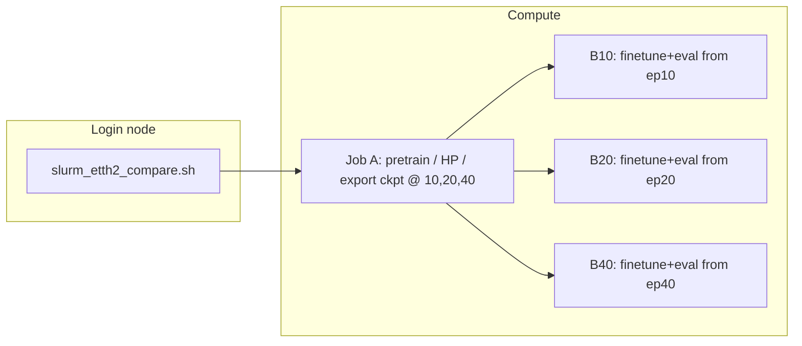

# Hyper-detailed walkthrough: FactorizedDiT multivariate diffusion (ts-sandbox)

Companion to `gaussian_pipeline_extreme_walkthrough.md`. This document is **implementation-first**: it traces tensors, names every major submodule down to layer lists, walks the **FactorizedDiT** backbone block-by-block, and records defaults from `DiffusionTSFConfig` / `pipeline_config.py` as of the repo state when this file was written.

**Scope:** Variate-factorized **FactorizedDiT** diffusion (Gaussian CDF and binary bit-flip), including **deterministic anchor loss** and anchor inference. Production Slurm jobs (`slurm_gaussian_anchor_92d3.sh`, `slurm_binary_anchor_92d3.sh`, height-matrix runs) pass `--model-type dit`. The legacy convolutional U-Net backbone (`model_type="unet"`) remains in code for old checkpoints only and is not documented here.

---

## 0) Reading map (files ↔ roles)

| Area | Primary files |
|------|----------------|
| Slurm orchestration | `slurm_etth2_compare.sh`, `slurm_profile_one_epoch.sh`, repo-root `run.sh` (Killarney full-variate driver) |
| CLI / stages / data load | `models/diffusion_tsf/train_multivariate_pipeline.py` |
| End-to-end model | `models/diffusion_tsf/diffusion_model.py` |
| DiT backbone | `models/diffusion_tsf/dit.py` |
| Anchor loss / anchor sampler | `models/diffusion_tsf/diffusion_model.py` (§11) |
| Context tokens | `models/diffusion_tsf/unet.py` — **only** `iTransformerTokenAdapter` (filename is historical; not the U-Net denoiser) |
| Noise schedule + DDIM sampler | `models/diffusion_tsf/diffusion.py` |
| 2D CDF + blur + inverse | `models/diffusion_tsf/preprocessing.py` |
| Hyperparameter dataclass | `models/diffusion_tsf/config.py` |
| iTransformer wrapper | `models/diffusion_tsf/guidance.py` |
| iTransformer baseline | `models/iTransformer/model/iTransformer.py`, `layers/Transformer_EncDec.py`, `layers/SelfAttention_Family.py`, `layers/Embed.py` |
| Synthetic pretrain | `models/diffusion_tsf/dataset.py`, `realts.py`, `augmentation.py` |

---

## 1) Slurm: DAG, preamble, persistent venv under STORE

### 1.1 Effective job graph



Job A runs `python -u -m models.diffusion_tsf.train_multivariate_pipeline` with `--mode pretrain` and exports milestone checkpoints; B* jobs depend on A with `--mode finetune-subset` (or equivalent) for ETTh2.

### 1.2 Shared preamble (`$STORE/job_preamble.sh`)

Each batch job sources a generated preamble that:

1. Loads modules: `StdEnv/2023`, `python/3.11`, `cuda/12.2`, `cudnn/8.9`.
2. **Python venv at `$STORE/venv`:** path is baked into the preamble at submit time (same as `${STORE}`). If `venv/bin/python` and `activate` exist, the job **reuses** it; otherwise it runs `virtualenv --no-download "$STORE/venv"`. Subsequent `pip install` lines reconcile packages (usually cheap when already satisfied).
3. Installs torch (wheel cache first), `wandb` with `--no-index`, then `optuna`, `matplotlib`, `einops`, `reformer-pytorch==1.4.4`, and `requirements.txt`.

---

## 2) Pipeline stages overview

**Synthetic pretrain** (`run_pretrain_mode`, Slurm `run.sh`, or manifest `--mode full` before dataset loops) is two Optuna phases whose **best checkpoints are promoted directly**—there is no extra multi-epoch “full synthetic pretrain” after either HP search unless a legacy cache has JSON params without the paired `*_hp_best.pt` file.

**Per-dataset finetune** (`--mode finetune`, `_finetune_and_eval_one_subset`, or the finetune stage inside `run.sh`) runs **four phases** on real data (iTrans HP → iTrans full finetune → diffusion HP → diffusion full finetune), then eval.

```
── PRETRAIN (synthetic, Slurm dim dir & manifest CHECKPOINT_DIR) ───────────────
  Phase 1A │ iTransformer HP tuning       │ best trial weights → itrans_hp_best.pt → itransformer.pt (no extra full-pretrain epoch block)
  Phase 1B │ Diffusion HP tuning          │ N_DIFFUSION_HP_TRIALS trials → diff_hp_best.pt → diffusion.pt (no extra full synthetic pretrain)
── FINETUNE (per dataset/subset) ────────────────────────────────────────────
  Phase 2A │ iTransformer HP finetune     │ real data (warm-start from Phase 1A ckpt) -> best trial weights promoted
  Phase 2B │ Diffusion HP finetune        │ real data; N_FINETUNE_HP_TRIALS Optuna trials; batch size auto-probed once
  Phase 2C │ Diffusion full finetune      │ real data (guidance = finetuned iTrans from 2A)
  Eval     │ Diffusion eval + iTrans baseline (finetuned iTrans for both)
─────────────────────────────────────────────────────────────────────────────
```

### Phase 1A — iTransformer HP tuning on synthetic data

- **Entry:** `run_itransformer_hp_tuning()`, called from `run_pretrain_mode` / manifest `run_pipeline`
- **Trials:** `N_ITRANS_HP_TRIALS = 7`, Optuna `TPESampler`, `MedianPruner(n_startup_trials=2)`
- **Search space:** `learning_rate` (log-uniform 1e-5–1e-3), `batch_size` (categorical), `dropout` (0–0.3)
- **Per-trial training:** up to 30 epochs, early-stop patience=5
- **Best-state tracking:** `best_state` dict shared across trials; whenever a trial val loss beats all previous, the model `state_dict` is cloned to CPU and stored
- **Output:** `itrans_hp.json` (best params, cached so reruns skip this phase); **`itrans_hp_best.pt`** is promoted to **`itransformer.pt`** / `pretrained_itransformer.pt` — **no** separate synthetic full-pretrain block after HP (only a fallback `pretrain_itransformer` if an **old** run cached JSON without `itrans_hp_best.pt`)

### Phase 1B — Diffusion HP tuning on synthetic data

- **Entry:** `run_diffusion_hp_tuning()`, called from `run_pretrain_mode` and `run_pipeline`
- **Trials:** `N_DIFFUSION_HP_TRIALS = 3`, same Optuna setup as iTrans HP
- **Search space:** `learning_rate` (log-uniform 1e-5–5e-4), `batch_size` (fixed after auto probe inside `run_diffusion_hp_tuning`)
- **Per-trial training:** up to `PRETRAIN_DIFFUSION_MAX_EPOCHS = 15` epochs (early stop)
- **Guidance:** frozen Phase **1A** iTransformer checkpoint (promoted from HP best)
- **Best-state tracking:** cross-trial clone → `diff_hp_best.pt`
- **Output:** `diff_hp.json` + `diff_hp_best.pt` → copied to `diffusion.pt` / `pretrained_diffusion.pt`. Fallback: full `pretrain_diffusion` up to `PRETRAIN_DIFFUSION_MAX_EPOCHS` only if no `diff_hp_best.pt` exists

### Phase 2A — iTransformer HP finetune on real data

- **Entry:** `run_itransformer_finetune_hp_tuning()`, called from `_finetune_and_eval_one_subset`
- **Trials:** `N_ITRANS_HP_TRIALS = 7`, same Optuna/pruner setup as Phase 1A
- **Search space:** identical to Phase 1A (`learning_rate`, `batch_size`, `dropout`)
- **Per-trial training:** 30 epochs, patience=5
- **Warm-start:** every trial loads pretrained `itransformer.pt` from Phase **1A** before training
- **Data:** real dataset (70%/10%/20% train/val/test split)
- **Best-state tracking:** cross-trial clone, same mechanism
- **Output:** `{subset_id}_itrans_ft_hp.json` (cached) + `{subset_id}_itrans_ft_hp_best.pt`

### Phase 2B — Diffusion HP finetune on real data

- **Entry:** `finetune_hp_objective` via Optuna in `_finetune_and_eval_one_subset` (and equivalent loop in `run_pipeline`)
- **Trials:** `N_FINETUNE_HP_TRIALS` (defaults to **3** in code — distinct from pretrain diffusion HP trials); logs explicitly label this as finetune-phase tuning so it is not confused with `N_DIFFUSION_HP_TRIALS`
- **Search space:** `learning_rate` only (log-uniform on `[FINETUNE_HP_LR_MIN, FINETUNE_HP_LR_MAX]` in `pipeline_config.py`, currently **3e‑6–2e‑4**) — batch size is **auto-probed once** (`select_diffusion_batch_size`) before trials and fixed for all trials
- **Starting model:** pretrained `diffusion.pt` from Phase **1B**
- **Guidance:** `{subset_id}_itransformer_finetuned.pt` from Phase 2A (not the pretrained one)
- **Per-trial training:** `HP_TUNE_EPOCHS` with early stop
- **Output:** best HP params dict (in-memory)

### Phase 2C — Diffusion full finetune on real data

- **Entry:** `finetune_on_dataset()`, called from `_finetune_and_eval_one_subset`
- **Epochs:** `FINETUNE_EPOCHS = 10`, patience `FINETUNE_PATIENCE = 5`
- **Starting model:** `diffusion.pt` from Phase **1B**, with best 2C params applied
- **Guidance:** same finetuned iTransformer as 2C
- **Output:** `{subset_id}_diffusion_finetuned.pt`

### Evaluation

After Phase 2C, `_finetune_and_eval_one_subset` runs two evaluations:

1. **Diffusion model** on the test split, guided by the finetuned iTransformer.
2. **Finetuned iTransformer baseline** (`evaluate_itransformer_baseline`) for direct comparison.

Both use `{subset_id}_itransformer_finetuned.pt` — not the pretrained one — to keep the comparison fair. Results are saved via `save_eval_results`.

### Implementation parity (`run_pretrain_mode` vs `run_pipeline`)

The manifest **`run_pipeline`** path (`--mode full`) matches **`run_pretrain_mode`** (Slurm `run.sh` Phase 1) for synthetic stages:

- `run_diffusion_hp_tuning(..., checkpoint_dir=…)` writes **`diff_hp_best.pt`** next to **`diff_hp.json`**.
- That file is **copied to `pretrained_diffusion.pt`** (full-mode checkpoint dir) or **`diffusion.pt`** (`pretrained_dim{V}/`), replacing the older behavior that always ran **`pretrain_diffusion`** after HP search.

Filenames differ by entrypoint (`pretrained_itransformer.pt` in manifest layout vs `itransformer.pt` under `pretrained_dim{V}/`), but the rule is the same: **HP-best weights are the canonical pretrained checkpoint.**

### Caching and resume

Existence checks skip work when artifacts are already present. Typical synthetic-pretrain artifacts:

- **`itrans_hp.json`**, **`itrans_hp_best.pt`** → promoted **`itransformer.pt`** / **`pretrained_itransformer.pt`**
- **`diff_hp.json`**, **`diff_hp_best.pt`** → promoted **`diffusion.pt`** / **`pretrained_diffusion.pt`**

Finetune caches under `CHECKPOINT_DIR` include **`{subset_id}_itrans_ft_hp.json`**, **`{subset_id}_itransformer_finetuned.pt`**, and diffusion fine-tuned checkpoints written by **`finetune_on_dataset`**.

When clearing a Slurm smoke run (`.smoke_test` flag), **`run_pretrain_mode`** also deletes **`itrans_hp_best.pt`** and **`diff_hp_best.pt`** so the next real run cannot silently reuse partial HP checkpoints.

---
## 3) Data: dataset loader vs model normalization (two layers)

### 3.1 `load_dataset` (real CSV benchmarks)

- Chronological split **70% / 10% / 20%** for train / val / test windows.
- **Z-score** each variate using **train slice only** (`mean`, `std` on `data[:train_end]`), then apply to the full series before windowing. This removes validation/test leakage from global stats.
- `TimeSeriesDataset` builds sliding windows: `lookback`, `horizon`, `stride`, `lookback_overlap`.

### 3.2 `_normalize_sequence` inside `DiffusionTSF`

For each batch, **past** (and **future** during training) is normalized again using **per-sequence** statistics computed from the **past** window only:

- `mean = past.mean(dim=-1, keepdim=True)`, `std = past.std(dim=-1, keepdim=True) + 1e-8`
- `past_norm`, `future_norm = (past - mean)/std`, `(future - mean)/std`

So the model sees **locally standardized** windows even after dataset-level z-scoring. That is intentional (non-stationary handling) but means two normalization layers stack; ablations should be aware of it.

### 3.3 Synthetic pretrain

- `get_synthetic_dataloader` → `RealTS` dataset: mixed generator families (RWB, PWB, LGB, TWDB, IFFTB, STB, seasonal), optional disk cache, multivariate coupling via `augmentation.py`.
- **Reproducibility caveat:** stochastic sampling / cache index behavior can weaken strict “epoch N is always the same samples” unless seeds and sampler semantics are pinned end-to-end.

---

## 4) Representation: `TimeSeriesTo2D` and `VerticalGaussianBlur`

### 4.1 CDF occupancy map (`TimeSeriesTo2D`)

**Parameters (defaults):** `height` = `config.image_height` (default **64**), `max_scale` = **3.5**.

**Forward (per paper implementation in code):**

1. Input `x`: `(B, V, L)` or `(B, L)` → promoted to `(B, V, L)`.
2. Clip values to `[-max_scale, max_scale]`.
3. Bin index per value:  
   `bin = clamp(floor((x + max_scale) / (2*max_scale) * height), 0, height-1)`.
4. For each column (time step), set rows `0..bin` to 1 and rows above to 0: monotone “filled from bottom” CDF staircase in value dimension.

**Output:** `(B, V, height, L)` with values in `{0,1}` before blur.

**Inverse (`inverse`):**

- `cdf_decoder="mean"` (default): column sum → normalized height → map back to approximately `[-max_scale, max_scale]`.
- `cdf_decoder="pdf_expectation"`: discrete PDF from finite differences of CDF, optional `decode_temperature` sharpening, expectation over bin indices.

Registered buffer `bin_centers` exists for diagnostics / compatibility; forward uses the floor-bin rule above.

### 4.2 Vertical Gaussian blur (`VerticalGaussianBlur`)

- **Defaults:** `kernel_size=31`, `sigma=1.0` in config (constructor in `DiffusionTSF` passes `config.blur_kernel_size`, `config.blur_sigma`).
- **Kernel shape:** `(1, 1, kernel_size, 1)` — convolved with `groups=channels`, **reflect** pad on height only.
- Effect: smooths **across value bins**; **time axis stays sharp** at this stage.

### 4.3 `encode_to_2d`

1. `image = to_2d(x)`
2. `blurred = blur(image)`
3. If `scale_for_diffusion`: clamp to `[0,1]`, then `* 2 - 1` → **Gaussian diffusion works in [-1, 1]**.

---

## 5) Diffusion scheduler (`DiffusionScheduler`)

**Construction (`__init__`):**

- `num_steps` = `config.num_diffusion_steps` (default **1000**).
- `beta_start`, `beta_end` (defaults **1e-4**, **0.02**) for linear schedule.
- `schedule`: `"linear"` | `"cosine"` | `"sigmoid"` | `"quadratic"`.
- Tensors on device: `betas`, `alphas = 1 - betas`, `alphas_cumprod`, `alphas_cumprod_prev` (padded with 1 at t=0), `sqrt_*` caches.

**Training (DDPM ε-prediction objective):**

- `add_noise(x0, t, noise?)`:  
  `x_t = sqrt(ᾱ_t) x0 + sqrt(1-ᾱ_t) ε`.
- Loss = `MSE(ε_θ(x_t, t, cond), ε)` — standard Ho et al. noise-prediction. DDIM is not used during training.

**From predicted noise:**

- `predict_x0_from_noise(x_t, t, noise_pred)` inverts the above.

**DDIM step (`ddim_step`) — inference only:**

- DDIM is a drop-in sampler; compatible with any ε-prediction model regardless of training sampler.
- Predicts `x0` from `x_t`, **clamps `x0`** with a dynamic range tied to `alpha_bar` (widens at noisy steps).
- Computes `sigma` from `eta` (DDIM stochasticity); if `eta=0`, deterministic path.
- Updates `x_{t-1}` per standard DDIM.

**Sampling helper:** `sample_ddim_cfg` builds a subsequence of timesteps linearly from `T-1` down to `0` with length `num_steps` (e.g. 50), supports **classifier-free guidance** on the **noise prediction** when `cfg_scale > 1` and `null_cond` is provided.

**Config knobs:** `ddim_steps`, `ddim_eta`, `cfg_dropout`, `cfg_scale`.

---


## 6) `DiffusionTSF` assembly (factorized DiT path), slowly

This section explains how the main model object is assembled for Gaussian (or binary) image diffusion with `model_type="dit"` (`FactorizedDiT`).

Important current behavior:
- We do **not** stack all variates as extra input channels on one forward pass.
- In factorized multivariate mode, the denoiser runs on `(BV, C_in, H, W)` — one occupancy map per variate, **shared weights** across the `BV = B·V` batch.
- The DiT backbone has **no internal cross-variate mixing**. Cross-variate coupling is **only** via (a) the frozen iTransformer guidance stack and (b) a **single bottleneck cross-attention** block that reads `V` context tokens per forward pass.

### 6.0 Multivariate context: what mixes, what does not

| Mechanism | Attention / mixing axis | Cross-variate? |
|-----------|-------------------------|----------------|
| **DiT self-attention** | Patch tokens on one variate’s `(H, W_fut)` canvas (`cond` patches ∥ `x` patches) | **No** — only spatial patches for the **target** variate in this forward |
| **DiT bottleneck cross-attention** | Spatial patch queries → `V` iTransformer context tokens | **Yes** — each of the `BV` forwards sees all `V` keys/values |
| **iTransformer (guidance)** | Self-attention over `V` variate tokens on lookback | **Yes** — happens **before** DiT, inside frozen `get_encoder_tokens` / `get_forecast` |
| **Guidance ghost channel** | Extra input channel: that variate’s forecast CDF image | **No** — per-variate pixel conditioning only |
| **Visual cond (`cond`)** | Past-tail occupancy map for **same** variate, patchified into the token sequence | **No** |

So: there is **no** “multivariate self-attention” inside DiT (no attention over a variate index). Multivariate structure enters as **(1)** iTransformer’s variate-token encoder, projected to `(B, V, ctx_dim)` and consumed at **one** cross-attention site, and **(2)** optional per-variate ghost images on the input canvas.

Set `disable_cross_attention=True` in config to drop (1); guidance pixels in (2) can remain if `use_guidance_channel=True`.

### 6.1 Backbone: `FactorizedDiT` (`model_type="dit"`)

`DiffusionTSF.__init__` builds **`FactorizedDiT`** from `dit.py` when `config.model_type == "dit"`. That is the **current** denoiser for multivariate training and eval in this repo.

| Setting | Value |
|---------|--------|
| Class | `FactorizedDiT` (`models/diffusion_tsf/dit.py`) |
| CLI / Slurm | `--model-type dit` on all 92d3 anchor and binary-height matrix scripts |
| `pipeline_config.py` | `MODEL_TYPE = "unet"` is a **stale default** for untouched local imports; override with CLI |

A legacy **`ConditionalUNet2D`** path (`model_type="unet"`) still exists in `unet.py` for old checkpoints. New work should not use it.

### 6.2 Channel accounting from `DiffusionTSFConfig` (what each channel means)

In variate-factorized multivariate mode (common ETTh2 style), each variate is treated almost like its own mini-image diffusion problem, while still allowing cross-variate context.

Core config flags:
- `variate_factorized=True`: process each variate map as a separate sample in the denoiser forward (required for multivariate).
- `num_variables=V`: number of variates (features) in the time series.

Now define channel counts carefully:

1. `backbone_in_channels`  
   Formula: `1 + num_aux_channels + (1 if use_guidance_channel else 0)`.
   - Base `1`: the noisy future occupancy map for one variate.
   - `num_aux_channels`: optional helper channels (coordinate ramp, time ramp, value hints, etc.).
   - Optional `+1`: iTransformer guidance ghost channel, if enabled.

2. `visual_cond_channels` → DiT `cond_channels`  
   Usually `1` for the past-tail occupancy map (optional +1 for value-channel variants). Guidance ghost is **not** in `cond`; it is concatenated onto `x` / `canvas` before the denoiser.

3. `out_channels`  
   For Gaussian diffusion this is `1` (predicted ε per variate map). Binary diffusion uses `2` (logits).

Why so much bookkeeping:
- In diffusion models, a wrong channel count usually does not fail immediately in a readable way; it often appears later as shape mismatch.
- Reading this section first makes debugging much easier.

### 6.3 Context encoder (`iTransformerTokenAdapter`)

Implemented in `unet.py` for historical import paths only (not the U-Net denoiser). Used by **FactorizedDiT** at the bottleneck cross-attention block.

- `iTransformerTokenAdapter(d_model=itrans_d_model, context_dim=context_embedding_dim)`.
- Input: `enc_tokens` from `guidance_model.get_encoder_tokens(past_raw)` → `(B, V, d_model)`.
- Output: `(B, V, context_dim)` after linear proj, per-variate `nn.Embedding`, dropout, LayerNorm.

Why this exists:
- Patch self-attention on one variate’s map cannot see other variates.
- Bottleneck cross-attention injects iTransformer’s **already cross-mixed** lookback summaries (one token per variate).
- Complements the ghost image, which carries **forecast** geometry for the target variate only.

### 6.4 `_forward_factorized`: full tensor trail and why each object exists

We now walk one training forward pass in factorized mode.

Symbols used:
- `B`: batch size.
- `V`: number of variates.
- `H`: image height (`config.image_height`, value-bin axis).
- `W_fut`: future width in 2D image space (usually forecast length, adjusted by overlap/unified axis logic).
- `T`: total diffusion steps (`config.num_diffusion_steps`).

Step-by-step:

1. Normalize sequences with `_normalize_sequence(past, future)`.
   - Input `past`: `(B, V, L_past)`.
   - Input `future`: `(B, V, L_fut)`.
   - Output:
     - `past_norm`: `(B, V, L_past)`.
     - `future_norm`: `(B, V, L_fut)`.
     - `stats`: mean/std stats used later for denormalization.
   Why:
   - Keeps per-window scale stable.
   - Makes diffusion training less sensitive to absolute amplitude drift across windows.

2. Convert future target to 2D occupancy.
   - `future_2d = encode_to_2d(future_norm)` -> `(B, V, H, W_fut)` in `[-1, 1]`.
   Why:
   - The denoiser expects image-like inputs; the occupancy map is the bridge from 1D series to 2D.

3. Sample diffusion timestep.
   - `t ~ Uniform({0, ..., T-1})`, shape `(B,)`.
   Why:
   - DDPM training draws random noise levels so one network learns denoising across all stages.

4. Add noise with scheduler.
   - `noisy_future, noise = scheduler.add_noise(future_2d, t)`.
   - Both shaped `(B, V, H, W_fut)`.
   Meanings:
   - `noisy_future`: `x_t`, the corrupted image at timestep `t`.
   - `noise`: actual sampled epsilon used to create `x_t`, and the target for noise-prediction loss.

5. Guidance from iTransformer.
   - iTransformer forecasts 1D future.
   - Forecast is normalized and encoded into `guidance_2d`.
   Why:
   - Gives the diffusion model a coarse trajectory prior, while diffusion refines sharp/local geometry.

6. Build cross-variate context tokens.
   - `ctx = _get_cross_variate_context(...)` -> `(B, V, context_dim)` or `None`.
   Why:
   - Lets each per-variate denoising path attend to summary tokens from all variates.

7. Flatten `(B, V)` into one dimension for the denoiser batch.
   - `BV = B * V`.
   - `canvas = noisy_future.reshape(BV, 1, H, W_fut)`.
   - Inject aux channels (coordinate ramp, optional time ramps) and optional guidance ghost → `backbone_in_channels`.
   Why:
   - One shared DiT over `BV` items is simpler and memory-efficient than `V` separate models.

8. Prepare visual conditioning map.
   - `past_tail = past_norm[..., -W_fut:]`.
   - `past_2d_cond = encode_to_2d(past_tail)`.
   - reshape to `(BV, 1, H, W_fut)`, with dropout rules.
   Why:
   - The model conditions on recent past geometry aligned to future width.

9. Broadcast cross-attention tokens when present.
   - `ctx_flat = ctx.unsqueeze(1).expand(-1, V, -1, -1).reshape(BV, V, context_dim)`.
   - Each of the `BV` denoising items gets the **full** `(V, ctx_dim)` memory (not a single variate slice).

10. DiT forward and reshape back.
    - `noise_pred_flat = self._predict_noise_chunked(canvas, t_flat, cond, encoder_hidden_states=ctx_flat)`.
    - Chunking uses `unet_max_chunk_size` (name is legacy; applies to DiT too).
    - Reshape to `(B, V, H, W_fut)` → predicted ε (or x0 logits in `x0_cumsum` mode).

Loss components:
- `noise_loss`: MSE between predicted epsilon and true epsilon.
- `emd_loss`: mean absolute CDF difference between predicted `x0` and target future CDF image.
- Optional `monotonicity_loss`: penalizes violations of CDF monotonic structure.
- Total:
  - `loss = noise_loss + emd_lambda * emd_loss + monotonicity_weight * mono_loss`.
  - Defaults include `emd_lambda=0.2`, monotonicity disabled unless configured.

Why multi-term loss:
- Pure epsilon MSE is standard diffusion training.
- CDF/EMD-like term biases toward occupancy-geometry faithfulness.
- Monotonicity term protects representation validity when enabled.

---

## 7) `FactorizedDiT` internals

`FactorizedDiT` (`dit.py`) is the production patchified Diffusion Transformer (DiT-style AdaLN-Zero) behind `DiffusionTSF._predict_noise_chunked`. Contract:

```python
noise_pred = FactorizedDiT(x, t, cond, encoder_hidden_states=ctx_flat)
# x: (BV, in_channels, H, W_fut)
# cond: (BV, cond_channels, H, W_fut)
# ctx_flat: (BV, V, context_dim) or None
```

### 7.1 Constructor defaults (`pipeline_config.py` / `DiffusionTSFConfig`)

| Knob | Typical default | Role |
|------|-----------------|------|
| `dit_patch_size` | `(8, 8)` | Conv patch embed stride; `image_height` must be divisible by patch height |
| `dit_embed_dim` | `384` | Token width `D` |
| `dit_depth` | `8` | Number of transformer blocks |
| `dit_num_heads` | `6` | MHA heads (`D` divisible by heads) |
| `dit_mlp_ratio` | `4.0` | FFN hidden = `4·D` |
| `dit_dropout` | `0.0` | Attention/MLP dropout |
| `context_embedding_dim` | `256` | iTrans token dim before `ctx_proj` → `D` |
| `use_gradient_checkpointing` | often `True` on cluster | Per-block `checkpoint(..., use_reentrant=False)` |

`bottleneck_idx = depth // 2` (default depth 8 → block index **4**). Only that block is `_DiTCrossAttnBlock`; all others are `_DiTBlock` (self-attn + MLP only).

### 7.2 Forward: patchify, sequence layout, time

1. **Reflect-pad** `x` and `cond` so `H`, `W_fut` are multiples of `patch_size` (crop output back at the end).
2. **Patch embed:** separate `Conv2d` stems `x_embed`, `cond_embed` → tokens `(BV, Nx, D)` and `(BV, Nc, D)` with `Nx = gh·gw`, `Nc` from cond grid.
3. **Positional embeddings:** learned `pos_x`, `pos_cond` (trunc-normal init) so cond vs noisy slots are distinguishable on the shared sequence axis.
4. **Concatenate sequence:** `tokens = [c_tok | x_tok]` along length `Nc + Nx`. Self-attention mixes **past cond patches and noisy future patches** for this variate only.
5. **Timestep:** sinusoidal embedding → MLP `t_embed` → vector `c` `(BV, D)` used in **AdaLN-Zero** in every block and the final head.

AdaLN-Zero (standard DiT block): for each sublayer, `shift, scale, gate = adaLN(c)` modulate LayerNorm’d tokens; `gate` is zero-init so blocks start as identity.

### 7.3 Block types

**`_DiTBlock` (all indices except `bottleneck_idx`):**

```
x ← x + g1 · SelfAttn(AdaLN(norm1(x), c))
x ← x + g2 · MLP(AdaLN(norm2(x), c))
```

Self-attention is multi-head over the **patch sequence** (length `Nc+Nx`), not over variates.

**`_DiTCrossAttnBlock` (bottleneck only):**

```
x ← x + g1 · SelfAttn(...)
x ← x + gx · CrossAttn(queries=x, keys/values=ctx_proj)   # skipped if ctx is None
x ← x + g2 · MLP(...)
```

- `ctx_proj = LayerNorm(Linear(encoder_hidden_states))` → `(BV, V, D)`.
- Cross-attention: **queries** from spatial tokens, **keys/values** from the `V` iTransformer tokens. This is the **only** place DiT reads other variates.
- Nine AdaLN gates (self, cross, MLP) are zero-init so cross-attn starts inactive.

### 7.4 Output head

After all blocks, **drop cond tokens**: `x_out = tokens[:, Nc:]` (noisy-future slots only).

Final AdaLN on `x_out`, then linear `head` → patch pixels → `_unpatchify` → `(BV, out_channels, H, W_fut)`.

Head weights are **zero-init** so training starts near “predict input noise structure” without a large random jump.

### 7.5 How conditioning enters (no channel concat inside DiT)

DiT keeps conditioning roles separate (no early-fusion conv stack):

| Signal | Path into DiT |
|--------|----------------|
| Noisy future + aux + ghost | `x` → `x_embed` → tail of token sequence |
| Past visual cond | `cond` → `cond_embed` → **prefix** of token sequence |
| Diffusion step | AdaLN vector `c` from `t` |
| Cross-variate lookback | `encoder_hidden_states` → bottleneck cross-attn only |

Guidance ghost is **not** passed in `cond`; `DiffusionTSF` concatenates it onto `canvas` channels before calling `FactorizedDiT`.

### 7.6 Complexity and memory notes

- Cost scales with `(Nc+Nx)²` per self-attn block (default `H=32`, `W_fut≈96`, patch 8×8 → on the order of tens of patches per axis).
- `unet_max_chunk_size` chunks the `BV` dimension in `_predict_noise_chunked` to cap activation memory.
- Wider time dimension increases `gw` and grows `Nx`; watch `max_pos_tokens` (default 8192) — forward raises if `Nx` or `Nc` exceeds the table.

---

## 8) Context encoder: tokens for bottleneck cross-attention

The DiT bottleneck cross-attention in §7.3 needs a sequence to attend *to*. That sequence comes from the frozen iTransformer encoder plus `iTransformerTokenAdapter`. This section walks through that path step by step.

### 8.1 `iTransformerTokenAdapter` — default for guided multivariate runs

**What problem it is solving.**
In the factorized setup there are `BV` separate DiT forwards (one per variate). Each pass only sees that variate's occupancy patches. The adapter's job is to give every pass a read-only summary of **all** variates' lookbacks. The forecast ghost image (§9.2 Place 1) already carries horizon geometry for the **target** variate; these tokens carry **encoder** state after iTransformer's own cross-variate attention on lookback.

The new approach taps the iTransformer's internal encoder output directly, before its linear projector collapses to the horizon dimension.

**Input.** Raw (un-normalized) past `(B, V, L)`. This is passed straight to `iTransformerGuidance.get_encoder_tokens()`.

**Step 1 — iTransformer internal normalization + embedding.**
```python
x_enc = past.permute(0, 2, 1)                     # (B, L, V) — iTransformer axis order
# iTransformer does per-time-step instance norm internally if use_norm=True
enc_out = model.enc_embedding(x_enc, None)         # (B, V, d_model)
enc_out, _ = model.encoder(enc_out, attn_mask=None)  # (B, V, d_model)
```
This is the same computation iTransformer runs in `get_forecast()` — but we stop before the `projector` linear. Each variate now has a `d_model=512`-dimensional token that reflects its full lookback, and the multi-head self-attention across V variates has already mixed cross-variate information.

**Step 2 — project to `context_dim`.**
```python
x = nn.Linear(d_model, context_dim)(enc_out)       # (B, V, 256)
```
Reduces from `d_model=512` to `context_dim=256`, then DiT's `ctx_proj` maps to `embed_dim` (e.g. 384).

**Step 3 — add per-variate identity embedding.**
```python
ids = torch.arange(V, device=x.device)
x = x + variate_embed(ids)                         # (B, V, 256)
```
A learned `nn.Embedding(max_variates=512, context_dim)`. Since each factorized forward targets one variate index, without this embedding all `V` context keys would be exchangeable up to iTrans content. The identity lets DiT learn variate-specific refinements at cross-attn.

**Step 4 — Dropout + LayerNorm and done.**
Output: `(B, V, 256)` — one 256-d token per variate, carrying rich iTransformer lookback structure plus identity.

**What DiT does with this.**
Before the denoiser, the code replicates so every item in the `BV` batch sees all `V` tokens:
```python
ctx_flat = ctx.unsqueeze(1).expand(-1, V, -1, -1).reshape(BV, V, -1)
# (BV, V, context_dim) — each variate's DiT pass cross-attends to all V tokens at the bottleneck
```
Patch tokens (after self-attn in the bottleneck block) are queries; `ctx_proj` supplies keys/values.

**When `get_encoder_tokens` is called.**
Training and inference call `_get_cross_variate_context(past)` once before the denoising loop; `ctx_flat` is reused for every DDIM step.

### 8.2 Summary: what the tokens actually represent

| Encoder | Token sequence length | What one token represents |
|---|---|---|
| `iTransformerTokenAdapter` | V | iTransformer lookback embedding projected to 256-d, plus variate identity |


---

## 9) iTransformer guidance stack

### 9.1 What problem it solves and when it is active

In the current training path, iTransformer guidance is **always on**.

There is no user-facing guidance toggle in `train_multivariate_pipeline.py` anymore. Model creation in this pipeline now hard-enables `use_guidance_channel=True`, so every train/infer run through this path uses iTransformer guidance by default.

Operationally, an iTransformer is run first on every batch to produce a **coarse deterministic forecast**. That forecast becomes a "ghost" occupancy image concatenated on the **noisy canvas** (`x` channels). DiT also receives past visual structure via the separate `cond` tensor (patch prefix). The denoiser learns to refine the ghost while respecting past geometry and cross-variate tokens.

### 9.2 The two ways the iTransformer feeds into the pipeline

With guidance enabled, iTransformer output is used in **two separate places**:

**Place 1 — extra channel on the noisy canvas ("ghost image")**

The coarse forecast `(B, V, forecast_length)` is normalized with the same per-sequence stats as the diffusion target, then `encode_to_2d`. In factorized mode this is `(BV, 1, H, W_fut)` concatenated onto `canvas` (not onto `cond`):

```python
if guidance_2d is not None:
    canvas = torch.cat([canvas, guidance_2d.reshape(BV, 1, H, W_fut)], dim=1)
```

`backbone_in_channels` counts this channel. DiT patch-embeds it as part of `x`, not as `cond`.

**Place 2 — input to `iTransformerTokenAdapter` (cross-attention tokens)**

`_get_cross_variate_context` detects the encoder type and routes accordingly:

```python
if isinstance(self.context_encoder, iTransformerTokenAdapter):
    enc_tokens = self.guidance_model.get_encoder_tokens(past_raw)  # (B, V, d_model)
    return self.context_encoder(enc_tokens)                         # (B, V, context_dim)
```

The raw past is fed through the iTransformer's frozen encoder (normalization + embedding + multi-head attention), and the resulting `enc_out` — before the horizon projector — is passed to the adapter. The tokens encode "what the lookback looks like per variate, after deep cross-variate attention" rather than "what the forecast will be". The forecast is already present pixel-wise as the ghost image (Place 1); these tokens are complementary, carrying lookback structure that pixels cannot convey.

### 9.3 The iTransformer itself

The iTransformer is wrapped in `iTransformerGuidance`, which:
- Keeps the weights **frozen** (`.requires_grad_(False)` at construction; `torch.no_grad()` at every call). It is never co-trained with the diffusion model.
- Exposes `get_forecast(past, forecast_length) → (B, V, forecast_length)` for the ghost-image path.
- Exposes `get_encoder_tokens(past) → (B, V, d_model)` for the cross-attention token path. Runs the same internal normalization + `enc_embedding` + `encoder` as `get_forecast`, but stops before `projector`.

Internally, the iTransformer uses an **inverted embedding**: instead of treating time steps as tokens (as a standard Transformer would), it treats **variates as tokens**. Each variate's full lookback is embedded as one token; the transformer then runs multi-head attention across those V tokens. This gives `enc_out` its cross-variate-aware structure before any horizon-specific projection is applied.

### 9.4 At inference

The same two-place injection happens at inference. Both the forecast (for the ghost image) and `get_encoder_tokens` (for context tokens) are computed **once before the DDIM loop** — `_get_cross_variate_context` is called a single time and `ctx_flat` is captured by closure and reused across all 50 denoising steps.

### 9.5 Summary

```
Current pipeline behavior:
  1. iTransformer on raw past → enc_out (B, V, d_model) + coarse forecast (B, V, F)
  2. Forecast → 2D ghost → extra channel on canvas (x)  [Place 1, per variate]
  3. enc_out → iTransformerTokenAdapter → bottleneck cross-attn memory  [Place 2, all V variates]
     (lookback in tokens; forecast in pixels — complementary)
```


---

## 10) Inference path (`generate` in factorized mode)

At inference we use **`FactorizedDiT`** via `_predict_noise_chunked`. Samplers:

| Sampler | Behavior |
|---------|----------|
| `ddim` | Default iterative DDIM (`ddim_steps`, typically 50) |
| `dpmpp` | DPM-Solver++ (`num_inference_steps`, e.g. 20 in matrix eval) |
| `ddpm` | Full-step DDPM |
| `anchor` / `deterministic_anchor` | **One-shot** deterministic decode (§11); Slurm `EVAL_SAMPLER=anchor` on 92d3 anchor scripts |

**Iterative flow (DDIM / DPM++ / DDPM):**
1. Normalize past; build `cond` (past-tail 2D), optional `ctx_flat`, optional CFG nulls.
2. Initialize noise `(BV, 1, H, W_fut)`; keep `ctx_flat` `(BV, V, ctx_dim)` fixed for all steps.
3. Denoise loop: rebuild `canvas` (noisy state + aux + ghost) → `_predict_noise_chunked` → `FactorizedDiT`; scheduler updates the latent.
4. Reshape `(BV, …)` → `(B, V, H, W_fut)`; `decode_from_2d` to 1D futures.

**Classifier-free guidance:** training uses `cfg_dropout`; inference mixes conditional vs null cond/ctx/guidance with `cfg_scale` (default `2.0`).

---

## 11) Deterministic anchor loss and anchor sampler

Deterministic anchor loss is an **auxiliary training term** that forces the **FactorizedDiT** denoiser to perform a good **single forward pass** from a neutral future canvas. The same forward defines the **`anchor` inference sampler** (one step, no DDIM loop). Enabled on production runs via `--deterministic-anchor-loss` (`slurm_gaussian_anchor_92d3.sh`, `slurm_binary_anchor_92d3.sh`).

Config fields (`DiffusionTSFConfig` / CLI):

| Field | Role | Typical Slurm values |
|-------|------|----------------------|
| `use_deterministic_anchor_loss` | Turn anchor term on | `True` on anchor Slurm scripts |
| `deterministic_anchor_lambda` (`λ`) | `combined = λ·L_diff + (1−λ)·L_anchor` | **0.99** (Gaussian and binary) |
| `deterministic_anchor_alpha` (`α`) | Pick noise level for anchor timestep | **0.5** Gaussian, **0.0** binary |

`λ` and `α` are **fixed** from `pipeline_config.py` / CLI — not Optuna-tuned. Diffusion HP phases optionally set `disable_anchor_loss=True` to skip the extra forward (~2× cheaper per step).

### 11.1 Gaussian CDF path (`diffusion_type="gaussian"`, `prediction_mode="epsilon"`)

**Training (each factorized forward, `compute_loss_factorized`):**

1. **Diffusion term** — sample timestep `t`, build noisy future `x_t`, predict noise `ε_θ`; `noise_loss` = MSE(`ε_θ`, `ε`) (with optional overlap weighting on the time axis).
2. **Anchor timestep** — `t_anchor = argmin_t |ᾱ_t − α|` on the training schedule (`_deterministic_anchor_params`).
3. **Anchor canvas** — future occupancy channel set to **zeros** (not random noise); keep past `cond`, ghost guidance channel, aux channels, and `ctx_flat` as in the main forward (`_build_anchor_canvas`).
4. **Anchor prediction** — one `FactorizedDiT` forward at `t_anchor`; optional **CFG** on cond/ctx/guidance identical to the main path when `cfg_scale > 1` (`_predict_anchor_noise`).
5. **Anchor target** — in noise space:  
   `scale = −√(ᾱ_{t_anchor}) / √(1−ᾱ_{t_anchor})`,  
   `anchor_target = scale · future_2d` (clean 2D CDF image).
6. **Anchor loss** — `anchor_loss = MSE(ε_anchor, anchor_target)`.
7. **Combined** — `combined_mse_loss = λ·noise_loss + (1−λ)·anchor_loss`; EMD / monotonicity / guidance penalty add on top as before.

**Inference (`sampler="anchor"`):** single forward at `t_anchor` from zero future canvas; recover clean map as `future_2d = ε_pred / scale`. Not supported with `prediction_mode="x0_cumsum"`.

### 11.2 Binary bit-flip path (`diffusion_type="binary"`)

**Training (`_forward_binary_factorized`):**

1. **Regular term** — BCE on predicted **x₀** and **zₜ** logits vs flipped future bits (`loss_x0 + loss_zt`).
2. **Anchor term** (if enabled) — timestep **`T−1`** (last schedule step); neutral future = **Bernoulli(0.5)** per pixel (not zeros); same `cond` / ghost / `ctx`; predict **x₀ logits** only.
3. **Anchor loss** — BCE between anchor x₀ logits and true future bits.
4. **Combined** — same λ mixture: `λ·regular_loss + (1−λ)·anchor_loss`.

**Inference (`sampler="anchor"`):** one forward at `t = T−1` from a 0.5 canvas; `future = 1[σ(x₀ logits) > 0.5]`.

### 11.3 Relation to guidance and DiT

- Anchor loss does **not** replace iTransformer guidance: ghost channel and `ctx_flat` are still present on the anchor forward.
- Only **FactorizedDiT** is trained/evaluated in current anchor matrix work (`--model-type dit`). The anchor forward uses the same `_predict_noise_chunked` entry point as DDIM steps.

---

## 12) Hyperparameter reference (defaults + what each group controls)

These are default values from `DiffusionTSFConfig` referenced in the original walkthrough; CLI often overrides some.

### 12.1 Sequence and multivariate geometry
- `lookback_length=512`: past context length in 1D samples.
- `forecast_length=96`: target horizon length.
- `lookback_overlap=8`: overlap handling for lookback/future boundaries.
- `past_loss_weight=0.3`: weighting for overlap-related loss partition logic.
- `num_variables=1` default baseline; multivariate runs override it.
- `variate_factorized=True`: process variates via factorized route.

### 12.2 2D representation
- `image_height=64`: number of vertical value bins in occupancy map.
- `max_scale=3.5`: clipping range for normalized values before binning.
- `blur_kernel_size=31`, `blur_sigma=1.0`: vertical Gaussian blur parameters.
- `unified_time_axis=False` default: separate width handling mode.

### 12.3 FactorizedDiT backbone (production default, `model_type="dit"`)
- `model_type="dit"` → `FactorizedDiT` in `dit.py` (pass `--model-type dit` on CLI; do not rely on `pipeline_config.MODEL_TYPE` alone)
- `dit_patch_size=(8, 8)`
- `dit_embed_dim=384`
- `dit_depth=8` → bottleneck cross-attn at index `4`
- `dit_num_heads=6`
- `dit_mlp_ratio=4.0`
- `dit_dropout=0.0`
- `use_gradient_checkpointing` / `use_amp` — often `True` on cluster (`pipeline_config.py`)
- `unet_max_chunk_size=128` — chunks `BV` through **FactorizedDiT** (config name is legacy)

### 12.4 Diffusion process and sampling
- `num_diffusion_steps=1000`
- `beta_start=1e-4`
- `beta_end=0.02`
- `noise_schedule="linear"`
- `ddim_steps=50`
- `ddim_eta=0`
- `cfg_dropout=0.1`
- `cfg_scale=2.0`

### 12.5 Decode and augmentation behavior
- `decode_temperature=0.5`
- plus `cutout_*` augmentation controls.

### 12.6 Loss terms
- `emd_lambda=0.2` (Gaussian)
- `use_monotonicity_loss=False`
- `monotonicity_weight=1.0`
- **Deterministic anchor** (§11): `use_deterministic_anchor_loss` (off in bare `pipeline_config`, on in anchor Slurm); `deterministic_anchor_lambda=0.99`; `deterministic_anchor_alpha=0.5` (Gaussian) or `0.0` (binary Slurm default)

### 12.7 Conditioning and context
- `model_type="dit"` for current FactorizedDiT runs (`"unet"` = legacy checkpoints only)
- `disable_cross_attention=False` — set `True` to remove bottleneck cross-variate tokens
- `use_guidance_channel=True` in the current training pipeline path (hard-enabled there)
- `context_embedding_dim=256`
- `use_coordinate_channel=True` and related aux-channel toggles.

### 12.8 Optimizer/training basics
- `learning_rate=2e-4`
- `batch_size=8`

Why include defaults in a slow walkthrough:
- New readers need a concrete baseline before they can reason about changes.
- Many bugs are simply mismatched assumptions about default knobs.

---

## 13) Known pitfalls (with practical interpretation)

1. DiT patch grid: `image_height` must divide `dit_patch_size[0]`; time width is reflect-padded to patch width. If `Nx` or `Nc` exceeds `max_pos_tokens`, forward fails — increase the table or shrink resolution.

2. Double normalization exists by design.
   - Dataset-level z-score and per-window past-stat normalization both operate.
   - You must account for both when validating scale-sensitive behavior.

3. Shared Slurm venv under `$STORE/venv`.
   - First job pays setup cost; later jobs usually reuse.
   - Store-backed IO can be slower than local scratch.

4. Synthetic epoch determinism is not guaranteed by default.
   - Sampling/caching semantics can vary unless every random source and loader behavior is pinned.

5. iTransformer internal normalization can stack with external normalization.
   - Important when interpreting guidance channel magnitudes.
