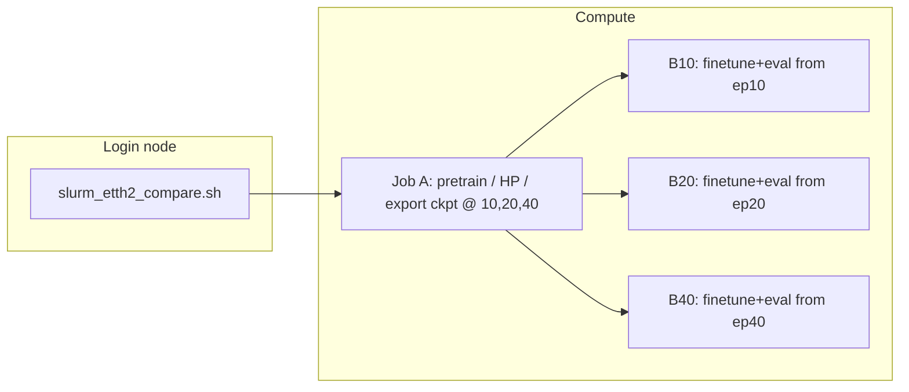

# Hyper-detailed walkthrough: Gaussian multivariate pipeline (ts-sandbox)

Companion to `gaussian_pipeline_extreme_walkthrough.md`. This document is **implementation-first**: it traces tensors, names every major submodule down to layer lists, indexes U-Net levels precisely, and records defaults from `DiffusionTSFConfig` as of the repo state when this file was written.

**Scope:** Gaussian diffusion, multi-channel U-Net path (all V variates as channels of a single forward pass, e.g. ETTh2 with `--n-variates 7`), Slurm chain `slurm_etth2_compare.sh`. Binary diffusion and latent-only branches are out of scope except where code is shared.

---

## 0) Reading map (files ↔ roles)

| Area | Primary files |
|------|----------------|
| Slurm orchestration | `slurm_etth2_compare.sh`, `slurm_profile_one_epoch.sh`, repo-root `run.sh` (Killarney full-variate driver) |
| CLI / stages / data load | `models/diffusion_tsf/train_multivariate_pipeline.py` |
| End-to-end model | `models/diffusion_tsf/diffusion_model.py` |
| U-Net | `models/diffusion_tsf/unet.py` |
| Noise schedule + DDIM sampler | `models/diffusion_tsf/diffusion.py` |
| 2D CDF + blur + inverse | `models/diffusion_tsf/preprocessing.py` |
| Hyperparameter dataclass | `models/diffusion_tsf/config.py` |
| iTransformer wrapper | `models/diffusion_tsf/guidance.py` |
| iTransformer baseline | `models/iTransformer/model/iTransformer.py`, `layers/Transformer_EncDec.py`, `layers/SelfAttention_Family.py`, `layers/Embed.py` |
| Synthetic pretrain | `models/diffusion_tsf/dataset.py`, `realts.py`, `augmentation.py` |

---

## 1) Slurm: DAG, preamble, persistent venv under STORE

### 1.1 Effective job graph



Job A runs `python -u -m models.diffusion_tsf.train_multivariate_pipeline` with `--mode pretrain` and exports milestone checkpoints; B* jobs depend on A with `--mode finetune-subset` (or equivalent) for ETTh2.

### 1.2 Shared preamble (`$STORE/job_preamble.sh`)

Each batch job sources a generated preamble that:

1. Loads modules: `StdEnv/2023`, `python/3.11`, `cuda/12.2`, `cudnn/8.9`.
2. **Python venv at `$STORE/venv`:** path is baked into the preamble at submit time (same as `${STORE}`). If `venv/bin/python` and `activate` exist, the job **reuses** it; otherwise it runs `virtualenv --no-download "$STORE/venv"`. Subsequent `pip install` lines reconcile packages (usually cheap when already satisfied).
3. Installs torch (wheel cache first), `wandb` with `--no-index`, then `optuna`, `matplotlib`, `einops`, `reformer-pytorch==1.4.4`, and `requirements.txt`.

---

## 2) Pipeline stages overview

**Synthetic pretrain** (`run_pretrain_mode`, Slurm `run.sh`, or manifest `--mode full` before dataset loops) is two Optuna phases whose **best checkpoints are promoted directly**—there is no extra multi-epoch “full synthetic pretrain” after either HP search unless a legacy cache has JSON params without the paired `*_hp_best.pt` file.

**Per-dataset finetune** (`--mode finetune`, `_finetune_and_eval_one_subset`, or the finetune stage inside `run.sh`) runs **four phases** on real data (iTrans HP → iTrans full finetune → diffusion HP → diffusion full finetune), then eval.

```
── PRETRAIN (synthetic, Slurm dim dir & manifest CHECKPOINT_DIR) ───────────────
  Phase 1A │ iTransformer HP tuning       │ best trial weights → itrans_hp_best.pt → itransformer.pt (no extra full-pretrain epoch block)
  Phase 1B │ Diffusion HP tuning          │ N_DIFFUSION_HP_TRIALS trials → diff_hp_best.pt → diffusion.pt (no extra full synthetic pretrain)
── FINETUNE (per dataset/subset) ────────────────────────────────────────────
  Phase 2A │ iTransformer HP finetune     │ real data (warm-start from Phase 1A ckpt) -> best trial weights promoted
  Phase 2B │ Diffusion HP finetune        │ real data; N_FINETUNE_HP_TRIALS Optuna trials; batch size auto-probed once
  Phase 2C │ Diffusion full finetune      │ real data (guidance = finetuned iTrans from 2A)
  Eval     │ Diffusion eval + iTrans baseline (finetuned iTrans for both)
─────────────────────────────────────────────────────────────────────────────
```

### Phase 1A — iTransformer HP tuning on synthetic data

- **Entry:** `run_itransformer_hp_tuning()`, called from `run_pretrain_mode` / manifest `run_pipeline`
- **Trials:** `N_ITRANS_HP_TRIALS = 7`, Optuna `TPESampler`, `MedianPruner(n_startup_trials=2)`
- **Search space:** `learning_rate` (log-uniform 1e-5–1e-3), `batch_size` (categorical), `dropout` (0–0.3)
- **Per-trial training:** up to 30 epochs, early-stop patience=5
- **Best-state tracking:** `best_state` dict shared across trials; whenever a trial val loss beats all previous, the model `state_dict` is cloned to CPU and stored
- **Output:** `itrans_hp.json` (best params, cached so reruns skip this phase); **`itrans_hp_best.pt`** is promoted to **`itransformer.pt`** / `pretrained_itransformer.pt` — **no** separate synthetic full-pretrain block after HP (only a fallback `pretrain_itransformer` if an **old** run cached JSON without `itrans_hp_best.pt`)

### Phase 1B — Diffusion HP tuning on synthetic data

- **Entry:** `run_diffusion_hp_tuning()`, called from `run_pretrain_mode` and `run_pipeline`
- **Trials:** `N_DIFFUSION_HP_TRIALS = 3`, same Optuna setup as iTrans HP
- **Search space:** `learning_rate` (log-uniform 1e-5–5e-4), `batch_size` (fixed after auto probe inside `run_diffusion_hp_tuning`)
- **Per-trial training:** up to `PRETRAIN_DIFFUSION_MAX_EPOCHS = 15` epochs (early stop)
- **Guidance:** frozen Phase **1A** iTransformer checkpoint (promoted from HP best)
- **Best-state tracking:** cross-trial clone → `diff_hp_best.pt`
- **Output:** `diff_hp.json` + `diff_hp_best.pt` → copied to `diffusion.pt` / `pretrained_diffusion.pt`. Fallback: full `pretrain_diffusion` up to `PRETRAIN_DIFFUSION_MAX_EPOCHS` only if no `diff_hp_best.pt` exists

### Phase 2A — iTransformer HP finetune on real data

- **Entry:** `run_itransformer_finetune_hp_tuning()`, called from `_finetune_and_eval_one_subset`
- **Trials:** `N_ITRANS_HP_TRIALS = 7`, same Optuna/pruner setup as Phase 1A
- **Search space:** identical to Phase 1A (`learning_rate`, `batch_size`, `dropout`)
- **Per-trial training:** 30 epochs, patience=5
- **Warm-start:** every trial loads pretrained `itransformer.pt` from Phase **1A** before training
- **Data:** real dataset (70%/10%/20% train/val/test split)
- **Best-state tracking:** cross-trial clone, same mechanism
- **Output:** `{subset_id}_itrans_ft_hp.json` (cached) + `{subset_id}_itrans_ft_hp_best.pt`

### Phase 2B — Diffusion HP finetune on real data

- **Entry:** `finetune_hp_objective` via Optuna in `_finetune_and_eval_one_subset` (and equivalent loop in `run_pipeline`)
- **Trials:** `N_FINETUNE_HP_TRIALS` (defaults to **3** in code — distinct from pretrain diffusion HP trials); logs explicitly label this as finetune-phase tuning so it is not confused with `N_DIFFUSION_HP_TRIALS`
- **Search space:** `learning_rate` only (log-uniform on `[FINETUNE_HP_LR_MIN, FINETUNE_HP_LR_MAX]` in `pipeline_config.py`, currently **3e‑6–2e‑4**) — batch size is **auto-probed once** (`select_diffusion_batch_size`) before trials and fixed for all trials
- **Starting model:** pretrained `diffusion.pt` from Phase **1B**
- **Guidance:** `{subset_id}_itransformer_finetuned.pt` from Phase 2A (not the pretrained one)
- **Per-trial training:** `HP_TUNE_EPOCHS` with early stop
- **Output:** best HP params dict (in-memory)

### Phase 2C — Diffusion full finetune on real data

- **Entry:** `finetune_on_dataset()`, called from `_finetune_and_eval_one_subset`
- **Epochs:** `FINETUNE_EPOCHS = 10`, patience `FINETUNE_PATIENCE = 5`
- **Starting model:** `diffusion.pt` from Phase **1B**, with best 2C params applied
- **Guidance:** same finetuned iTransformer as 2C
- **Output:** `{subset_id}_diffusion_finetuned.pt`

### Evaluation

After Phase 2C, `_finetune_and_eval_one_subset` runs two evaluations:

1. **Diffusion model** on the test split, guided by the finetuned iTransformer.
2. **Finetuned iTransformer baseline** (`evaluate_itransformer_baseline`) for direct comparison.

Both use `{subset_id}_itransformer_finetuned.pt` — not the pretrained one — to keep the comparison fair. Results are saved via `save_eval_results`.

### Implementation parity (`run_pretrain_mode` vs `run_pipeline`)

The manifest **`run_pipeline`** path (`--mode full`) matches **`run_pretrain_mode`** (Slurm `run.sh` Phase 1) for synthetic stages:

- `run_diffusion_hp_tuning(..., checkpoint_dir=…)` writes **`diff_hp_best.pt`** next to **`diff_hp.json`**.
- That file is **copied to `pretrained_diffusion.pt`** (full-mode checkpoint dir) or **`diffusion.pt`** (`pretrained_dim{V}/`), replacing the older behavior that always ran **`pretrain_diffusion`** after HP search.

Filenames differ by entrypoint (`pretrained_itransformer.pt` in manifest layout vs `itransformer.pt` under `pretrained_dim{V}/`), but the rule is the same: **HP-best weights are the canonical pretrained checkpoint.**

### Caching and resume

Existence checks skip work when artifacts are already present. Typical synthetic-pretrain artifacts:

- **`itrans_hp.json`**, **`itrans_hp_best.pt`** → promoted **`itransformer.pt`** / **`pretrained_itransformer.pt`**
- **`diff_hp.json`**, **`diff_hp_best.pt`** → promoted **`diffusion.pt`** / **`pretrained_diffusion.pt`**

Finetune caches under `CHECKPOINT_DIR` include **`{subset_id}_itrans_ft_hp.json`**, **`{subset_id}_itransformer_finetuned.pt`**, and diffusion fine-tuned checkpoints written by **`finetune_on_dataset`**.

When clearing a Slurm smoke run (`.smoke_test` flag), **`run_pretrain_mode`** also deletes **`itrans_hp_best.pt`** and **`diff_hp_best.pt`** so the next real run cannot silently reuse partial HP checkpoints.

---
## 3) Data: dataset loader vs model normalization (two layers)

### 3.1 `load_dataset` (real CSV benchmarks)

- Chronological split **70% / 10% / 20%** for train / val / test windows.
- **Z-score** each variate using **train slice only** (`mean`, `std` on `data[:train_end]`), then apply to the full series before windowing. This removes validation/test leakage from global stats.
- `TimeSeriesDataset` builds sliding windows: `lookback`, `horizon`, `stride`, `lookback_overlap`.

### 3.2 `_normalize_sequence` inside `DiffusionTSF`

For each batch, **past** (and **future** during training) is normalized again using **per-sequence** statistics computed from the **past** window only:

- `mean = past.mean(dim=-1, keepdim=True)`, `std = past.std(dim=-1, keepdim=True) + 1e-8`
- `past_norm`, `future_norm = (past - mean)/std`, `(future - mean)/std`

So the model sees **locally standardized** windows even after dataset-level z-scoring. That is intentional (non-stationary handling) but means two normalization layers stack; ablations should be aware of it.

### 3.3 Synthetic pretrain

- `get_synthetic_dataloader` → `RealTS` dataset: mixed generator families (RWB, PWB, LGB, TWDB, IFFTB, STB, seasonal), optional disk cache, multivariate coupling via `augmentation.py`.
- **Reproducibility caveat:** stochastic sampling / cache index behavior can weaken strict “epoch N is always the same samples” unless seeds and sampler semantics are pinned end-to-end.

---

## 4) Representation: `TimeSeriesTo2D` and `VerticalGaussianBlur`

### 4.1 CDF occupancy map (`TimeSeriesTo2D`)

**Parameters (defaults):** `height` = `config.image_height` (default **64**), `max_scale` = **3.5**.

**Forward (per paper implementation in code):**

1. Input `x`: `(B, V, L)` or `(B, L)` → promoted to `(B, V, L)`.
2. Clip values to `[-max_scale, max_scale]`.
3. Bin index per value:  
   `bin = clamp(floor((x + max_scale) / (2*max_scale) * height), 0, height-1)`.
4. For each column (time step), set rows `0..bin` to 1 and rows above to 0: monotone “filled from bottom” CDF staircase in value dimension.

**Output:** `(B, V, height, L)` with values in `{0,1}` before blur.

**Inverse (`inverse`):**

- `cdf_decoder="mean"` (default): column sum → normalized height → map back to approximately `[-max_scale, max_scale]`.
- `cdf_decoder="pdf_expectation"`: discrete PDF from finite differences of CDF, optional `decode_temperature` sharpening, expectation over bin indices.

Registered buffer `bin_centers` exists for diagnostics / compatibility; forward uses the floor-bin rule above.

### 4.2 Vertical Gaussian blur (`VerticalGaussianBlur`)

- **Defaults:** `kernel_size=31`, `sigma=1.0` in config (constructor in `DiffusionTSF` passes `config.blur_kernel_size`, `config.blur_sigma`).
- **Kernel shape:** `(1, 1, kernel_size, 1)` — convolved with `groups=channels`, **reflect** pad on height only.
- Effect: smooths **across value bins**; **time axis stays sharp** at this stage.

### 4.3 `encode_to_2d`

1. `image = to_2d(x)`
2. `blurred = blur(image)`
3. If `scale_for_diffusion`: clamp to `[0,1]`, then `* 2 - 1` → **Gaussian diffusion works in [-1, 1]**.

---

## 5) Diffusion scheduler (`DiffusionScheduler`)

**Construction (`__init__`):**

- `num_steps` = `config.num_diffusion_steps` (default **1000**).
- `beta_start`, `beta_end` (defaults **1e-4**, **0.02**) for linear schedule.
- `schedule`: `"linear"` | `"cosine"` | `"sigmoid"` | `"quadratic"`.
- Tensors on device: `betas`, `alphas = 1 - betas`, `alphas_cumprod`, `alphas_cumprod_prev` (padded with 1 at t=0), `sqrt_*` caches.

**Training (DDPM ε-prediction objective):**

- `add_noise(x0, t, noise?)`:  
  `x_t = sqrt(ᾱ_t) x0 + sqrt(1-ᾱ_t) ε`.
- Loss = `MSE(ε_θ(x_t, t, cond), ε)` — standard Ho et al. noise-prediction. DDIM is not used during training.

**From predicted noise:**

- `predict_x0_from_noise(x_t, t, noise_pred)` inverts the above.

**DDIM step (`ddim_step`) — inference only:**

- DDIM is a drop-in sampler; compatible with any ε-prediction model regardless of training sampler.
- Predicts `x0` from `x_t`, **clamps `x0`** with a dynamic range tied to `alpha_bar` (widens at noisy steps).
- Computes `sigma` from `eta` (DDIM stochasticity); if `eta=0`, deterministic path.
- Updates `x_{t-1}` per standard DDIM.

**Sampling helper:** `sample_ddim_cfg` builds a subsequence of timesteps linearly from `T-1` down to `0` with length `num_steps` (e.g. 50), supports **classifier-free guidance** on the **noise prediction** when `cfg_scale > 1` and `null_cond` is provided.

**Config knobs:** `ddim_steps`, `ddim_eta`, `cfg_dropout`, `cfg_scale`.

---


## 6) `DiffusionTSF` assembly (Gaussian U-Net path), slowly

This section explains how the main model object is assembled when we are in the Gaussian image-diffusion route (not the transformer-only route).

Important current behavior:
- All V variates ride along as **channels** of a single U-Net forward pass (RGB-style). Input shape into the U-Net is `(B, V + aux + V_guidance, H, W_fut)`, output is `(B, V, H, W_fut)`.
- Cross-variate information enters through (a) the V channels mixing in every conv/attention layer, and (b) `encoder_hidden_states` cross-attention to V context tokens from `iTransformerTokenAdapter` at every level in `attention_levels` and the middle block.

### 6.1 Channel accounting from `DiffusionTSFConfig`

`num_variables=V` is the variate count. Channel counts scale with V:

1. `backbone_in_channels` = `V + num_aux_channels + (V if use_guidance_channel else 0)`.
   - First `V`: noisy future occupancy maps, one channel per variate.
   - `num_aux_channels`: shared aux channels (coordinate ramp, time ramp, sine) broadcast across all variates — these are 1 channel each regardless of V.
   - Trailing `V`: iTransformer guidance ghost channels, one per variate, when enabled.

2. `visual_cond_channels` = `V (+ 1 if use_value_channel else 0)`.
   - Past-tail occupancy map per variate (interpolated to W_fut), concatenated on the channel axis inside the U-Net's `init_conv`.

3. `out_channels` = `V`. The U-Net emits one predicted-epsilon field per variate.

Why so much bookkeeping:
- In diffusion models, a wrong channel count usually does not fail immediately in a readable way; it often appears later as shape mismatch.

### 6.2 Which context encoder gets created?

`DiffusionTSF` uses `iTransformerTokenAdapter` as the sole context encoder for the U-Net.

Constructor behavior:
- Build `iTransformerTokenAdapter(d_model=itrans_d_model, context_dim=context_embedding_dim)`.
- Input: raw past `(B, V, L)` fed through the frozen iTransformer encoder → `(B, V, d_model)`, then projected + variate-identity-embedded → `(B, V, context_dim)`.
- Output tokens: `(B, V, context_dim)`, one token per variate, passed directly as `encoder_hidden_states` to every `SpatialTransformerBlock` (no broadcasting needed because there's only one U-Net pass per sample).

Why this exists:
- The 2D guidance ghost channels carry the iTransformer's coarse **forecast** as pixels.
- Cross-attention tokens carry the iTransformer's **lookback** representation in token form, complementary to the pixel ghost.

### 6.3 `_forward_multichannel`: full tensor trail

Symbols used:
- `B`: batch size.
- `V`: number of variates.
- `H`: image height (`config.image_height`, value-bin axis).
- `W_fut`: future width in 2D image space (forecast length + lookback_overlap).
- `T`: total diffusion steps (`config.num_diffusion_steps`).

Step-by-step:

1. Normalize sequences with `_normalize_sequence(past, future)`.
   - Input `past`: `(B, V, L_past)`.
   - Input `future`: `(B, V, L_fut)`.
   - Output:
     - `past_norm`: `(B, V, L_past)`.
     - `future_norm`: `(B, V, L_fut)`.
     - `stats`: mean/std stats used later for denormalization.
   Why:
   - Keeps per-window scale stable.
   - Makes diffusion training less sensitive to absolute amplitude drift across windows.

2. Convert future target to 2D occupancy.
   - `future_2d = encode_to_2d(future_norm)` -> `(B, V, H, W_fut)` in `[-1, 1]`.
   Why:
   - Diffusion U-Net expects image-like inputs; occupancy map is the bridge from 1D series to 2D spatial processing.

3. Sample diffusion timestep.
   - `t ~ Uniform({0, ..., T-1})`, shape `(B,)`.
   Why:
   - DDPM training draws random noise levels so one network learns denoising across all stages.

4. Add noise with scheduler.
   - `noisy_future, noise = scheduler.add_noise(future_2d, t)`.
   - Both shaped `(B, V, H, W_fut)`.
   Meanings:
   - `noisy_future`: `x_t`, the corrupted image at timestep `t`.
   - `noise`: actual sampled epsilon used to create `x_t`, and the target for noise-prediction loss.

5. Guidance from iTransformer.
   - iTransformer forecasts 1D future.
   - Forecast is normalized and encoded into `guidance_2d`.
   Why:
   - Gives the diffusion model a coarse trajectory prior, while diffusion refines sharp/local geometry.

6. Build cross-variate context tokens.
   - `ctx = _get_cross_variate_context(...)` -> `(B, V, context_dim)` or `None`.
   Why:
   - Lets each per-variate denoising path attend to summary tokens from all variates.

7. Build the canvas — V noisy channels + aux + V guidance channels.
   - `canvas = noisy_future` of shape `(B, V, H, W_fut)`.
   - Inject coordinate channel (1 channel, shared across variates).
   - Inject time_ramp / time_sine channels if enabled (1 each, shared).
   - If `use_guidance_channel`: `canvas = torch.cat([canvas, guidance_2d], dim=1)` where `guidance_2d` is `(B, V, H, W_fut)`. Total channels = `backbone_in_channels = V + aux + V`.
   Why:
   - One U-Net pass denoises every variate simultaneously; the V output channels can interact through every conv and attention layer.

8. Prepare visual conditioning map.
   - `cond_for_unet = F.interpolate(past_2d, size=(H, W_fut), mode='bilinear')` → `(B, V, H, W_fut)`.
   - CFG dropout zeros the entire conditioning (all V channels) and the ctx tokens and the guidance channels with the same per-sample mask.
   Why:
   - Conditioning is dropped jointly so the unconditional branch sees a fully blank context, matching what CFG inference expects.

9. Cross-attention tokens.
   - `ctx = (B, V, context_dim)` from `iTransformerTokenAdapter` — passed straight to the U-Net as `encoder_hidden_states`, no broadcasting.
   Semantics:
   - Every `SpatialTransformerBlock` cross-attends over those V tokens regardless of which output channel it is producing.

10. U-Net forward.
    - `noise_pred = noise_predictor(canvas, t, cond_for_unet, encoder_hidden_states=ctx)` → `(B, V, H, W_fut)`.
    Meaning:
    - Predicted epsilon (`epsilon_theta`) per variate, per spatial location.

Loss components:
- `noise_loss`: MSE between predicted epsilon and true epsilon.
- `emd_loss`: mean absolute CDF difference between predicted `x0` and target future CDF image.
- Optional `monotonicity_loss`: penalizes violations of CDF monotonic structure.
- Total:
  - `loss = noise_loss + emd_lambda * emd_loss + monotonicity_weight * mono_loss`.
  - Defaults include `emd_lambda=0.2`, monotonicity disabled unless configured.

Why multi-term loss:
- Pure epsilon MSE is standard diffusion training.
- CDF/EMD-like term biases toward occupancy-geometry faithfulness.
- Monotonicity term protects representation validity when enabled.

---

## 7) `ConditionalUNet2D` internals, level by level with variable meaning

This section describes exactly what the U-Net contains and how indices map to resolution levels.

### 7.1 Constructor defaults and what they imply

Important defaults:
- `channels=[64,128,256,512]`: feature widths by depth level.
- `num_res_blocks=2`: two residual blocks per stage.
- `attention_levels`: indices into down-block positions.
- `time_emb_dim=256`: timestep embedding width.
- `num_groups=8`: GroupNorm groups.
- `kernel_size=(3,3)`: local convolution support over (value-axis, time-axis).
- `conditioning_mode="visual_concat"` in default pipeline.
- Cross-attention route is provided by `iTransformerTokenAdapter`.

Why this layout:
- It is a standard, strong tradeoff for medium-sized diffusion tasks.
- Wider channels at lower resolution increase global context capacity.

### 7.2 Timestep embedding path (`t` -> `t_emb`)

Flow:
1. `get_timestep_embedding(t, 256)` creates sinusoidal embeddings.
2. `time_mlp`: `Linear(256->1024) -> SiLU -> Linear(1024->256)`.
3. Each residual block has its own projection `Linear(256->out_channels)` and adds the result as `(B, C, 1, 1)`.

Variable meanings:
- `t`: integer diffusion step index.
- `t_emb`: learned embedding summary of noise level.

Why:
- Same image at different diffusion timesteps means different denoising function.
- Time embedding tells every block which denoising regime it is in.

### 7.3 Input stack in `visual_concat` mode

Before first conv:
- Model receives noisy input channels plus visual condition channels concatenated along channel axis.

`init_conv`:
- `Conv2d(init_conv_in_channels -> 64, kernel 3x3, same padding)`.

`init_conv_in_channels` meaning:
- `in_channels` from noisy/guidance/aux stack.
- `+ visual_cond_channels` from past conditioning map(s).

Why concat works:
- It is simple and effective for image-like conditioning.
- No extra encoder is needed for the default path.

### 7.4 Attention map: where each type appears (default config)

`attention_levels` is now the **only** knob. Whatever loop index is listed gets a
`SpatialTransformerBlock` (self-attention + cross-attention); everything else just
runs the residual stack. The middle block always has one regardless.

Default `channels=[64,128,256,512]`, `attention_levels=[1,2]`:

```
Stage              | Channels | SpatialTransformerBlock?
-------------------|----------|--------------------------
Down block i=0     | 64→128   | no   (0 not in [1,2])
Down block i=1     | 128→256  | yes
Down block i=2     | 256→512  | yes
Middle             | 512→512  | yes  (always)
Up block i=0       | 512→256  | yes  (mirrors down i=2)
Up block i=1       | 256→128  | yes  (mirrors down i=1)
Up block i=2       | 128→64   | no   (mirrors down i=0)
```

To add or remove attention at a depth, just add or remove its index from `attention_levels`.

### 7.5 What self-attention is doing

`SpatialTransformerBlock` flattens the 2D feature map to `H×W` spatial tokens and runs
multi-head self-attention over them. This lets the model mix information across every
spatial location in the occupancy image at that resolution — both across value-axis rows
and across time-axis columns.

The first down block (`i=0`, highest spatial resolution) skips attention; the residual
convolutions are sufficient at full resolution and it keeps cost down.

### 7.6 What cross-attention is doing

Cross-attention runs *after* self-attention inside every `SpatialTransformerBlock`.
Its keys and values come from `encoder_hidden_states`, not from the feature map.

The U-Net runs once per sample with all V variates living as channels. The output
head emits all V predicted-noise channels in a single forward — **all variates at once**.

`encoder_hidden_states` is `(B, V, context_dim)` straight from `iTransformerTokenAdapter`
— one token per variate. There is no `B*V` flattening or broadcasting. Every
`SpatialTransformerBlock`'s `H*W` spatial queries attend over those V keys/values; the
queries themselves contain mixed information from all V channels through the preceding
convolutions and self-attention. If `encoder_hidden_states` is `None`, cross-attention is
skipped and the block acts as self-attention only.

Guidance enters in two distinct paths:
- **2D guidance channels (U-Net input):** `V` ghost CDF maps (one per variate) are concatenated to the V noisy-future channels, giving the U-Net a per-variate forecast prior at the pixel level.
- **Cross-attention tokens:** the V iTransformer-encoder tokens carry per-variate lookback structure that pixels cannot convey.

Cross-attention is applied in every `SpatialTransformerBlock` (selected down/up levels and
always in the middle block), not only in a single bottleneck call site.

**Self-attention:** which spatial positions in my feature map should mix?
**Cross-attention:** given a summary of every variate's recent behaviour, how should I adjust?

### 7.7 `attention_levels` index arithmetic

Down blocks are built with `for i, out_ch in enumerate(channels[1:])` so `i` is a
loop counter in `0 .. len(channels)-2`, not a channel size.

With `channels=[64,128,256,512]` there are three down blocks:

| Loop index `i` | Channels in → out | `i in [1,2]`? |
|----------------|-------------------|---------------|
| `0` | 64 → 128 | no |
| `1` | 128 → 256 | yes |
| `2` | 256 → 512 | yes |

Up blocks use `(len(channels) - 2 - i) in attention_levels` so the same depth labels
apply symmetrically (index `2` on the way down = index `0` on the way up, etc.).

Using an out-of-range index silently does nothing.

**Order within a `DownBlock`:** residual blocks → optional `SpatialTransformerBlock` → strided-conv downsample. Skip saved after attention, before downsample.

**Order within an `UpBlock`:** transpose-conv upsample → concat skip → residual blocks → optional `SpatialTransformerBlock`.

### 7.8 `SpatialTransformerBlock` internals

GroupNorm → 1×1 `proj_in` → flatten `(B,C,H,W)` to `(B,HW,C)` → self-MHA →
cross-MHA to `encoder_hidden_states` (skipped if `None`) → FFN (`C→4C→C`) →
reshape → 1×1 `proj_out` → residual add.

### 7.9 Output head

Final projection:
- `GroupNorm(64) -> SiLU -> Conv2d(64->out_channels)`.
- For Gaussian path, `out_channels=1`.

Output meaning:
- Predicted epsilon map, same spatial shape as noisy target map.

### 7.10 Gradient checkpointing switch

If `use_gradient_checkpointing=True` and model is training:
- Down blocks, middle, and up blocks run under checkpointing (`use_reentrant=False`).

Why:
- Reduces memory by recomputing intermediates on backward.
- Helpful for larger batches or larger resolutions at cost of runtime.

---

## 8) Context encoders: what they are, what they produce, and how that feeds into the U-Net

The U-Net cross-attention in §7.6 needs something to attend *to* — a sequence of tokens with meaningful content. That sequence comes from a **context encoder** that runs before the U-Net on the original 1D time series. This section explains what each encoder does step by step.

The U-Net path uses `iTransformerTokenAdapter` for cross-attention context tokens.

### 8.1 `iTransformerTokenAdapter` — default for guided multivariate runs

**What problem it is solving.**
In the multi-channel setup the U-Net runs once per sample with V channels in and V channels out. Mixing across variates happens implicitly through every conv and self-attention layer, but the cross-attention tokens still provide a separate symbolic stream summarizing each variate's lookback. The previous approach (§8.1 legacy) computed crude 3-stat summaries over the iTransformer's *horizon predictions*, then ran a second cross-variate transformer over those. This was doubly redundant: the iTransformer already does deep cross-variate attention internally over the *lookback*, and the forecast ghost image (§9.2 Place 1) already feeds the horizon predictions into the U-Net as pixels.

The new approach taps the iTransformer's internal encoder output directly, before its linear projector collapses to the horizon dimension.

**Input.** Raw (un-normalized) past `(B, V, L)`. This is passed straight to `iTransformerGuidance.get_encoder_tokens()`.

**Step 1 — iTransformer internal normalization + embedding.**
```python
x_enc = past.permute(0, 2, 1)                     # (B, L, V) — iTransformer axis order
# iTransformer does per-time-step instance norm internally if use_norm=True
enc_out = model.enc_embedding(x_enc, None)         # (B, V, d_model)
enc_out, _ = model.encoder(enc_out, attn_mask=None)  # (B, V, d_model)
```
This is the same computation iTransformer runs in `get_forecast()` — but we stop before the `projector` linear. Each variate now has a `d_model=512`-dimensional token that reflects its full lookback, and the multi-head self-attention across V variates has already mixed cross-variate information.

**Step 2 — project to `context_dim`.**
```python
x = nn.Linear(d_model, context_dim)(enc_out)       # (B, V, 256)
```
Reduces from `d_model=512` to `context_dim=256`. Chosen as a middle ground — retains more information than the old 128-d path while staying near the U-Net feature dim range (64–512).

**Step 3 — add per-variate identity embedding.**
```python
ids = torch.arange(V, device=x.device)
x = x + variate_embed(ids)                         # (B, V, 256)
```
A learned `nn.Embedding(max_variates=512, context_dim)`. Without it the V cross-attention tokens would be exchangeable from the model's perspective; the identity embedding lets the diffusion model learn variate-specific refinements (e.g., "variate 3 tends to have sharper peaks") even though the U-Net output channels themselves are also indexed by variate.

**Step 4 — Dropout + LayerNorm and done.**
Output: `(B, V, 256)` — one 256-d token per variate, carrying rich iTransformer lookback structure plus identity.

**What the U-Net does with this.**
The `(B, V, 256)` tensor is passed directly to the U-Net as `encoder_hidden_states`. At every active `SpatialTransformerBlock`, the `H*W` spatial feature tokens act as queries and these V tokens as keys/values.

**When `get_encoder_tokens` is called.**
Both training and inference call `_get_cross_variate_context(..., past_raw=past)` once, before any U-Net calls. The resulting `ctx_flat` is captured by closure and reused across all DDIM steps — zero redundant computation.

### 8.2 Summary: what the tokens actually represent

| Encoder | Token sequence length | What one token represents |
|---|---|---|
| `iTransformerTokenAdapter` | V | iTransformer lookback embedding projected to 256-d, plus variate identity |


---

## 9) iTransformer guidance stack

### 9.1 What problem it solves and when it is active

In the current training path, iTransformer guidance is **always on**.

There is no user-facing guidance toggle in `train_multivariate_pipeline.py` anymore. Model creation in this pipeline now hard-enables `use_guidance_channel=True`, so every train/infer run through this path uses iTransformer guidance by default.

Operationally, an iTransformer is run first on every batch to produce a **coarse deterministic forecast**. That forecast is converted into a second occupancy image (the "ghost image") and concatenated as an extra channel to the U-Net input. The U-Net then sees both "what the past looks like" and "what a strong baseline model predicts the future looks like", and learns to refine the latter.

### 9.2 The two ways the iTransformer feeds into the pipeline

With guidance always enabled in the current pipeline, the iTransformer output is used in **two separate places**:

**Place 1 — extra input channel to the U-Net ("ghost image")**

The coarse forecast `(B, V, forecast_length)` is z-score normalized with the same per-sequence stats used for the diffusion target, then converted to a 2D CDF occupancy map by the same `encode_to_2d` function. This yields a `(B, V, H, W_fut)` image that is concatenated onto the V noisy-future channels:

```python
if guidance_2d is not None:
    canvas = torch.cat([canvas, guidance_2d], dim=1)  # (B, V+aux+V, H, W_fut)
```

This adds V extra input channels (one per variate), so `backbone_in_channels = V + aux + V`. The U-Net literally sees the iTransformer's prediction as a stack of pixel images sitting next to the noisy occupancy maps it is trying to denoise.

**Place 2 — input to `iTransformerTokenAdapter` (cross-attention tokens)**

`_get_cross_variate_context` detects the encoder type and routes accordingly:

```python
if isinstance(self.context_encoder, iTransformerTokenAdapter):
    enc_tokens = self.guidance_model.get_encoder_tokens(past_raw)  # (B, V, d_model)
    return self.context_encoder(enc_tokens)                         # (B, V, context_dim)
```

The raw past is fed through the iTransformer's frozen encoder (normalization + embedding + multi-head attention), and the resulting `enc_out` — before the horizon projector — is passed to the adapter. The tokens encode "what the lookback looks like per variate, after deep cross-variate attention" rather than "what the forecast will be". The forecast is already present pixel-wise as the ghost image (Place 1); these tokens are complementary, carrying lookback structure that pixels cannot convey.

### 9.3 The iTransformer itself

The iTransformer is wrapped in `iTransformerGuidance`, which:
- Keeps the weights **frozen** (`.requires_grad_(False)` at construction; `torch.no_grad()` at every call). It is never co-trained with the diffusion model.
- Exposes `get_forecast(past, forecast_length) → (B, V, forecast_length)` for the ghost-image path.
- Exposes `get_encoder_tokens(past) → (B, V, d_model)` for the cross-attention token path. Runs the same internal normalization + `enc_embedding` + `encoder` as `get_forecast`, but stops before `projector`.

Internally, the iTransformer uses an **inverted embedding**: instead of treating time steps as tokens (as a standard Transformer would), it treats **variates as tokens**. Each variate's full lookback is embedded as one token; the transformer then runs multi-head attention across those V tokens. This gives `enc_out` its cross-variate-aware structure before any horizon-specific projection is applied.

### 9.4 At inference

The same two-place injection happens at inference. Both the forecast (for the ghost image) and `get_encoder_tokens` (for context tokens) are computed **once before the DDIM loop** — `_get_cross_variate_context` is called a single time and `ctx_flat` is captured by closure and reused across all 50 denoising steps.

### 9.5 Summary

```
Current pipeline behavior:
  1. iTransformer runs on the raw past → enc_out (B, V, d_model) + coarse forecast (B, V, F)
  2. Forecast → 2D occupancy image → V extra channels on the U-Net input canvas  [Place 1]
  3. enc_out → iTransformerTokenAdapter (project + variate embed) → cross-attention tokens  [Place 2]
     (lookback structure in tokens; forecast structure in pixels — complementary signals)
```


---

## 10) Inference path (`generate`), with intent behind each step

At inference we do iterative denoising, usually with DDIM.

Flow:
1. Normalize past window and build conditioning objects (V-channel visual condition + context tokens + optional CFG null condition).
2. Initialize latent noise at shape `(B, V, H, W_fut)`.
3. Run DDIM loop from high noise to low noise:
   - Build per-step canvas: V noisy channels + aux channels + V guidance channels.
   - Predict noise in a single U-Net pass, yielding `(B, V, H, W_fut)`.
   - Cross-attention to `(B, V, ctx_dim)` tokens at every active `SpatialTransformerBlock`.
   - Apply DDIM update to move toward cleaner sample.
4. Decode the final `(B, V, H, W_fut)` 2D map back to 1D future with `decode_from_2d`.

Classifier-free guidance details:
- Training side uses `cfg_dropout` to create unconditional exposure.
- Inference side mixes conditional/unconditional noise predictions with `cfg_scale`.
- Default `cfg_scale=2.0`.
---

## 12) Hyperparameter reference (defaults + what each group controls)

These are default values from `DiffusionTSFConfig` referenced in the original walkthrough; CLI often overrides some.

### 12.1 Sequence and multivariate geometry
- `lookback_length=512`: past context length in 1D samples.
- `forecast_length=96`: target horizon length.
- `lookback_overlap=8`: overlap handling for lookback/future boundaries.
- `past_loss_weight=0.3`: weighting for overlap-related loss partition logic.
- `num_variables=1` default baseline; multivariate runs override it. All V variates are processed as channels in a single multi-channel U-Net pass.

### 12.2 2D representation
- `image_height=64`: number of vertical value bins in occupancy map.
- `max_scale=3.5`: clipping range for normalized values before binning.
- `blur_kernel_size=31`, `blur_sigma=1.0`: vertical Gaussian blur parameters.
- `unified_time_axis=False` default: separate width handling mode.

### 12.3 U-Net architecture
- `unet_channels=[64,128,256]`
- `num_res_blocks=2`
- `attention_levels=[2]`
- `unet_kernel_size=(3,3)`
- `use_dilated_middle=False`
- `separable_kernel=False`
- `use_gradient_checkpointing=False`
- `use_amp=False`

### 12.4 Diffusion process and sampling
- `num_diffusion_steps=1000`
- `beta_start=1e-4`
- `beta_end=0.02`
- `noise_schedule="linear"`
- `ddim_steps=50`
- `ddim_eta=0`
- `cfg_dropout=0.1`
- `cfg_scale=2.0`

### 12.5 Decode and augmentation behavior
- `decode_temperature=0.5`
- plus `cutout_*` augmentation controls.

### 12.6 Loss terms
- `emd_lambda=0.2`
- `use_monotonicity_loss=False`
- `monotonicity_weight=1.0`

### 12.7 Conditioning and context
- `conditioning_mode="visual_concat"`
- `use_guidance_channel=True` in the current training pipeline path (hard-enabled there)
- `context_embedding_dim=256`
- `use_coordinate_channel=True` and related aux-channel toggles.

### 12.8 Optimizer/training basics
- `learning_rate=2e-4`
- `batch_size=8`

Why include defaults in a slow walkthrough:
- New readers need a concrete baseline before they can reason about changes.
- Many bugs are simply mismatched assumptions about default knobs.

---

## 13) Known pitfalls (with practical interpretation)

1. `attention_levels` indexing is by down-block index, not by channel value.
   - Indices outside valid range silently do nothing.
   - Including `0` enables expensive highest-resolution attention.

2. Double normalization exists by design.
   - Dataset-level z-score and per-window past-stat normalization both operate.
   - You must account for both when validating scale-sensitive behavior.

3. Shared Slurm venv under `$STORE/venv`.
   - First job pays setup cost; later jobs usually reuse.
   - Store-backed IO can be slower than local scratch.

4. Synthetic epoch determinism is not guaranteed by default.
   - Sampling/caching semantics can vary unless every random source and loader behavior is pinned.

5. iTransformer internal normalization can stack with external normalization.
   - Important when interpreting guidance channel magnitudes.
