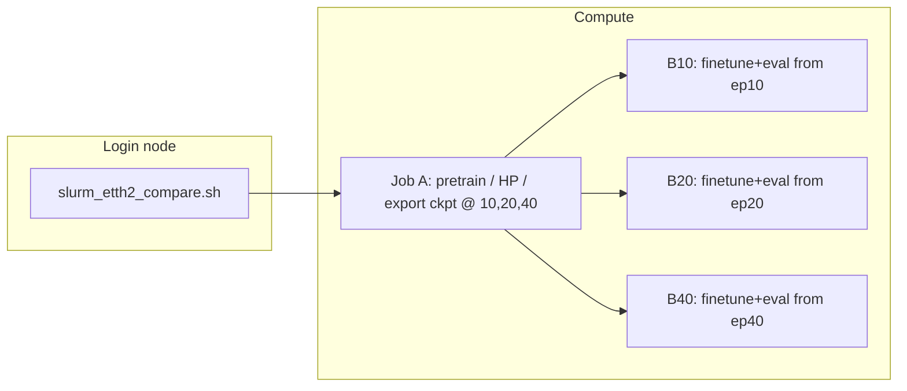

# Hyper-detailed walkthrough: Gaussian multivariate pipeline (ts-sandbox)

Companion to `gaussian_pipeline_extreme_walkthrough.md`. This document is **implementation-first**: it traces tensors, names every major submodule down to layer lists, indexes U-Net levels precisely, and records defaults from `DiffusionTSFConfig` as of the repo state when this file was written.

**Scope:** Gaussian diffusion, variate-factorized path (e.g. ETTh2 with `--n-variates 7`), Slurm chain `slurm_etth2_compare.sh`. Binary diffusion and latent-only branches are out of scope except where code is shared.

---

## 0) Reading map (files ↔ roles)

| Area | Primary files |
|------|----------------|
| Slurm orchestration | `slurm_etth2_compare.sh`, `slurm_profile_one_epoch.sh` |
| CLI / stages / data load | `models/diffusion_tsf/train_multivariate_pipeline.py` |
| End-to-end model | `models/diffusion_tsf/diffusion_model.py` |
| U-Net | `models/diffusion_tsf/unet.py` |
| Noise schedule + DDIM sampler | `models/diffusion_tsf/diffusion.py` |
| 2D CDF + blur + inverse | `models/diffusion_tsf/preprocessing.py` |
| Hyperparameter dataclass | `models/diffusion_tsf/config.py` |
| iTransformer wrapper | `models/diffusion_tsf/guidance.py` |
| iTransformer baseline | `models/iTransformer/model/iTransformer.py`, `layers/Transformer_EncDec.py`, `layers/SelfAttention_Family.py`, `layers/Embed.py` |
| Synthetic pretrain | `models/diffusion_tsf/dataset.py`, `realts.py`, `augmentation.py` |

---

## 1) Slurm: DAG, preamble, persistent venv under STORE

### 1.1 Effective job graph



Job A runs `python -u -m models.diffusion_tsf.train_multivariate_pipeline` with `--mode pretrain` and exports milestone checkpoints; B* jobs depend on A with `--mode finetune-subset` (or equivalent) for ETTh2.

### 1.2 Shared preamble (`$STORE/job_preamble.sh`)

Each batch job sources a generated preamble that:

1. Loads modules: `StdEnv/2023`, `python/3.11`, `cuda/12.2`, `cudnn/8.9`.
2. **Python venv at `$STORE/venv`:** path is baked into the preamble at submit time (same as `${STORE}`). If `venv/bin/python` and `activate` exist, the job **reuses** it; otherwise it runs `virtualenv --no-download "$STORE/venv"`. Subsequent `pip install` lines reconcile packages (usually cheap when already satisfied).
3. Installs torch (wheel cache first), `wandb` with `--no-index`, then `optuna`, `matplotlib`, `einops`, `reformer-pytorch==1.4.4`, and `requirements.txt`.

---

## 2) Pipeline stages (what “4-stage” means in code)

Inside **pretrain** (`run_pretrain_mode` and helpers), the logical order is:

1. **iTransformer Optuna HP search** on synthetic data (`--itransformer-trials`, etc.).
2. **iTransformer pretrain** on synthetic windows (RealTS / `get_synthetic_dataloader`).
3. **Diffusion Optuna** (guided by frozen iTransformer when configured).
4. **Diffusion Gaussian pretrain** on synthetic data, with optional `--diffusion-export-epochs` writing milestone checkpoints for downstream finetune jobs.

Slurm **B10/B20/B40** are not extra “stages” inside Python; they are separate jobs that consume exported checkpoints.

---

## 3) Data: dataset loader vs model normalization (two layers)

### 3.1 `load_dataset` (real CSV benchmarks)

- Chronological split **70% / 10% / 20%** for train / val / test windows.
- **Z-score** each variate using **train slice only** (`mean`, `std` on `data[:train_end]`), then apply to the full series before windowing. This removes validation/test leakage from global stats.
- `TimeSeriesDataset` builds sliding windows: `lookback`, `horizon`, `stride`, `lookback_overlap`.

### 3.2 `_normalize_sequence` inside `DiffusionTSF`

For each batch, **past** (and **future** during training) is normalized again using **per-sequence** statistics computed from the **past** window only:

- `mean = past.mean(dim=-1, keepdim=True)`, `std = past.std(dim=-1, keepdim=True) + 1e-8`
- `past_norm`, `future_norm = (past - mean)/std`, `(future - mean)/std`

So the model sees **locally standardized** windows even after dataset-level z-scoring. That is intentional (non-stationary handling) but means two normalization layers stack; ablations should be aware of it.

### 3.3 Synthetic pretrain

- `get_synthetic_dataloader` → `RealTS` dataset: mixed generator families (RWB, PWB, LGB, TWDB, IFFTB, STB, seasonal), optional disk cache, multivariate coupling via `augmentation.py`.
- **Reproducibility caveat:** stochastic sampling / cache index behavior can weaken strict “epoch N is always the same samples” unless seeds and sampler semantics are pinned end-to-end.

---

## 4) Representation: `TimeSeriesTo2D` and `VerticalGaussianBlur`

### 4.1 CDF occupancy map (`TimeSeriesTo2D`)

**Parameters (defaults):** `height` = `config.image_height` (default **64**), `max_scale` = **3.5**.

**Forward (per paper implementation in code):**

1. Input `x`: `(B, V, L)` or `(B, L)` → promoted to `(B, V, L)`.
2. Clip values to `[-max_scale, max_scale]`.
3. Bin index per value:  
   `bin = clamp(floor((x + max_scale) / (2*max_scale) * height), 0, height-1)`.
4. For each column (time step), set rows `0..bin` to 1 and rows above to 0: monotone “filled from bottom” CDF staircase in value dimension.

**Output:** `(B, V, height, L)` with values in `{0,1}` before blur.

**Inverse (`inverse`):**

- `cdf_decoder="mean"` (default): column sum → normalized height → map back to approximately `[-max_scale, max_scale]`.
- `cdf_decoder="pdf_expectation"`: discrete PDF from finite differences of CDF, optional `decode_temperature` sharpening, expectation over bin indices.

Registered buffer `bin_centers` exists for diagnostics / compatibility; forward uses the floor-bin rule above.

### 4.2 Vertical Gaussian blur (`VerticalGaussianBlur`)

- **Defaults:** `kernel_size=31`, `sigma=1.0` in config (constructor in `DiffusionTSF` passes `config.blur_kernel_size`, `config.blur_sigma`).
- **Kernel shape:** `(1, 1, kernel_size, 1)` — convolved with `groups=channels`, **reflect** pad on height only.
- Effect: smooths **across value bins**; **time axis stays sharp** at this stage.

### 4.3 `encode_to_2d`

1. `image = to_2d(x)`
2. `blurred = blur(image)`
3. If `scale_for_diffusion`: clamp to `[0,1]`, then `* 2 - 1` → **Gaussian diffusion works in [-1, 1]**.

---

## 5) Diffusion scheduler (`DiffusionScheduler`)

**Construction (`__init__`):**

- `num_steps` = `config.num_diffusion_steps` (default **1000**).
- `beta_start`, `beta_end` (defaults **1e-4**, **0.02**) for linear schedule.
- `schedule`: `"linear"` | `"cosine"` | `"sigmoid"` | `"quadratic"`.
- Tensors on device: `betas`, `alphas = 1 - betas`, `alphas_cumprod`, `alphas_cumprod_prev` (padded with 1 at t=0), `sqrt_*` caches.

**Training (DDPM ε-prediction objective):**

- `add_noise(x0, t, noise?)`:  
  `x_t = sqrt(ᾱ_t) x0 + sqrt(1-ᾱ_t) ε`.
- Loss = `MSE(ε_θ(x_t, t, cond), ε)` — standard Ho et al. noise-prediction. DDIM is not used during training.

**From predicted noise:**

- `predict_x0_from_noise(x_t, t, noise_pred)` inverts the above.

**DDIM step (`ddim_step`) — inference only:**

- DDIM is a drop-in sampler; compatible with any ε-prediction model regardless of training sampler.
- Predicts `x0` from `x_t`, **clamps `x0`** with a dynamic range tied to `alpha_bar` (widens at noisy steps).
- Computes `sigma` from `eta` (DDIM stochasticity); if `eta=0`, deterministic path.
- Updates `x_{t-1}` per standard DDIM.

**Sampling helper:** `sample_ddim_cfg` builds a subsequence of timesteps linearly from `T-1` down to `0` with length `num_steps` (e.g. 50), supports **classifier-free guidance** on the **noise prediction** when `cfg_scale > 1` and `null_cond` is provided.

**Config knobs:** `ddim_steps`, `ddim_eta`, `cfg_dropout`, `cfg_scale`.

---


## 6) `DiffusionTSF` assembly (Gaussian U-Net path), slowly

This section explains how the main model object is assembled when we are in the Gaussian image-diffusion route (not the transformer-only route).

Important current behavior (to avoid old mental models):
- We do **not** denoise all variates as parallel U-Net channels.
- In factorized multivariate mode, the U-Net runs on `(BV, 1, H, W)` (one variate-map per sample), with shared weights.
- Cross-variate information is injected through `encoder_hidden_states` into hybrid attention blocks concentrated in deeper levels and the middle block (near bottleneck).

### 6.0 First branch: which model family are we building?

Inside the model setup logic, there is an early branch:
- If `config.model_type == "transformer"`, code builds `DiffusionTransformer`.
- Otherwise, we build the Gaussian `DiffusionTSF` pipeline with U-Net.

Why this branch matters:
- The rest of this document assumes we are in the U-Net image diffusion path.
- If you accidentally run transformer mode, many tensors and channels described below will not exist in the same way.

### 6.1 Channel accounting from `DiffusionTSFConfig` (what each channel means)

In variate-factorized multivariate mode (common ETTh2 style), each variate is treated almost like its own mini-image diffusion problem, while still allowing cross-variate context.

Core config flags:
- `variate_factorized=True`: process each variate map as a separate sample in the U-Net forward.
- `num_variables=V`: number of variates (features) in the time series.

Now define channel counts carefully:

1. `backbone_in_channels`  
   Formula: `1 + num_aux_channels + (1 if use_guidance_channel else 0)`.
   - Base `1`: the noisy future occupancy map for one variate.
   - `num_aux_channels`: optional helper channels (coordinate ramp, time ramp, value hints, etc.).
   - Optional `+1`: iTransformer guidance ghost channel, if enabled.

2. `visual_cond_channels`  
   Usually:
   - `1` for the past-tail occupancy condition map.
   - Optional +1 for value-channel variants (if enabled).

3. `out_channels`  
   For Gaussian diffusion this is `1`, because the U-Net predicts one noise field (`epsilon`) per variate map.

4. `cond_in_channels` passed internally  
   Set as `backbone_in_channels - guidance_channels`.
   Why: in certain conditioning modes, the conditioning encoder should not receive guidance-only channels that are meant for another role.

Why so much bookkeeping:
- In diffusion models, a wrong channel count usually does not fail immediately in a readable way; it often appears later as shape mismatch.
- Reading this section first makes debugging much easier.

### 6.2 Which context encoder gets created? (`use_hybrid_condition`)

`DiffusionTSF` can optionally build a 1D context path that feeds `encoder_hidden_states` into U-Net cross-attention.

The constructor logic is:
- If `use_hybrid_condition=False`:
  - `context_encoder = None`.
  - U-Net runs without cross-attention context tokens.
- If `use_hybrid_condition=True` and `variate_factorized=True`:
  - Build `VariateCrossEncoder`.
  - Input expectation: `(B, V, T)` normalized series.
  - Output tokens: `(B, V, context_dim)`, i.e. one token per variate.
  - Important correction: this branch is chosen even when `V=1`; `V>1` is not required by constructor logic.
- If `use_hybrid_condition=True` and `variate_factorized=False`:
  - Build `TimeSeriesContextEncoder`.
  - Input built by `_prepare_1d_context`: stack `[value, normalized_time_index]` per step.
  - Output tokens: `(B, L_past, context_dim)`, i.e. one token per time step.

What the two encoders represent:
- `TimeSeriesContextEncoder` preserves full temporal granularity along the past axis; attention can look up step-level context.
- `VariateCrossEncoder` compresses each variate into summary stats (mean/trend/std over a trailing window), then runs cross-variate transformer attention so each variate token carries interactions with other variates.

Why this exists:
- 2D occupancy conditioning is strong at local geometric structure.
- Cross-attention tokens add a separate symbolic context stream (temporal or cross-variate) that the U-Net can query while denoising.
- In factorized mode this is especially useful: each variate map is denoised with shared U-Net weights, while cross-variate coupling is reintroduced through those variate tokens at attention blocks/bottleneck.

Repo-root shell script default behavior:
- The root Slurm wrappers do not pass a dedicated CLI flag for hybrid conditioning.
- They call `models.diffusion_tsf.train_multivariate_pipeline`, whose `create_diffusion_model(...)` sets `use_hybrid_condition=True` in `DiffusionTSFConfig`.
- So for those scripts, hybrid conditioning is effectively on by default unless code is changed.

### 6.3 `_forward_factorized`: full tensor trail and why each object exists

We now walk one training forward pass in factorized mode.

Symbols used:
- `B`: batch size.
- `V`: number of variates.
- `H`: image height (`config.image_height`, value-bin axis).
- `W_fut`: future width in 2D image space (usually forecast length, adjusted by overlap/unified axis logic).
- `T`: total diffusion steps (`config.num_diffusion_steps`).

Step-by-step:

1. Normalize sequences with `_normalize_sequence(past, future)`.
   - Input `past`: `(B, V, L_past)`.
   - Input `future`: `(B, V, L_fut)`.
   - Output:
     - `past_norm`: `(B, V, L_past)`.
     - `future_norm`: `(B, V, L_fut)`.
     - `stats`: mean/std stats used later for denormalization.
   Why:
   - Keeps per-window scale stable.
   - Makes diffusion training less sensitive to absolute amplitude drift across windows.

2. Convert future target to 2D occupancy.
   - `future_2d = encode_to_2d(future_norm)` -> `(B, V, H, W_fut)` in `[-1, 1]`.
   Why:
   - Diffusion U-Net expects image-like inputs; occupancy map is the bridge from 1D series to 2D spatial processing.

3. Sample diffusion timestep.
   - `t ~ Uniform({0, ..., T-1})`, shape `(B,)`.
   Why:
   - DDPM training draws random noise levels so one network learns denoising across all stages.

4. Add noise with scheduler.
   - `noisy_future, noise = scheduler.add_noise(future_2d, t)`.
   - Both shaped `(B, V, H, W_fut)`.
   Meanings:
   - `noisy_future`: `x_t`, the corrupted image at timestep `t`.
   - `noise`: actual sampled epsilon used to create `x_t`, and the target for noise-prediction loss.

5. Guidance from iTransformer.
   - iTransformer forecasts 1D future.
   - Forecast is normalized and encoded into `guidance_2d`.
   Why:
   - Gives the diffusion model a coarse trajectory prior, while diffusion refines sharp/local geometry.

6. Build cross-variate context tokens.
   - `ctx = _get_cross_variate_context(...)` -> `(B, V, context_dim)` or `None`.
   Why:
   - Lets each per-variate denoising path attend to summary tokens from all variates.

7. Flatten `(B, V)` into one dimension for the U-Net batch.
   - `BV = B * V`.
   - `canvas = noisy_future.reshape(BV, 1, H, W_fut)`.
   - Inject aux channels and optional guidance to reach `backbone_in_channels`.
   Why:
   - Reusing one shared U-Net over `BV` samples is simpler and memory-efficient compared to separate model copies per variate.

8. Prepare visual conditioning map.
   - `past_tail = past_norm[..., -W_fut:]`.
   - `past_2d_cond = encode_to_2d(past_tail)`.
   - reshape to `(BV, 1, H, W_fut)`, with dropout rules.
   Why:
   - The model conditions on recent past geometry aligned to future width.

9. Flatten cross-attention tokens when present.
   - `ctx_flat = ctx.unsqueeze(1).expand(-1, V, -1, -1).reshape(BV, V, context_dim)`.
   Semantics:
   - For each of the `BV` denoising items, token memory contains all `V` variate tokens.
   Why:
   - Each denoising stream can use cross-variate relationships even though visual input is factorized.

10. U-Net forward and reshape back.
    - `noise_pred_flat = noise_predictor(canvas, t_flat, cond_for_unet, encoder_hidden_states=ctx_flat)`.
    - reshape to `(B, V, H, W_fut)`.
    Meaning:
    - Predicted epsilon (`epsilon_theta`) at each spatial location.

Loss components:
- `noise_loss`: MSE between predicted epsilon and true epsilon.
- `emd_loss`: mean absolute CDF difference between predicted `x0` and target future CDF image.
- Optional `monotonicity_loss`: penalizes violations of CDF monotonic structure.
- Total:
  - `loss = noise_loss + emd_lambda * emd_loss + monotonicity_weight * mono_loss`.
  - Defaults include `emd_lambda=0.2`, monotonicity disabled unless configured.

Why multi-term loss:
- Pure epsilon MSE is standard diffusion training.
- CDF/EMD-like term biases toward occupancy-geometry faithfulness.
- Monotonicity term protects representation validity when enabled.

---

## 7) `ConditionalUNet2D` internals, level by level with variable meaning

This section describes exactly what the U-Net contains and how indices map to resolution levels.

### 7.1 Constructor defaults and what they imply

Important defaults:
- `channels=[64,128,256,512]`: feature widths by depth level.
- `num_res_blocks=2`: two residual blocks per stage.
- `attention_levels`: indices into down-block positions.
- `time_emb_dim=256`: timestep embedding width.
- `num_groups=8`: GroupNorm groups.
- `kernel_size=(3,3)`: local convolution support over (value-axis, time-axis).
- `conditioning_mode="visual_concat"` in default pipeline.
- `use_hybrid_condition`: allows spatial transformer + cross-attention route.

Why this layout:
- It is a standard, strong tradeoff for medium-sized diffusion tasks.
- Wider channels at lower resolution increase global context capacity.

### 7.2 Timestep embedding path (`t` -> `t_emb`)

Flow:
1. `get_timestep_embedding(t, 256)` creates sinusoidal embeddings.
2. `time_mlp`: `Linear(256->1024) -> SiLU -> Linear(1024->256)`.
3. Each residual block has its own projection `Linear(256->out_channels)` and adds the result as `(B, C, 1, 1)`.

Variable meanings:
- `t`: integer diffusion step index.
- `t_emb`: learned embedding summary of noise level.

Why:
- Same image at different diffusion timesteps means different denoising function.
- Time embedding tells every block which denoising regime it is in.

### 7.3 Input stack in `visual_concat` mode

Before first conv:
- Model receives noisy input channels plus visual condition channels concatenated along channel axis.

`init_conv`:
- `Conv2d(init_conv_in_channels -> 64, kernel 3x3, same padding)`.

`init_conv_in_channels` meaning:
- `in_channels` from noisy/guidance/aux stack.
- `+ visual_cond_channels` from past conditioning map(s).

Why concat works:
- It is simple and effective for image-like conditioning.
- No extra encoder is needed for the default path.

### 7.4 Attention map: where each type appears (default config)

`attention_levels` is now the **only** knob. Whatever loop index is listed gets a
`SpatialTransformerBlock` (self-attention + cross-attention); everything else just
runs the residual stack. The middle block always has one regardless.

Default `channels=[64,128,256,512]`, `attention_levels=[1,2]`:

```
Stage              | Channels | SpatialTransformerBlock?
-------------------|----------|--------------------------
Down block i=0     | 64→128   | no   (0 not in [1,2])
Down block i=1     | 128→256  | yes
Down block i=2     | 256→512  | yes
Middle             | 512→512  | yes  (always)
Up block i=0       | 512→256  | yes  (mirrors down i=2)
Up block i=1       | 256→128  | yes  (mirrors down i=1)
Up block i=2       | 128→64   | no   (mirrors down i=0)
```

To add or remove attention at a depth, just add or remove its index from `attention_levels`.

### 7.5 What self-attention is doing

`SpatialTransformerBlock` flattens the 2D feature map to `H×W` spatial tokens and runs
multi-head self-attention over them. This lets the model mix information across every
spatial location in the occupancy image at that resolution — both across value-axis rows
and across time-axis columns.

The first down block (`i=0`, highest spatial resolution) skips attention; the residual
convolutions are sufficient at full resolution and it keeps cost down.

### 7.6 What cross-attention is doing

Cross-attention runs *after* self-attention inside every `SpatialTransformerBlock`.
Its keys and values come from `encoder_hidden_states`, not from the feature map.

In factorized multivariate mode, the U-Net predicts one target variate per forward path
(implemented as flattening `(B, V, ...) -> (B*V, ...)` with shared weights). It is **not**
an all-variates-at-once output head.

Cross-variate information is still global: `encoder_hidden_states` comes from
`VariateCrossEncoder`, which runs over all V variates and emits one token per variate
`(B, V, context_dim)`.
Before the U-Net call that tensor is broadcast so every variate slot gets all V tokens:

```python
ctx_flat = ctx.unsqueeze(1).expand(-1, V, -1, -1).reshape(BV, V, -1)
# (B, V, ctx_dim)  →  (B*V, V, ctx_dim)
```

So each target variate's `H×W` spatial queries attend over V keys/values — one compact
stat summary per variate. If `encoder_hidden_states` is `None` (e.g. univariate), the
cross-attention step is skipped and the block acts as self-attention only.

With the current pipeline defaults, the token source is the iTransformer normalized
forecast (`guidance_forecast_norm`), not raw past values. The raw past is only a fallback
when no guidance forecast is present.

Guidance enters in two distinct paths:
- **2D guidance channel (U-Net input):** one ghost CDF map for the **same target variate**
  is concatenated to that variate's noisy-future canvas (`(BV, 1, H, W_fut)` append).
- **Cross-attention tokens:** summary stats from **all V variates'** iTransformer forecast
  become the `V` context tokens each target variate attends to.

Cross-attention is applied in every `SpatialTransformerBlock` (selected down/up levels and
always in the middle block), not only in a single bottleneck call site.

**Self-attention:** which spatial positions in my feature map should mix?
**Cross-attention:** given a summary of every variate's recent behaviour, how should I adjust?

### 7.7 `attention_levels` index arithmetic

Down blocks are built with `for i, out_ch in enumerate(channels[1:])` so `i` is a
loop counter in `0 .. len(channels)-2`, not a channel size.

With `channels=[64,128,256,512]` there are three down blocks:

| Loop index `i` | Channels in → out | `i in [1,2]`? |
|----------------|-------------------|---------------|
| `0` | 64 → 128 | no |
| `1` | 128 → 256 | yes |
| `2` | 256 → 512 | yes |

Up blocks use `(len(channels) - 2 - i) in attention_levels` so the same depth labels
apply symmetrically (index `2` on the way down = index `0` on the way up, etc.).

Using an out-of-range index silently does nothing.

**Order within a `DownBlock`:** residual blocks → optional `SpatialTransformerBlock` → strided-conv downsample. Skip saved after attention, before downsample.

**Order within an `UpBlock`:** transpose-conv upsample → concat skip → residual blocks → optional `SpatialTransformerBlock`.

### 7.8 `SpatialTransformerBlock` internals

GroupNorm → 1×1 `proj_in` → flatten `(B,C,H,W)` to `(B,HW,C)` → self-MHA →
cross-MHA to `encoder_hidden_states` (skipped if `None`) → FFN (`C→4C→C`) →
reshape → 1×1 `proj_out` → residual add.

### 7.9 Output head

Final projection:
- `GroupNorm(64) -> SiLU -> Conv2d(64->out_channels)`.
- For Gaussian path, `out_channels=1`.

Output meaning:
- Predicted epsilon map, same spatial shape as noisy target map.

### 7.10 Gradient checkpointing switch

If `use_gradient_checkpointing=True` and model is training:
- Down blocks, middle, and up blocks run under checkpointing (`use_reentrant=False`).

Why:
- Reduces memory by recomputing intermediates on backward.
- Helpful for larger batches or larger resolutions at cost of runtime.

---

## 8) Context encoders: what they are, what they produce, and how that feeds into the U-Net

The U-Net cross-attention in §7.6 needs something to attend *to* — a sequence of tokens with meaningful content. That sequence comes from a **context encoder** that runs before the U-Net on the original 1D time series. This section explains what each encoder does step by step.

There are two encoders; exactly one is used per run:

| Encoder | When it is used |
|---|---|
| `VariateCrossEncoder` | `variate_factorized=True` (the default multivariate path) |
| `TimeSeriesContextEncoder` | `variate_factorized=False` (non-factorized, single-variable path) |

Both are only active when `use_hybrid_condition=True`. If that flag is False, `context_encoder` is set to None and no tokens are produced at all.

### 8.1 `VariateCrossEncoder` — the default for multivariate runs

**What problem it is solving.**
In the factorized setup there are V separate U-Net forward passes (one per variate). Each pass only sees that variate's occupancy image. The encoder's job is to give every one of those passes a compact read-only summary of all the other variates, so the denoising of variate `k` can be informed by what variate `j` is doing.

**Input.** In the current always-guided path, the input is the iTransformer normalized forecast, shape `(B, V, T)` (with `T` equal to the guided forecast width including overlap). The encoder summarizes that guidance sequence per variate before cross-variate attention. (Fallback to raw past exists only for non-guided/legacy paths.)

**Step 1 — take only the last 32 timesteps (`summary_window=32`).**
```python
tail = x[..., -min(T, 32):]   # (B, V, 32)
```
The full lookback can be hundreds of steps; we only need a recent snapshot to characterise the current regime of each variate.

**Step 2 — compute three numbers per variate.**
```python
mean  = tail.mean(dim=-1)                            # (B, V)
std   = tail.std(dim=-1).clamp(min=1e-6)             # (B, V)
trend = (tail[..., -1] - tail[..., 0]) / (w - 1)    # (B, V)  per-step slope
```
Each variate is now described by just three scalars: its recent level, its recent volatility, and whether it is rising or falling.

**Step 3 — project those three numbers into a `context_dim`-dimensional vector.**
```python
stats = torch.stack([mean, trend, std], dim=-1)   # (B, V, 3)
x_emb = nn.Linear(3, context_dim)(stats)          # (B, V, 128)
```
Now we have one 128-d embedding per variate, but the variates haven't talked to each other yet.

**Step 4 — run a small transformer *across* the V variate tokens.**
```python
x_emb = transformer_encoder(x_emb)   # still (B, V, 128)
```
This is a standard transformer with self-attention across the V token sequence. Token `k` attends to all other tokens and updates itself to reflect cross-variate dependencies — e.g. "variate 2 is highly correlated with me and is rising, so I should expect to rise too." Two layers, four heads by default.

**Step 5 — LayerNorm and done.**
Output: `(B, V, 128)` — one 128-d token per variate, cross-variate-aware.

**What the U-Net does with this.**
As shown in §7.6, before calling the U-Net the code replicates this tensor so every variate slot in the `B*V` batch gets the full V-token sequence:
```python
ctx_flat = ctx.unsqueeze(1).expand(-1, V, -1, -1).reshape(BV, V, -1)
# (B*V, V, 128) — every variate's U-Net pass can cross-attend to all V tokens
```
The U-Net cross-attention then uses the `H*W` spatial feature tokens as queries and these V tokens as keys/values at every `SpatialTransformerBlock` that is switched on.

### 8.2 `TimeSeriesContextEncoder` — used in non-factorized mode only

This encoder is for the case where variates are not processed separately: the U-Net sees all variates stacked as channels. There is no per-variate token structure; instead the context is a sequence of **time-step tokens** derived from the past values of the first (or only) variate.

**Input preparation (`_prepare_1d_context`).**
Takes the normalized past `(B, T)` and pairs each time step's value with a normalised position index:
```python
time_idx = torch.linspace(0.0, 1.0, T)        # position 0 = oldest, 1 = most recent
context_input = torch.stack([past_1d, time_idx], dim=-1)   # (B, T, 2)
```
This gives the encoder both the *what* (value) and the *when* (position) for every step.

**Pipeline.**
1. `Linear(2 → 128)` — project each time step’s `[value, position]` pair from 2-d into 128-d. This is the standard transformer input projection: a transformer operates on a sequence of fixed-size vectors (the model dimension), so every element — no matter how small the raw input — must be lifted to that size first. The `Linear(2, 128)` weight matrix has shape `(128, 2)` and learns how to spread the two input numbers across all 128 dimensions in a way that makes downstream attention useful. Think of NLP word embeddings: one integer (a token ID) gets mapped to a 768-d vector by the same logic.
2. Add sinusoidal positional encoding (separate from the `position` scalar already in the input; standard transformer practice to bake in absolute order).
3. Two transformer encoder layers (self-attention across time steps + FFN, pre-norm).
4. `LayerNorm`.

Output: `(B, T, 128)` — one 128-d token per past time step.

The U-Net cross-attention then has `T` keys/values to attend to instead of V. Each spatial feature token in the U-Net can look up specific time steps from the past, not just per-variate summaries.

### 8.3 Summary: what the tokens actually represent

| Encoder | Token sequence length | What one token represents |
|---|---|---|
| `VariateCrossEncoder` | V (number of variates) | summary of one variate's recent level/trend/volatility, after cross-variate attention |
| `TimeSeriesContextEncoder` | T (past sequence length) | embedding of one past time step (value + position) |

The first is cheap and cross-variate-aware but very lossy — three numbers summarise a whole variate. The second is richer in temporal detail but doesn't explicitly model variate-to-variate relationships.


---

## 9) iTransformer guidance stack

### 9.1 What problem it solves and when it is active

In the current training path, iTransformer guidance is **always on**.

There is no user-facing guidance toggle in `train_multivariate_pipeline.py` anymore. Model creation in this pipeline now hard-enables `use_guidance_channel=True`, so every train/infer run through this path uses iTransformer guidance by default.

Operationally, an iTransformer is run first on every batch to produce a **coarse deterministic forecast**. That forecast is converted into a second occupancy image (the "ghost image") and concatenated as an extra channel to the U-Net input. The U-Net then sees both "what the past looks like" and "what a strong baseline model predicts the future looks like", and learns to refine the latter.

### 9.2 The two ways the iTransformer feeds into the pipeline

With guidance always enabled in the current pipeline, the iTransformer output is used in **two separate places**:

**Place 1 — extra input channel to the U-Net ("ghost image")**

The coarse forecast `(B, V, forecast_length)` is z-score normalized with the same per-sequence stats used for the diffusion target, then converted to a 2D CDF occupancy map by the same `encode_to_2d` function. In factorized mode this gives a `(B*V, 1, H, W_fut)` image that is concatenated onto the U-Net input canvas alongside the noisy future and the past visual conditioning:

```python
if guidance_2d is not None:
    canvas = torch.cat([canvas, guidance_2d.reshape(BV, 1, H, W_fut)], dim=1)
```

This adds one extra input channel, so `backbone_in_channels` includes the guidance channel in this path. The U-Net literally sees the iTransformer's prediction as a pixel image sitting next to the noisy occupancy map it is trying to denoise.

**Place 2 — input to `VariateCrossEncoder` (cross-attention tokens)**

`_get_cross_variate_context` prefers the iTransformer's normalized forecast over the raw past as input to `VariateCrossEncoder`:

```python
if guidance_forecast_norm is not None:
    src = guidance_forecast_norm   # use iTransformer output if available
else:
    src = past_norm                # fall back to raw past
```

So the V summary tokens that feed into cross-attention are derived from the iTransformer's forecast rather than from the raw lookback. This means the cross-attention tokens encode "what a strong baseline thinks each variate will do" rather than "what each variate has recently been doing".

### 9.3 The iTransformer itself

The iTransformer is wrapped in `iTransformerGuidance`, which:
- Keeps the weights **frozen** (`.requires_grad_(False)` at construction; `torch.no_grad()` at every call). It is never co-trained with the diffusion model.
- Exposes a single method `get_forecast(past, forecast_length) → (B, V, forecast_length)` in the axis order the rest of the pipeline expects.

Internally, the iTransformer uses an **inverted embedding**: instead of treating time steps as tokens (as a standard Transformer would), it treats **variates as tokens**. Each variate's full lookback is embedded as one token; the transformer then runs attention across those V tokens to produce a forecast per variate. This is why it captures cross-variate structure well and makes its output a reasonable starting point for the diffusion refinement.

### 9.4 At inference

The same two-place injection happens at inference. There is also an optional **guidance cache** (`_guidance_cache`): if the dataset window indices are known ahead of time, iTransformer forecasts can be precomputed and stored to avoid re-running the iTransformer on every DDIM step. When the cache is populated, `_forward_factorized` looks up the precomputed tensor instead of calling `guidance_model.get_forecast`.

### 9.5 Summary

```
Current pipeline behavior:
  1. iTransformer runs on the raw past → coarse forecast (B, V, F)
  2. Forecast → 2D occupancy image → extra channel on the U-Net input canvas
  3. Forecast (normalized) → VariateCrossEncoder → cross-attention tokens
     (instead of using the raw past for the tokens)
```


---

## 10) Inference path (`generate` in factorized mode), with intent behind each step

At inference we do iterative denoising, usually with DDIM.

Flow:
1. Normalize past window and build conditioning objects (visual condition + optional context tokens + optional CFG null condition).
2. Build factorized inference batch and initialize latent noise:
   - Flatten variates into batch: `BV = B * V`.
   - Start DDIM state as `x ~ N(0, I)` with shape `(BV, 1, H, W_fut)`.
   - Keep cross-variate context tokens separately (typically shaped from `(B, V, ctx_dim)` to `(BV, V, ctx_dim)`).
3. Run DDIM loop from high noise to low noise:
   - Build per-step canvas similarly to training (same aux/guidance channel injections on top of the single-variate noisy map).
   - Predict noise with shared U-Net weights for each of the `BV` streams.
   - Inject cross-variate information through `encoder_hidden_states` at hybrid attention sites near the bottleneck/deep levels.
   - Apply DDIM update to move toward cleaner sample.
4. Reshape sampled output back from `(BV, 1, H, W_fut)` to `(B, V, H, W_fut)`.
5. Decode final 2D CDF map back to 1D future with `decode_from_2d`.
6. Optionally smooth decoded sequence depending on decode settings.

Classifier-free guidance details:
- Training side uses `cfg_dropout` to create unconditional exposure.
- Inference side mixes conditional/unconditional noise predictions with `cfg_scale`.
- Default `cfg_scale=2.0`.
---

## 12) Hyperparameter reference (defaults + what each group controls)

These are default values from `DiffusionTSFConfig` referenced in the original walkthrough; CLI often overrides some.

### 12.1 Sequence and multivariate geometry
- `lookback_length=512`: past context length in 1D samples.
- `forecast_length=96`: target horizon length.
- `lookback_overlap=0`: overlap handling for lookback/future boundaries.
- `past_loss_weight=0.3`: weighting for overlap-related loss partition logic.
- `num_variables=1` default baseline; multivariate runs override it.
- `variate_factorized=True`: process variates via factorized route.

### 12.2 2D representation
- `image_height=64`: number of vertical value bins in occupancy map.
- `max_scale=3.5`: clipping range for normalized values before binning.
- `blur_kernel_size=31`, `blur_sigma=1.0`: vertical Gaussian blur parameters.
- `unified_time_axis=False` default: separate width handling mode.

### 12.3 U-Net architecture
- `unet_channels=[64,128,256,512]`
- `num_res_blocks=2`
- `attention_levels=[1,2]`
- `unet_kernel_size=(3,3)`
- `use_dilated_middle=False`
- `separable_kernel=False`
- `use_gradient_checkpointing=False`
- `use_amp=False`

### 12.4 Diffusion process and sampling
- `num_diffusion_steps=1000`
- `beta_start=1e-4`
- `beta_end=0.02`
- `noise_schedule="linear"`
- `ddim_steps=50`
- `ddim_eta=0`
- `cfg_dropout=0.1`
- `cfg_scale=2.0`

### 12.5 Decode and augmentation behavior
- `decode_temperature=0.5`
- `decode_smoothing=False`
- plus `cutout_*` augmentation controls.

### 12.6 Loss terms
- `emd_lambda=0.2`
- `use_monotonicity_loss=False`
- `monotonicity_weight=1.0`

### 12.7 Conditioning and context
- `conditioning_mode="visual_concat"`
- `use_guidance_channel=True` in the current training pipeline path (hard-enabled there)
- `use_hybrid_condition=True`
- `context_embedding_dim=128`
- `context_input_channels=2`
- `context_encoder_layers=2`
- `use_coordinate_channel=True` and related aux-channel toggles.

### 12.8 Optimizer/training basics
- `learning_rate=2e-4`
- `batch_size=8`

Why include defaults in a slow walkthrough:
- New readers need a concrete baseline before they can reason about changes.
- Many bugs are simply mismatched assumptions about default knobs.

---

## 13) Known pitfalls (with practical interpretation)

1. `attention_levels` indexing is by down-block index, not by channel value.
   - Indices outside valid range silently do nothing.
   - Including `0` enables expensive highest-resolution attention.

2. Double normalization exists by design.
   - Dataset-level z-score and per-window past-stat normalization both operate.
   - You must account for both when validating scale-sensitive behavior.

3. Shared Slurm venv under `$STORE/venv`.
   - First job pays setup cost; later jobs usually reuse.
   - Store-backed IO can be slower than local scratch.

4. Synthetic epoch determinism is not guaranteed by default.
   - Sampling/caching semantics can vary unless every random source and loader behavior is pinned.

5. iTransformer internal normalization can stack with external normalization.
   - Important when interpreting guidance channel magnitudes.
