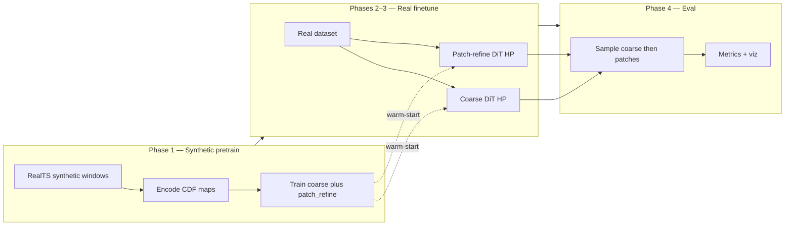
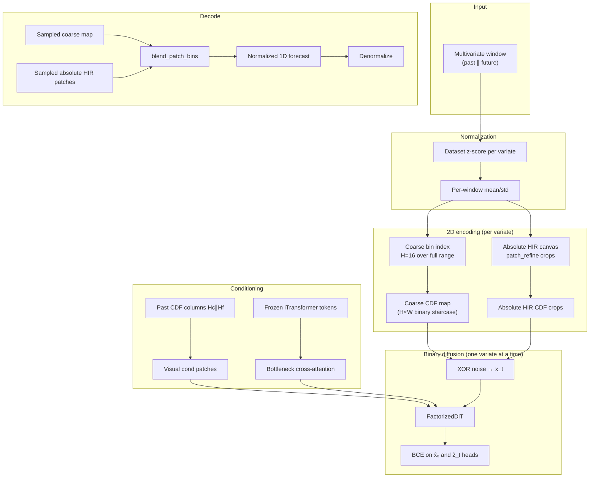

# Binary Staged Diffusion for Time Series Forecasting

This repo trains a probabilistic forecaster that treats future values as **2D binary images** and denoises them with diffusion. The core bet is simple: real series have sharp jumps, flat segments, and geometric structure that Gaussian MSE models smear out. By encoding values as hard cumulative-distribution (CDF) maps and diffusing in the **binary domain** (bit-flip noise, BCE loss), the model gets a much denser training signal on exactly those shapes.

The pipeline is **YAML-driven and multi-phase** (synthetic pretrain → real finetune HP → staged eval), **factorized per variate**, and uses **iTransformer encoder tokens** for cross-variate context when enabled. Live binary geometry is **canvas128 / patch_refine**: **p64×6** (ETTh1 and other p64 leaves) and **p32×6** (solar, exchange, weather, and other p32 leaves). Legacy residual fine-as-primary (16h×96w strip), vertical dual, channel dual, and patch-decoder guidance paths have been removed.

---

## Architecture Overview

### Representation mode (live)

| Mode | Flags | What it trains |
|------|-------|----------------|
| **Patch refine (only live binary path)** | `use_patch_refine_stage: true` | Full-horizon **coarse** DiT, then a second DiT on **overlapping absolute hi-res CDF crops** (not fine residual) from a tall canvas (`patch_refine.py` / `patch_refine_geometry.py`) |

Campaign leaves: `configs/binary_window_norm_patch_refine_canvas128_p64x6*.yaml` and `configs/binary_window_norm_patch_refine_canvas128_p32x6*.yaml` (extend flattened `earlyjuly_norm` → `base/binary_staged`). Height is the crop H (`patch_refine_patch_height`); width/stride stay 6/5. ETTh1 uses p64; solar / exchange / weather use p32. Past conditioning still stacks `Hc∥Hf` via `encode_dual_heights` / `stack_past_coarse_fine` (`fine_image_height` kept for that stack only).

Obsolete (deleted): sequential fine residual strip (`binary_ordinal_fine_finer_*`), vertical dual concat, channel dual, noise-schedule ablations, legacy `binary_anchor_ar*`.

### Training phases at a glance (patch-refine / canvas128)

| Phase | YAML `phase` | Purpose |
|-------|--------------|---------|
| **1** | `staged_diffusion_pretrain` | Teach valid CDF maps on synthetic `RealTS` (coarse + patch_refine) |
| **2** | `diffusion_coarse_finetune_hp` | Optuna-tune coarse DiT on real data |
| **3** | `diffusion_patch_refine_finetune_hp` | Optuna-tune overlapping absolute-HIR upscaler |
| **4** | `staged_eval` | Anchor + probabilistic metrics (CRPS, staged MSE/MAE) |

When cross-attention is enabled, an `itrans_finetune_hp` phase sits between pretrain and diffusion finetune. Its frozen iTransformer encoder is the sole source of cross-variate tokens; it does not provide a 2D diffusion input. Patch-decoder guidance (`guidance_type=patch_decoder`, `patch_guidance_finetune_hp`) has been removed.

Phase 1 is deliberately narrow: it does **not** need to match real data statistics. Its job is representation fluency — monotone binary staircases, column alignment, stable BCE — before real finetuning.



### End-to-end data flow

Each training or inference step follows the same encoding path. Past and future horizons are normalized, mapped to 2D CDF images, and fed to a **FactorizedDiT** that denoises **one variate per forward pass**.



**Training vs inference.** Sample full-horizon coarse, then denoise **overlapping absolute-HIR crops** (aux + optional AR prev-refine) and stitch with `blend_patch_bins`. Past visual cond remains a lossless `Hc∥Hf` stack (`stack_past_coarse_fine`).

---

### One variate at a time

Multivariate series use a **factorized batch layout**: each variate is one row in a `(B×V, C, H, W)` tensor. Self-attention inside the DiT runs over **spatial patches only**.

Cross-variate context enters at the bottleneck as frozen iTransformer encoder tokens, projected each forward by a trainable `iTransformerTokenAdapter` (dropout included). Large `B×V` (or patch-refine crop) batches are chunked via `unet_max_chunk_size`. `disable_cross_attention: true` selects visual past-conditioning only; otherwise iTransformer cross-attention is on by default. Stable real windows cache **encoder** tokens (not adapter outputs) for the diffusion phase.

---

### Dual-scale value factorization

A single tall absolute map would be one huge image. Value precision is **factored**:

1. **Coarse** — bin into `H_c = 16` over `[-max_scale, max_scale]` (or ordinal span) as a hard CDF staircase. Trained as a full-horizon FactorizedDiT.
2. **Patch refine (absolute HIR)** — second stage does **not** train a residual fine map. It encodes the future as an **absolute hi-res CDF** of height `patch_refine_canvas_height` (`encode_absolute_hir_cdf` in `patch_refine.py`), crops **boundary-centered overlapping patches**, denoises those crops, then stitches bins back (`blend_patch_bins`) and mid-bin decodes (`decode_absolute_hir_cdf`).

`fine_image_height` remains only so past conditioning can stack `Hc∥Hf` (`encode_dual_heights` / `stack_past_coarse_fine`).

Default geometry in `configs/base/binary_staged.yaml`: canvas **256**, patch **32×8**, col stride **6**. Live campaign leaves (`configs/binary_window_norm_patch_refine_canvas128_p64x6.yaml` and `...p32x6...`): canvas **128** (= 8 hi-res bins per coarse row), patch **64×6** or **32×6**, stride **5** (overlap 1), `dit_patch_size` / `dit_cond_patch_size` **[8,6]** so W divides the DiT patch.

---

### Patch refine stage (overlapping absolute HIR)

Modules: `patch_refine.py`, `patch_refine_geometry.py`, `patch_refine_segments.py`; train/sample entrypoints `_forward_binary_patch_refine` / `_generate_binary_patch_refine` in `diffusion_model.py`.

**Coarse → refine staging.** Phase 1–2 train/sample the coarse DiT on full-horizon `H_c` CDFs. Phase 3 / eval requires `future_coarse_2d` from that model: nearest-neighbour upscale to the tall canvas (`naive_upscale_coarse_cdf`), derive per-timestep coarse boundary rows (`coarse_edges_from_cdf`), then place crops.

**Crop placement.** `select_patch_locations` walks primary `col_stride` starts, vertically centers each crop on the coarse edge, then adds fill-in crops until every timestep’s boundary is covered. Overlap is `patch_width − col_stride` (e.g. 8−6=2, or canvas128’s 6−5=1).

**Absolute HIR vs residual.** Targets are absolute-canvas CDF crops, not within-bin residual maps. Visible-transition masking drops all-empty / all-full columns so out-of-view boundaries are not treated as cues. At infer, abstaining columns keep the naive coarse scaffold (`blend_patch_bins`).

**Aux channels (3).** `build_patch_aux_channels` concatenates onto the noisy occupancy canvas: (1) naive-upscaled coarse crop, (2) H-constant coarse-cell id map, (3) absolute-time map. Patch-refine never conditions on previously generated refine patches.

**Lookback cond.** Full native-width past **coarse∥fine** stack (`stack_past_coarse_fine`), expanded per crop — never resized to the patch width.

**FactorizedDiT extras (patch_refine only).** `use_patch_abs_embedding=True` adds learned embeds for `patch_coarse_bin` + `patch_time0` (absolute crop location). `use_variate_embedding` (when `variate_factorized` and `V>1`) tags each crop’s variate. Cross-attn tokens come from iTransformer `get_encoder_tokens(past)` (then `iTransformerTokenAdapter`) when `guidance_type=itransformer` and `disable_cross_attention=false`; otherwise ctx is skipped.

**Unique-segment path.** With `patch_refine_unique_segments: true` (many ordinal / guided leaves, including the canvas128 window-norm chain), train samples one fixed-`col0` crop per window (`locations_for_fixed_col0`); infer samples every stride-grid crop in parallel (`primary_stride_col0s` / `patch_layout_for_fixed_col0`) then coverage-gap fills. Overlapping stride mode (`unique_segments: false`) trains/samples all coverage crops in parallel.

**Config knobs** (`experiment.*` → `PipelineState` / `DiffusionConfig`):

| Knob | Role |
|------|------|
| `use_patch_refine_stage` | Required; enables coarse+`patch_refine` stages |
| `patch_refine_canvas_height` | Absolute HIR rows (must divide by `coarse_image_height`) |
| `patch_refine_patch_height` / `_width` | Crop H×W |
| `patch_refine_col_stride` | Primary horizontal stride (overlap = width − stride) |
| `patch_refine_unique_segments` | Unique absolute segments; infer is fully parallel across patches |
| `dit_patch_size` / `dit_cond_patch_size` | Must divide patch / lookback spatial sizes |
| `guidance_type: itransformer` | Cross-attn context from frozen iTransformer tokens (when enabled) |

---

### Binary representation (BDPM-inspired)

#### Why not Gaussian diffusion on raw values?

Standard DDPMs assume continuous data and Gaussian noise with MSE loss. That pairing is a poor fit for **discretized** structure: quantizing intermediate Gaussians causes artifacts, and MSE trains the network to predict noise rather than exact discrete states. [Binary Diffusion Probabilistic Models (BDPM)](reference/BDPM_ref.md) sidesteps this by working natively in `{0,1}`: forward corruption is **XOR bit-flip**, the denoiser predicts both clean bits and flip masks, and optimization uses **binary cross-entropy**.

We adopt that framework for time-series CDF maps rather than RGB bit-planes.

#### CDF maps vs ViTime-style PDF

An earlier **PDF / skyline** representation placed a one-hot activation on a single row (the value bin) — essentially a ViTime-style vertical stripe. Decoding diffuses gradient through a thin peak; most rows stay at zero, so the BCE/MSE signal is **sparse** and training is slow.

The current **hard binary CDF** fills every row from the bottom up to the bin index:

```
value bin k  →  rows 0..k are 1, rows k+1..H-1 are 0
```

Each column is a monotone staircase. Neighboring bins share most of their bits, so flips propagate structured, correlated gradients — much denser supervision per timestep column.

Values are clipped to `[-max_scale, max_scale]` before binning. No Gaussian blur is applied; maps are strictly `{0,1}`.

#### Forward and reverse process

**Schedule.** Quadratic-in-√t betas from `β_start = 10⁻⁵` to `β_end = 0.5` over `T = 1000` steps (`sqrt_linear` schedule).

**Forward (training corruption).** For clean binary map `x₀` and timestep `t`, draw a Bernoulli flip mask `z_t` with per-pixel flip probability `β_t`, then:

$$x_t = x_0 \oplus z_t$$

**Denoiser heads.** The DiT outputs `2×` channels: the first head predicts clean bits `x̂₀` (or equivalently the flip mask under an ε-parameterization); the second predicts `ẑ_t`.

**Loss.** Weighted BCE on both heads:

$$\mathcal{L}_\text{reg} = \mathcal{L}_\text{BCE}(\hat{x}_0, x_0) + \mathcal{L}_\text{BCE}(\hat{z}_t, z_t)$$

Optional min-SNR timestep weighting can rebalance early vs late noise levels.

**Reverse (sampling).** Starting from noise, each step predicts `x̂₀`, thresholds via sigmoid, draws a new flip mask at the lower timestep, and XORs forward. Eval defaults to **DPM-Solver++** (20 steps, 20 samples for probabilistic metrics).

---

### Anchor mechanism (adapted from MMPD)

[MMPD](reference/MMPD_methods_reference.md) (Zhang et al., ICLR 2026) adds a **deterministic anchor** to diffusion training: besides the usual noise-prediction loss at random timesteps, an extra term trains the denoiser to reconstruct the clean target from **maximum noise** in a single forward pass. The combined objective is:

$$\mathcal{L} = \lambda \,\mathcal{L}_\text{reg} + (1-\lambda)\,\mathcal{L}_\text{anchor}, \quad \lambda = 0.99$$

At the anchor timestep `t = T−1`, MMPD feeds **exact zeros** (Gaussian noise cancels the signal). The deterministic prediction is then one MLP pass — no iterative sampling — giving a fast point forecast.

#### Our binary-flat adaptation

The same **λ = 0.99** balance is used, but the anchor input is adapted to binary CDF diffusion:

| MMPD (Gaussian) | This repo (binary flat) |
|-----------------|-------------------------|
| Anchor canvas = **0** at max noise | Anchor canvas = **constant 0.5** per pixel (`stationary_flat`) |
| MSE on noise prediction | BCE on `x̂₀` vs ground-truth CDF map |
| Anchor at `ᾱ_{k*} ≈ 0.5` | Anchor at `t = T−1` (max flip rate) |

`stationary_flat` means every pixel is 0.5 — the **mean** of Bernoulli(0.5), not random bits. That fixed canvas is the binary analogue of "uninformative max noise": the model must infer the full CDF staircase from context (past columns + optional guidance tokens) alone.

At inference, the **anchor sampler** runs this one-shot path: one forward pass at max noise → sigmoid threshold → decode. No iterative diffusion. Eval reports both anchor metrics (`anchor_mse`, `anchor_mae`) and full DPM++ sample metrics (CRPS, sample-mean MSE).

---

## Analysis

### Where the model excels

**Discontinuities and step functions.** CDF maps represent a level change as a horizontal boundary moving vertically — a coherent shape for convolution and attention. Binary BCE penalizes misplaced boundaries sharply, so jumps are preserved rather than regressed to the mean.

**Flatlines and plateaus.** A constant value is a CDF column with the same cutoff row repeated across time — a flat 2D ridge. The model learns to extend these ridges without the oscillation typical of Gaussian likelihoods.

**Geometric "texture".** Recurring patterns (ramps, spikes, boxcar pulses) appear as repeated motifs in the 2D layout. Dual-scale decomposition keeps coarse structure and fine detail in separate denoising problems, which helps capture both the macro shape and sharp edges.

**Probabilistic spread when needed.** DPM-Solver++ multi-sample inference yields an ensemble for CRPS and top-k metrics; the anchor path remains available for cheap deterministic forecasts.

### Tradeoffs to keep in mind

- Very smooth, high-frequency continuous variation may be better served by more bins or longer fine stages than by coarse+fine alone.
- Cross-variate coupling is only as strong as the guidance bottleneck (when enabled) — there is no pixel-level mixing across channels.
- Coarse errors still propagate into patch-refine (naive scaffold + edge centering) / fine residual stages.

---

## Technical Details

The sections below are aimed at developers and coding assistants working in the repo.

### Current default (production)

**What we run:** window-norm **canvas128 patch_refine** binary diffusion — **p64×6** (`binary_window_norm_patch_refine_canvas128_p64x6*`, e.g. ETTh1) and **p32×6** (`...p32x6*`, e.g. solar / exchange / weather) — **stationary-flat anchor** (`0.5` canvas), overlapping absolute-HIR crops, matched non-ordinal **MMPD** baseline (`mmpd_decoder_flat_subsets_paper_lb336_hz96_matched_binary`), then discriminator eval. Vertical dual / residual fine paths are gone.

| Knob | Value | Config source |
|------|-------|----------------|
| Pipeline | YAML `phases` list | `configs/base/binary_staged.yaml` |
| Leaf experiment (h96 ordinal) | `binary_patch_refine_lb336_hz96_ordinal_tuned` (+ `_synth_fallback`) | `configs/binary_patch_refine_*.yaml` |
| Leaf (window-norm canvas128 p64) | `binary_window_norm_patch_refine_canvas128_p64x6` | `configs/binary_window_norm_patch_refine_canvas128_p64x6*.yaml` |
| Leaf (window-norm canvas128 p32) | `binary_window_norm_patch_refine_canvas128_p32x6` | `configs/binary_window_norm_patch_refine_canvas128_p32x6*.yaml` |
| Representation | Coarse + **patch_refine** absolute HIR crops | `use_patch_refine_stage: true` |
| Norm | Ordinal window norm (ordinal leaves) / window mean-std (canvas128 chain) | `use_ordinal_window_norm` / `use_window_normalization` |
| `binary_anchor_input_mode` | `stationary_flat` | flat `0.5` XOR anchor |
| Cross-variate conditioning | frozen iTransformer encoder tokens by default | `guidance_type: itransformer`; disable only with `disable_cross_attention: true` |
| MMPD match | Decoder, same lb/hz/subset | `configs/mmpd_decoder_flat_subsets_paper_lb336_hz96_matched_binary.yaml` |

---

### File map

| Area | Files |
|------|--------|
| Orchestration | `models/diffusion_tsf/pipeline/` (`orchestrator.py`, `state.py`, `phases/*`) |
| CLI entry | `models/diffusion_tsf/train_multivariate_pipeline.py` |
| Model | `models/diffusion_tsf/diffusion_model.py`, `dit.py`, `diffusion.py`, `preprocessing.py` |
| Config | `models/diffusion_tsf/pipeline/config.py`, `configs/base/binary_staged.yaml` |
| Submit | `submit_binary.sh` / `submit_mmpd.sh`; leaf YAML under `configs/`. Diagnostic probes may live under `temp/scripts/` (e.g. coverage dead-code). |
| Patch refine | `models/diffusion_tsf/patch_refine.py`, `patch_refine_geometry.py`, `patch_refine_segments.py` |
| Ordinal norm | `models/diffusion_tsf/ordinal_window_norm.py` |
| Guidance | `models/diffusion_tsf/guidance.py` (`iTransformerGuidance`) |

#### Submit conventions

- Login node: **`./submit_binary.sh`** or **`./submit_mmpd.sh` only** for training/eval campaigns. Compute worker for binary is `slurm_worker.sh` (do not sbatch it by hand for normal runs).
- Experiment variants are **leaf YAMLs** under `configs/`, not new shell wrappers. `--configs` / `--mmpd-run-config` accept bare stems (`foo` → `configs/foo.yaml`), paths, or globs.
- Geometry (lookback / horizon) and HPs live in YAML. Prefer a new leaf config over CLI sprawl.

---

### Pipeline (YAML-driven)

`PipelineState` holds paths and knobs; `Pipeline` runs registered `PipelinePhase` classes in order (`models/diffusion_tsf/pipeline/phases/`). `normalize_guidance_phases` **rejects** patch-decoder phases and obsolete fine/finer/vertical/channel phases.

Reuse configs skip synthetic pretrain via `reuse_pretrain_from_config` / `require_reuse_pretrain` when donors exist.

#### Phase map (doc numbering)

| Doc | YAML `phase` | Implementation |
|-----|--------------|----------------|
| **1** | `staged_diffusion_pretrain` | `StagedDiffusionPretrainPhase` |
| *(guidance)* | `itrans_finetune_hp` | `ITransFinetuneHPPhase` (when guidance on) |
| **2** | `diffusion_coarse_finetune_hp` | `CoarseDiffusionFinetuneHPPhase` |
| **3** | `diffusion_patch_refine_finetune_hp` | `PatchRefineDiffusionFinetuneHPPhase` |
| **4** | `staged_eval` | `StagedEvalPhase` |

Default trial/epoch counts come from `configs/base/binary_staged.yaml` and leaf overrides.

---

#### Phase encyclopedia

##### Phase 1 — Synthetic staged pretrain (`staged_diffusion_pretrain`)

Trains denoisers on synthetic `RealTS` windows (no Optuna here — fixed HP from `use_hardcoded_synthetic_hp` / Phase-1 source config).

- **Entry:** `StagedDiffusionPretrainPhase.execute` → `pretrain_diffusion` per stage.
- **Stages:** `coarse` + `patch_refine` only (`use_patch_refine_stage` required).
- **YAML defaults:** `n_samples: 10000`, `epochs: 20`, `patience: 4`.
- **Outputs:** `pretrained_<stage>/pretrained_diffusion.pt`; shared cache only when `shared_cache: true`.
- **Skip when:** stage ckpts exist, shared cache hit, or `reuse_pretrain_from_config` copies a donor (unless `force_retrain_synthetic` / missing donor with `require_reuse_pretrain: false`).
- **Smoke:** tiny `n_samples`, `epochs = 1`, `shared_cache: false`; or `python temp/scripts/smoke_patch_refine.py`.

##### iTransformer guidance (`itrans_finetune_hp`) — optional

Real-data iTransformer HP when cross-attention is enabled. Frozen encoder tokens feed FactorizedDiT bottleneck cross-attn via `get_encoder_tokens` + `iTransformerTokenAdapter` (adapter runs every train/val forward; the phase cache stores encoder tokens only). There is no 2D guidance channel.

##### Phase 2 — Coarse diffusion finetune HP (`diffusion_coarse_finetune_hp`)

Optuna-tunes the **coarse** DiT on real data; **best trial checkpoint is final**.

- **Entry:** `CoarseDiffusionFinetuneHPPhase` (`diffusion_stage: coarse`).
- **Warm-start:** `pretrained_coarse/pretrained_diffusion.pt` from Phase 1.
- **Search spaces:** `lr_only`, `lr_eff_batch_univariate`, `lr_eff_batch_univariate_ema`, `fixed`, etc. (see phase YAML).
- **Outputs:** `{checkpoint_dir}/{subset_id}/coarse/best.pt` + `metadata.json`.

##### Phase 3a — Patch-refine finetune HP (`diffusion_patch_refine_finetune_hp`) — campaign default

Same Optuna machinery for the **overlapping absolute-HIR** upscaler (`diffusion_stage: patch_refine`).

- **Entry:** `PatchRefineDiffusionFinetuneHPPhase`.
- **Requires:** coarse `best.pt`.
- **Geometry:** `patch_refine_canvas_height` / patch H×W / `col_stride` / unique-seg flags from experiment.
- **Target:** absolute HIR CDF crops (`encode_absolute_hir_cdf`), not fine residual.
- **Outputs:** `{subset_id}/patch_refine/best.pt` + `metadata.json`.

See **Patch refine stage** above for aux channels, AR unique-seg path, and DiT location embeds.

##### Phase 4 — Staged eval (`staged_eval`)

Loads coarse + patch_refine `best.pt`, runs anchor + probabilistic sampling, writes metrics.

- **Entry:** `StagedEvalPhase`.
- **Inference:** sample coarse, then absolute-HIR patch crops (`blend_patch_bins`).
- **Metrics:** `eval/staged_*` (CRPS, anchor/prob MSE, …); optional viz skipped when `skip_eval_visualizations: true`.

#### Caching and resume

| Artifact | Phase |
|----------|-------|
| `pretrained_<stage>/pretrained_diffusion.pt` | 1 |
| `{subset_id}/coarse/best.pt`, `.../patch_refine/best.pt` | 2, 3 |
| `results/partials/*_staged_anchor.json` | 4 |

`should_skip` on each phase checks these paths. Coverage probe uses `--fresh` + unique run stems + `force_retrain_synthetic` so skips do not fire.

---

### Data normalization (two layers)

1. **Dataset z-score** — train-split mean/std per variate (`load_dataset`).
2. **Per-window norm** — past mean/std applied to past+future when `use_window_normalization: true` (`_normalize_sequence`).

Synthetic pretrain: `RealTS` + `augmentation.py` (mixed generators, optional cache).

---

### Representation: hard binary CDF

Values clipped to `[-max_scale, max_scale]`, binned into `H=16` rows; occupancy map is a monotone staircase in `{0,1}` (no Gaussian blur).

**Staged (live):** coarse full-range CDF + absolute-HIR patch_refine crops. Past cond still uses `Hc∥Hf` from `encode_dual_heights`.

- **Coarse:** full-range binning → coarse CDF map.
- **Patch refine:** absolute hi-res CDF crops (not residual fine).
- **Decode:** `decode_dual(coarse, fine)` = sum of decoded coarse + fine, clamped.

**Training (legacy):** coarse predicts future coarse from past; fine conditions on **GT** future coarse. **Inference:** sample coarse, then fine, then decode.

**Only live binary path** is **patch refine** (coarse full-horizon + overlapping absolute-HIR crops) — see Representation mode / Patch refine stage above.

---

### Binary diffusion (implementation)

- Schedule: `sqrt_linear` β from `1e-5` → `0.5`, `num_steps=1000`.
- Forward: independent Bernoulli XOR flips per pixel (`BinaryDiffusionScheduler`).
- Loss: BCE on clean-bit and flip-mask heads (`out_channels=2`).
- **Stationary-flat anchor:** at `t=T−1`, anchor canvas is **constant 0.5** (not `Bernoulli(0.5)`); see `_binary_anchor_canvas_like` when `binary_anchor_input_mode=stationary_flat`.
- Combined train loss: `λ·L_reg + (1−λ)·L_anchor` with `λ=0.99`.

**Eval:** campaign leaves often use `probabilistic_sampler: quad_t` (e.g. h96 ordinal); older sweeps used `dpmpp`. Anchor path remains one-shot at max noise.

---

### Model: FactorizedDiT (staged path)

- `model_type: dit` → `FactorizedDiT` (`dit.py`); leaf `dit_patch_size` / `dit_cond_patch_size` must divide image / patch widths (e.g. `[8,8]` default, `[8,6]` on canvas128 p64×6 and p32×6).
- Typical capacity: `embed_dim=384`, `depth=8`, `heads=6`.
- One variate = one batch row (`BV`); self-attention is **spatial patches only** (no variate axis in DiT).
- **Variate embedding:** when `use_variate_embedding` and `variate_factorized` and `V>1`, a learned embed is added per row (including each patch-refine crop’s `variate_index`).
- **Patch absolute location embeds:** on `diffusion_stage=patch_refine`, `use_patch_abs_embedding` adds `coarse_bin_embed(patch_coarse_bin) + horizon_time_embed(patch_time0)`.
- Cross-variate signal: bottleneck cross-attention. With `guidance_type=itransformer`, tokens are `guidance_model.get_encoder_tokens(past_raw)` projected by `iTransformerTokenAdapter`.
- With `disable_cross_attention=true`, no cross-variate context — visual past-conditioning only. There is no forecast/ghost guidance channel in this architecture.
- Patch refine feeds **3 aux channels** (naive / coarse-cell / time) plus optional prev-refine stuffing — see Patch refine stage. Past visual cond remains `Hc∥Hf`.
- Optional **EMA** shadow weights during finetune when `training.diffusion_ema_decay > 0` (default **0.99**).

Chunking: `unet_max_chunk_size` caps `BV` (or patch-refine `N` crops) through the denoiser for memory.

---

### Guidance (optional)

Default for many ordinal leaves: **off**. When on (guided_p8 / early-July window-norm / canvas128 chain), **`guidance_type: itransformer`** with `itrans_finetune_hp`. Tokens feed FactorizedDiT bottleneck cross-attn via `get_encoder_tokens` + adapter. Patch-decoder guidance has been removed.

---

### Hyperparameters

Read merged YAML — do not rely on deleted `pipeline_config.py` defaults.

- **Base:** `configs/base/binary_staged.yaml`
- **h96 ordinal patch-refine:** `configs/binary_patch_refine_lb336_hz96_ordinal_tuned*.yaml`
- **Window-norm canvas128:** `configs/binary_window_norm_patch_refine_canvas128_p64x6*.yaml` and `...p32x6*.yaml` (extends early-July guided window-norm). Patch height is 64 or 32; both use width 6.

---

### Pitfalls

1. **Representation mode** — only `use_patch_refine_stage: true` (coarse + patch_refine). Obsolete dual/fine phases raise in `normalize_guidance_phases`.
2. **Patch refine is absolute HIR, not residual fine** — do not feed `decode_dual` residual math to patch-refine canvases; use `decode_absolute_hir_cdf` / `blend_patch_bins`.
3. **`patch_refine_canvas_height` must be divisible by `coarse_image_height`**; patch W and DiT patch W must divide cleanly (`dit_patch_size`).
4. **Double normalization** — dataset z-score then window or ordinal norm.
5. **`image_height` must divide patch size**.
6. **Training flags must reach `PipelineState`** — `training.*` keys need wiring (`training_value()` / `apply_training_section_to_state`).
7. **Subset ckpt paths** use `subset_id` (e.g. `coverage_synth_2v_s480`), not bare dataset name.
8. **Donor reuse** can silently skip synthetic pretrain — coverage probe forces fresh dirs + `force_retrain_synthetic`.
9. **`experiment.data_subset` is removed.** Config policy is only `experiment.data_subset_by_dataset`. Checkpoint/result metadata uses the same key keyed by dataset. Old artifacts with only `data_subset` fail until `python utils/backfill_data_subset_metadata.py --path <artifact>`.
10. **MMPD gap/redbox packs are per-dataset.** Shared canvas128 leaves must not set a global `mmpd_campaign_root` (that inherited an ETTh1 campaign onto weather/ETTh2/…). Use `mmpd_campaign_root_by_dataset`. Flags on + campaign set + missing pack → fail at submit/pipeline start. Flags on + no campaign for this dataset → skip.
11. **Ordinal discriminator DAG is gone.** `submit_binary.sh` no longer launches the deleted ordinal evaluator. Retained disc path is `utils/eval_discriminator_binary_vs_mmpd_univariate.py` plus `utils/disc_shared.py`.
12. **Redbox pool geometry** reads `lookback_length` / `forecast_length` on `PipelineState`. `getattr(state, "lookback")` silently used 336/96 defaults.
