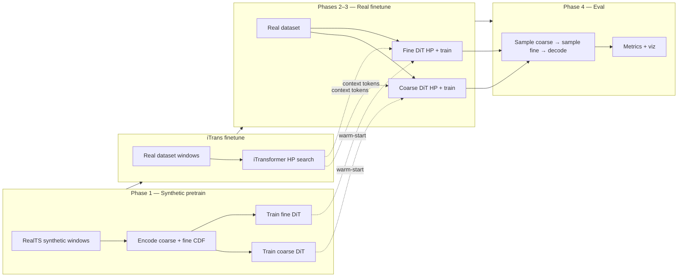
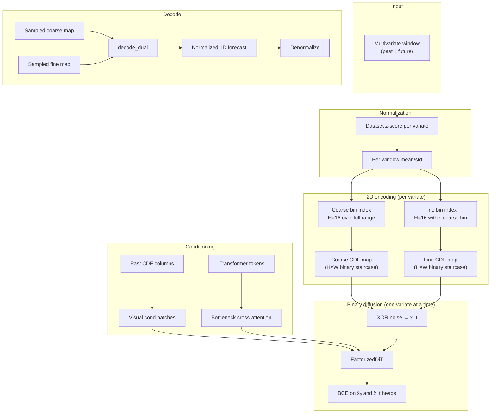

# Binary Staged Diffusion for Time Series Forecasting

This repo trains a probabilistic forecaster that treats future values as **2D binary images** and denoises them with diffusion. The core bet is simple: real series have sharp jumps, flat segments, and geometric structure that Gaussian MSE models smear out. By encoding values as hard cumulative-distribution (CDF) maps and diffusing in the **binary domain** (bit-flip noise, BCE loss), the model gets a much denser training signal on exactly those shapes.

The pipeline is **staged** (coarse scale, then fine residual), **factorized per variate** (one channel denoised at a time), and **cross-variate only at the bottleneck** via a finetuned iTransformer. Training runs as a YAML-driven multi-phase pipeline from synthetic pretrain through real-data finetune to evaluation.

---

## Architecture Overview

### Training phases at a glance

| Phase | Name | Purpose |
|-------|------|---------|
| **1** | Synthetic staged pretrain | Teach the denoiser to produce **valid CDF maps** on synthetic `RealTS` windows — no real dataset yet |
| **iTrans** | iTransformer finetune | Fit cross-variate context tokens on real data (cold start; synthetic iTrans tends toward a trivial mean predictor) |
| **2** | Coarse diffusion finetune | Optuna-tune the **coarse** DiT on real data; warm-start from Phase 1 |
| **3** | Fine diffusion finetune | Same for the **fine** residual denoiser; conditions on GT coarse during training |
| **4** | Staged eval | Chain coarse → fine sampling, decode, metrics (CRPS, anchor MSE/MAE, viz) |

Phase 1 is deliberately narrow: it does **not** need to match real data statistics. Its job is to make the network fluent in the representation — monotone binary staircases, correct column alignment, stable BCE gradients — before real finetuning teaches domain-specific patterns.



### End-to-end data flow

Each training or inference step follows the same encoding path. Past and future horizons are normalized, mapped to 2D CDF images, and fed to a **FactorizedDiT** that denoises **one variate per forward pass**.



**Training vs inference.** During training, the fine stage sees **ground-truth** coarse CDF columns as an extra condition channel. At inference, coarse is **sampled first**, then fine is sampled conditioned on that draw. Both stages share the same iTransformer context but use **separate checkpoints**.

---

### One variate at a time

Multivariate series are handled with a **factorized batch layout**: each variate is one row in a `(B×V, C, H, W)` tensor. Self-attention inside the DiT runs over **spatial patches only** — there is no variate axis in the transformer.

Cross-variate information enters **once**, at the bottleneck, through cross-attention to `V` iTransformer tokens (one token per variate). This design avoids the memory and compute explosion of joint denoising over `V` channels × `H` × `W` pixels simultaneously. With `unet_max_chunk_size`, large `B×V` batches are chunked through the denoiser without changing the math.

---

### Dual-scale decomposition

A single 256-bin discretization would mean a `256`-row image — expensive to diffuse and slow to train. Instead, value precision is **factored**:

1. **Coarse stage** — bin the normalized value into one of `H_c = 16` bins spanning `[-max_scale, max_scale]`. Encode as a hard binary CDF staircase (all rows from the bottom up to the bin index are `1`).
2. **Fine stage** — within the selected coarse bin, bin the **residual** into another `H_f = 16` levels. Again a CDF staircase, but over the local residual range `±max_scale / H_c`.
3. **Decode** — `decode_dual(coarse, fine)` decodes each map to a normalized scalar and **sums** them, then clamps to `[-max_scale, max_scale]`.

Effective resolution is `H_c × H_f = 256` buckets, but each diffusion target is only **16 rows tall**. That is roughly **16× fewer pixels per denoising step** than a flat 256-row map, which is why dual-scale training empirically converges much faster while keeping fine precision.

The two stages are **separate models**. Coarse and fine each get their own Phase 1 pretrain checkpoint and Phase 2/3 finetune run.

---

### Binary representation (BDPM-inspired)

#### Why not Gaussian diffusion on raw values?

Standard DDPMs assume continuous data and Gaussian noise with MSE loss. That pairing is a poor fit for **discretized** structure: quantizing intermediate Gaussians causes artifacts, and MSE trains the network to predict noise rather than exact discrete states. [Binary Diffusion Probabilistic Models (BDPM)](reference/BDPM_ref.md) sidesteps this by working natively in `{0,1}`: forward corruption is **XOR bit-flip**, the denoiser predicts both clean bits and flip masks, and optimization uses **binary cross-entropy**.

We adopt that framework for time-series CDF maps rather than RGB bit-planes.

#### CDF maps vs ViTime-style PDF

An earlier **PDF / skyline** representation placed a one-hot activation on a single row (the value bin) — essentially a ViTime-style vertical stripe. Decoding diffuses gradient through a thin peak; most rows stay at zero, so the BCE/MSE signal is **sparse** and training is slow.

The current **hard binary CDF** fills every row from the bottom up to the bin index:

```
value bin k  →  rows 0..k are 1, rows k+1..H-1 are 0
```

Each column is a monotone staircase. Neighboring bins share most of their bits, so flips propagate structured, correlated gradients — much denser supervision per timestep column.

Values are clipped to `[-max_scale, max_scale]` before binning. No Gaussian blur is applied; maps are strictly `{0,1}`.

#### Forward and reverse process

**Schedule.** Quadratic-in-√t betas from `β_start = 10⁻⁵` to `β_end = 0.5` over `T = 1000` steps (`sqrt_linear` schedule).

**Forward (training corruption).** For clean binary map `x₀` and timestep `t`, draw a Bernoulli flip mask `z_t` with per-pixel flip probability `β_t`, then:

$$x_t = x_0 \oplus z_t$$

**Denoiser heads.** The DiT outputs `2×` channels: the first head predicts clean bits `x̂₀` (or equivalently the flip mask under an ε-parameterization); the second predicts `ẑ_t`.

**Loss.** Weighted BCE on both heads:

$$\mathcal{L}_\text{reg} = \mathcal{L}_\text{BCE}(\hat{x}_0, x_0) + \mathcal{L}_\text{BCE}(\hat{z}_t, z_t)$$

Optional min-SNR timestep weighting can rebalance early vs late noise levels.

**Reverse (sampling).** Starting from noise, each step predicts `x̂₀`, thresholds via sigmoid, draws a new flip mask at the lower timestep, and XORs forward. Eval defaults to **DPM-Solver++** (20 steps, 20 samples for probabilistic metrics).

---

### Anchor mechanism (adapted from MMPD)

[MMPD](reference/MMPD_methods_reference.md) (Zhang et al., ICLR 2026) adds a **deterministic anchor** to diffusion training: besides the usual noise-prediction loss at random timesteps, an extra term trains the denoiser to reconstruct the clean target from **maximum noise** in a single forward pass. The combined objective is:

$$\mathcal{L} = \lambda \,\mathcal{L}_\text{reg} + (1-\lambda)\,\mathcal{L}_\text{anchor}, \quad \lambda = 0.99$$

At the anchor timestep `t = T−1`, MMPD feeds **exact zeros** (Gaussian noise cancels the signal). The deterministic prediction is then one MLP pass — no iterative sampling — giving a fast point forecast.

#### Our binary-flat adaptation

The same **λ = 0.99** balance is used, but the anchor input is adapted to binary CDF diffusion:

| MMPD (Gaussian) | This repo (binary flat) |
|-----------------|-------------------------|
| Anchor canvas = **0** at max noise | Anchor canvas = **constant 0.5** per pixel (`stationary_flat`) |
| MSE on noise prediction | BCE on `x̂₀` vs ground-truth CDF map |
| Anchor at `ᾱ_{k*} ≈ 0.5` | Anchor at `t = T−1` (max flip rate) |

`stationary_flat` means every pixel is 0.5 — the **mean** of Bernoulli(0.5), not random bits. That fixed canvas is the binary analogue of "uninformative max noise": the model must infer the full CDF staircase from context (past columns + iTransformer tokens) alone.

At inference, the **anchor sampler** runs this one-shot path: one forward pass at max noise → sigmoid threshold → decode. No iterative diffusion. Eval reports both anchor metrics (`anchor_mse`, `anchor_mae`) and full DPM++ sample metrics (CRPS, sample-mean MSE).

---

## Analysis

### Where the model excels

**Discontinuities and step functions.** CDF maps represent a level change as a horizontal boundary moving vertically — a coherent shape for convolution and attention. Binary BCE penalizes misplaced boundaries sharply, so jumps are preserved rather than regressed to the mean.

**Flatlines and plateaus.** A constant value is a CDF column with the same cutoff row repeated across time — a flat 2D ridge. The model learns to extend these ridges without the oscillation typical of Gaussian likelihoods.

**Geometric "texture".** Recurring patterns (ramps, spikes, boxcar pulses) appear as repeated motifs in the 2D layout. Dual-scale decomposition keeps coarse structure and fine detail in separate denoising problems, which helps capture both the macro shape and sharp edges.

**Probabilistic spread when needed.** DPM-Solver++ multi-sample inference yields an ensemble for CRPS and top-k metrics; the anchor path remains available for cheap deterministic forecasts.

### Tradeoffs to keep in mind

- Very smooth, high-frequency continuous variation may be better served by more bins or longer fine stages than by coarse+fine alone.
- Cross-variate coupling is only as strong as the iTransformer bottleneck — there is no pixel-level mixing across channels.
- Staged inference is sequential (coarse then fine); errors in coarse propagate to fine.

---

## Technical Details

The sections below are aimed at developers and coding assistants working in the repo.

### Current default (production)

**What we run:** staged coarse→fine binary diffusion on hard CDF maps, **stationary-flat anchor** (`0.5` canvas, not random bits), **EMA 0.99** on diffusion weights during finetune, **anchor** training loss (`λ=0.99`), eval with **DPM-Solver++** (20 steps, 20 samples for sweeps).

| Knob | Value | Config source |
|------|-------|----------------|
| Pipeline | YAML `phases` list | `configs/base/binary_staged.yaml` |
| Leaf experiment | `binary_anchor_stationary_flat_subsets_ema099` (or `_flat` / `_flat_subsets`) | `configs/binary_anchor_stationary_flat*.yaml` |
| Representation | Staged coarse + fine CDF (`image_height=16` each) | separate checkpoints per stage |
| `binary_anchor_input_mode` | `stationary_flat` | flat `0.5` XOR anchor |
| `diffusion_ema_decay` | `0.99` | `training:` section |
| `deterministic_anchor_lambda` | `0.99` | anchor BCE mixed into train loss |
| `deterministic_anchor_alpha` | `0.0` | unused for binary |
| Diffusion finetune LR | `3e-5` fixed | `configs/base/fixed_lr_pipeline_base.yaml` |
| `max_scale` | per-dataset | `max_scale_by_dataset` in `binary_staged.yaml` |
| Variate policy | ETTh1-capped subsets | `data_subset` in `binary_staged.yaml` |
| CFG / guidance channel | off | `use_guidance_channel: false`, `cfg_dropout: 0.0` |
| Eval sampler | `dpmpp` (sweep) / `anchor` (loss) | `staged_eval` phase overrides |

---

### File map

| Area | Files |
|------|--------|
| Orchestration | `models/diffusion_tsf/pipeline/` (`orchestrator.py`, `state.py`, `phases/*`) |
| CLI entry | `models/diffusion_tsf/train_multivariate_pipeline.py` |
| Model | `models/diffusion_tsf/diffusion_model.py`, `dit.py`, `diffusion.py`, `preprocessing.py` |
| Config | `models/diffusion_tsf/pipeline/config.py`, `configs/base/binary_staged.yaml` |
| Submit | `submit_binary.sh` (diffusion) / `submit_mmpd.sh` (MMPD); leaf YAML under `configs/`. See `legacy.md` for removed wrappers. |
| iTransformer | `models/diffusion_tsf/guidance.py`, `models/iTransformer/` |

#### Submit conventions

- Login node: **`./submit_binary.sh`** or **`./submit_mmpd.sh` only** for training/eval campaigns. Compute worker for binary is `slurm_worker.sh` (do not sbatch it by hand for normal runs).
- Experiment variants are **leaf YAMLs** under `configs/`, not new shell wrappers. `--configs` / `--mmpd-run-config` accept bare stems (`foo` → `configs/foo.yaml`), paths, or globs.
- Geometry (lookback / horizon) and HPs live in YAML. Prefer a new leaf config over CLI sprawl.
- Removed thin wrappers and their equivalents: `legacy.md`.

---

### Pipeline (YAML-driven)

`PipelineState` holds paths and knobs; `Pipeline` runs registered `PipelinePhase` classes in order (`models/diffusion_tsf/pipeline/phases/`). Add steps by subclassing `PipelinePhase`, registering in `phases/__init__.py`, and listing the phase in YAML — avoid one-off shell DAGs.

Sweep / flat-subset reuse configs skip Phase 1 (+ iTrans) via `reuse_pretrain_from_config` / `reuse_checkpoint_from_config` and only re-run Phases 2–4.

#### Phase map (doc numbering)

| Doc | YAML `phase` | Implementation |
|-----|--------------|----------------|
| **1** | `staged_diffusion_pretrain` | `StagedDiffusionPretrainPhase` |
| *(iTrans)* | `itrans_finetune_hp` | `ITransFinetuneHPPhase` — runs after Phase 1, before Phase 2 |
| **2** | `diffusion_coarse_finetune_hp` | `CoarseDiffusionFinetuneHPPhase` |
| **3** | `diffusion_fine_finetune_hp` | `FineDiffusionFinetuneHPPhase` |
| **4** | `staged_eval` | `StagedEvalPhase` |

Default trial/epoch counts below come from `configs/base/binary_staged.yaml`. Sweep leaves (`fixed_lr_pipeline_base.yaml`) override to `n_trials: 1`, fixed LR `3e-5`, `search_space: lr_only`.

---

#### Phase encyclopedia

##### Phase 1 — Synthetic staged pretrain (`staged_diffusion_pretrain`)

Trains **separate** coarse and fine denoisers on synthetic `RealTS` windows (no Optuna in this phase — fixed HP from `use_hardcoded_synthetic_hp` / Phase-1 source config).

- **Entry:** `StagedDiffusionPretrainPhase.execute` → `pretrain_diffusion` per stage.
- **Stages:** `coarse`, then `fine` (add `finer` when `use_triple_scale: true`).
- **YAML defaults:** `n_samples: 10000`, `epochs: 20`, `patience: 4`, `phase1_config_name: binary_dual_scale_staged`.
- **Guidance:** frozen synthetic-pretrain iTransformer from Phase-1 source dir (`itrans_hp_best.pt` lineage), or retrain a new iTrans on synthetic data if not available.
- **Diffusion HP:** reuses `diff_hp.json` / hardcoded synthetic params from the same source (not re-searched here).
- **Outputs:**
  - `pretrained_coarse/pretrained_diffusion.pt`
  - `pretrained_fine/pretrained_diffusion.pt`
  - Shared cache under `_shared_staged_pretrain/<signature>/<stage>/` when `shared_cache: true`.
- **Skip when:** both stage ckpts exist locally, in shared cache, or `reuse_pretrain_from_config` copies from a prior run config.
- **Smoke:** `n_samples ≤ 4`, `epochs = patience = 1`.

##### iTrans finetune (`itrans_finetune_hp`) — between Phase 1 and Phase 2

Real-data iTransformer HP search; **cold start by default** (`cold_start: true`) — synthetic pretrain is skipped because RealTS pretrain tends toward a trivial mean predictor.

- **Entry:** `ITransFinetuneHPPhase` → `run_itransformer_finetune_hp_tuning`.
- **YAML defaults:** `n_trials: 10`, `max_epochs: 10`.
- **Search space:** `learning_rate` categorical over `itrans_paper_lr_grid` (`[1e-3, 5e-4, 1e-4]`); batch size fixed at `32`, dropout fixed at `0.1` (paper-faithful); Optuna `TPESampler`, `MedianPruner`.
- **Data:** 70/10/20 train/val/test windows on the target dataset/subset.
- **Outputs:** `{subset_id}_itrans_ft_hp_best.pt` promoted to `{subset_id}_itransformer_finetuned.pt`; `{subset_id}_itrans_ft_hp.json`.
- **Skip when:** finetuned ckpt exists, or `reuse_checkpoint_from_config` copies from a sibling config.
- **Downstream:** Phases 2–4 load this ckpt for cross-variate context tokens (guidance channel stays off in default binary flat runs).

##### Phase 2 — Coarse diffusion finetune HP (`diffusion_coarse_finetune_hp`)

Optuna-tunes the **coarse** staged DiT on real data; **best trial checkpoint is final** (no extra full retrain after HP).

- **Entry:** `CoarseDiffusionFinetuneHPPhase` (`diffusion_stage: coarse`).
- **YAML defaults:** `n_trials: 20`, `max_epochs: 20`, `patience: 8`, `search_space: default`.
- **Warm-start:** `pretrained_coarse/pretrained_diffusion.pt` from Phase 1.
- **Context:** finetuned iTransformer from iTrans step (cross-attn tokens only when enabled).
- **Search space `default`:** LR `3e-6`–`8e-4` log, batch from probed grid, `ema_decay` ∈ `{0, 0.99, 0.995, 0.999}`, noise schedule, loss weighting, prediction target; optional `max_scale` tune when `training.max_scale_tuning: true`.
- **Search space `lr_only`:** LR only (sweep default: fixed `3e-5`); `ema_decay` taken from `training.diffusion_ema_decay` (default **0.99**).
- **Search space `lr_eff_batch_univariate`:** LR + categorical effective univariate batch `{512,1024,2048}` (micro×accum); other diffusion knobs fixed.
- **Search space `lr_eff_batch_g`:** same as `lr_eff_batch_univariate` plus continuous `binary_length_g` ∈ `[hp_g_min, hp_g_max]` (default 1–10, `binary_length_mode: power`). Optuna / Hyperband / early-stop / best-ckpt use **one-shot decoded val anchor MSE** on `hp_anchor_eval_val_fraction` of val (default 0.5), not diffusion val loss (incomparable across `g`). Winner `binary_length_*` is written into `PipelineState` (and `binary_length_g_by_dataset[dataset]`) so `staged_eval` / `patch_globals` use the tuned schedule, not the leaf YAML fallback. Leaf: `..._joint_g_lr_batch_s30r20.yaml` (30×4ep → refit 20; reuses g1 pretrain; optional `training.train_window_aug`).
- **Optuna:** `TPESampler`, `HyperbandPruner`; EMA shadow weights updated during training when `ema_decay > 0`; promoted `best.pt` uses EMA weights.
- **Outputs:** `{checkpoint_dir}/{subset_id}/coarse/best.pt` + `metadata.json` (`tuned_params`).
- **Skip when:** `best.pt` + `metadata.json` exist, or `reuse_tuned_params_from` copies HP from another config (still retrains with current policy `max_scale`).

##### Phase 3 — Fine diffusion finetune HP (`diffusion_fine_finetune_hp`)

Same machinery as Phase 2 for the **fine** residual denoiser.

- **Entry:** `FineDiffusionFinetuneHPPhase` (`diffusion_stage: fine`).
- **YAML defaults:** same as Phase 2 (`n_trials: 20`, `max_epochs: 20`, `patience: 8`).
- **Requires:** completed Phase 2 coarse `best.pt` (fine conditions on coarse at inference; training uses **GT** coarse channel).
- **Warm-start:** `pretrained_fine/pretrained_diffusion.pt` from Phase 1.
- **Outputs:** `{subset_id}/fine/best.pt` + `metadata.json`.
- **Triple-scale:** optional `diffusion_finer_finetune_hp` after Phase 3 when `use_triple_scale: true` (not in current flat-subset defaults).

##### Phase 4 — Staged eval (`staged_eval`)

Loads coarse + fine `best.pt`, runs chained sampling, writes metrics and optional viz.

- **Entry:** `StagedEvalPhase`.
- **YAML defaults:** `probabilistic_sampler: dpmpp`, `probabilistic_num_inference_steps: 20`, `probabilistic_n_samples: 20`, `tune_sampler: false`, `eval_test_fraction: 1.0`, `test_stride: 4`, `batch_size: 8`.
- **Inference:** sample coarse → sample fine conditioned on sampled coarse → `decode_dual` to normalized values → denormalize.
- **Metrics:** CRPS / top-k from DPM++ sample ensemble; `sample_mean_mse/mae`; separate **anchor** one-shot metrics (`anchor_mse`, `anchor_mae`).
- **Outputs:** `results/partials/{dataset}_staged_anchor.json`, `{subset_id}/staged_results.json`, raw NPZ under `results/raw/`.
- **Skip when:** partial JSON has full metric set and raw NPZ artifacts exist (re-runs if anchor or sample-mean fields missing).
- **Baselines:** finetuned iTransformer evaluated alongside diffusion when enabled in phase.

#### Caching and resume

| Artifact | Phase |
|----------|-------|
| `pretrained_{coarse,fine}/pretrained_diffusion.pt` | 1 |
| `{subset_id}_itransformer_finetuned.pt` | iTrans |
| `{subset_id}/coarse/best.pt`, `.../fine/best.pt` | 2, 3 |
| `results/partials/*_staged_anchor.json` | 4 |

`should_skip` on each phase checks these paths. Reuse flags (`reuse_pretrain_from_config`, `reuse_checkpoint_from_config`, `reuse_tuned_params_from`) symlink/copy from a donor config so EMA sweeps and grad-accum ablations only rerun Phases 2–4.

---

### Data normalization (two layers)

1. **Dataset z-score** — train-split mean/std per variate (`load_dataset`).
2. **Per-window norm** — past mean/std applied to past+future when `use_window_normalization: true` (`_normalize_sequence`).

Synthetic pretrain: `RealTS` + `augmentation.py` (mixed generators, optional cache).

---

### Representation: hard binary CDF

Values clipped to `[-max_scale, max_scale]`, binned into `H=16` rows; occupancy map is a monotone staircase in `{0,1}` (no Gaussian blur).

**Staged (default):** dual decomposition with **separate models**:

- **Coarse:** full-range binning → coarse CDF map.
- **Fine:** residual within coarse bin → fine CDF map.
- **Decode:** `decode_dual(coarse, fine)` = sum of decoded coarse + fine, clamped.

**Training:** coarse stage predicts future coarse map from past maps; fine stage conditions on **GT** future coarse (not model prediction). **Inference:** sample coarse, then sample fine conditioned on sampled coarse, then decode.

---

### Binary diffusion (implementation)

- Schedule: `sqrt_linear` β from `1e-5` → `0.5`, `num_steps=1000`.
- Forward: independent Bernoulli XOR flips per pixel (`BinaryDiffusionScheduler`).
- Loss: BCE on clean-bit and flip-mask heads (`out_channels=2`).
- **Stationary-flat anchor:** at `t=T−1`, anchor canvas is **constant 0.5** (not `Bernoulli(0.5)`); see `_binary_anchor_canvas_like` when `binary_anchor_input_mode=stationary_flat`.
- Combined train loss: `λ·L_reg + (1−λ)·L_anchor` with `λ=0.99`.

**Eval:** `staged_eval` uses `probabilistic_sampler: dpmpp`, `probabilistic_num_inference_steps: 20`, `probabilistic_n_samples: 20` for sweep metrics; anchor path is one-shot at max noise for the anchor loss only.

---

### Model: FactorizedDiT (staged path)

- `model_type: dit` → `FactorizedDiT` (`dit.py`), patch size `(8,8)`, `embed_dim=384`, `depth=8`, `heads=6`.
- One variate = one batch row (`BV`); self-attention is **spatial patches only** (no variate axis in DiT).
- Cross-variate signal: bottleneck cross-attention to `V` iTransformer tokens (`iTransformerTokenAdapter` in `unet.py`) when `disable_cross_attention=false`.
- With `use_guidance_channel=false` (default), no ghost forecast channel on the canvas.
- Fine-stage `cond` includes **GT coarse CDF channel** during training; coarse channel from sampled coarse at inference.
- Optional **EMA** shadow weights during finetune when `training.diffusion_ema_decay > 0` (default **0.99**).

Chunking: `unet_max_chunk_size` caps `BV` through the denoiser for memory.

---

### iTransformer

Frozen encoder; finetuned per dataset/subset. Provides bottleneck context tokens when cross-attention is enabled. With guidance channel off, it does **not** add a pixel ghost map. Cold-start finetune on real data (`itrans_finetune_hp`, `cold_start: true`).

---

### Hyperparameters

Read merged YAML — do not rely on stale `pipeline_config.py` module defaults.

- **Base:** `configs/base/binary_staged.yaml` (experiment + training + phases).
- **Fixed LR sweep base:** `configs/base/fixed_lr_pipeline_base.yaml` (`3e-5`, `lr_only` HP phases).
- **Flat anchor leaf:** `configs/binary_anchor_stationary_flat.yaml` sets `binary_anchor_input_mode: stationary_flat`.
- **EMA 0.99 leaf:** `configs/binary_anchor_stationary_flat_subsets_ema099.yaml` sets `diffusion_ema_decay: 0.99`.

Optuna LR range when tuning: `finetune_hp_lr_min/max` = **`3e-6` – `2e-4`** log-uniform (`lr_only` search space).

---

### Pitfalls

1. **Staged pipeline only** — separate coarse/fine checkpoints, chained eval.
2. **Double normalization** — dataset z-score then per-window norm.
3. **`image_height` must divide patch size** (16 / 8 = 2 patches tall).
4. **Training flags must reach `PipelineState`** — `training.*` keys need wiring (`training_value()` / `apply_training_section_to_state`); module globals alone are not enough for Optuna paths.
5. **Subset ckpt paths** use `subset_id` (e.g. `weather_4v_s2`), not bare dataset name.
