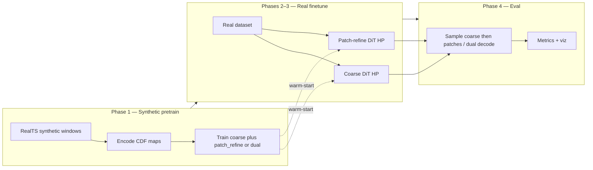
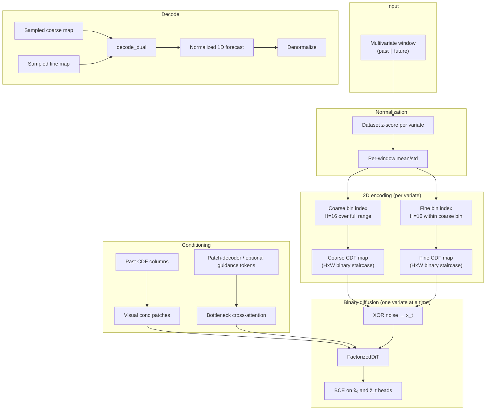

# Binary Staged Diffusion for Time Series Forecasting

This repo trains a probabilistic forecaster that treats future values as **2D binary images** and denoises them with diffusion. The core bet is simple: real series have sharp jumps, flat segments, and geometric structure that Gaussian MSE models smear out. By encoding values as hard cumulative-distribution (CDF) maps and diffusing in the **binary domain** (bit-flip noise, BCE loss), the model gets a much denser training signal on exactly those shapes.

The pipeline is **YAML-driven and multi-phase** (synthetic pretrain → real finetune HP → staged eval), **factorized per variate**, and usually **patch-decoder guidance** (not iTransformer) when cross-variate context is enabled. Live campaign leaves mostly use **ordinal window norm** plus one of the representation modes below — sequential coarse→fine is still implemented but is **not** the current default.

---

## Architecture Overview

### Representation modes (pick one family per leaf)

| Mode | Flags | What it trains |
|------|-------|----------------|
| **Patch refine (current campaign default)** | `use_patch_refine_stage: true` | Full-horizon **coarse** DiT, then a second DiT on **localized overlapping patches** cropped from a tall canvas (`patch_refine_geometry.py`) |
| **Vertical dual concat** | `use_vertical_dual_concat: true` | One DiT on a stacked `Hc∥Hf` canvas (`stack_vertical_dual` / `decode_vertical_dual`) |
| **Channel dual** | `use_channel_dual_concat: true` | Coarse∥fine as two occupancy channels |
| **Sequential coarse→fine (legacy path)** | neither of the above | Separate coarse then fine residual DiTs (`decode_dual`); still in the phase registry |

### Training phases at a glance (patch-refine / ordinal campaign)

| Phase | YAML `phase` | Purpose |
|-------|--------------|---------|
| **1** | `staged_diffusion_pretrain` | Teach valid CDF maps on synthetic `RealTS` (stages follow the representation mode) |
| **2** | `diffusion_coarse_finetune_hp` | Optuna-tune coarse DiT on real data |
| **3** | `diffusion_patch_refine_finetune_hp` | Optuna-tune overlapping-patch upscaler (replaces `diffusion_fine_finetune_hp`) |
| **4** | `staged_eval` | Anchor + probabilistic metrics (CRPS, staged MSE/MAE) |

When `use_guidance_channel` / cross-attn is on, a `patch_guidance_finetune_hp` phase may sit between pretrain and diffusion finetune. The old `itrans_finetune_hp` phase is **dropped** for `guidance_type=patch_decoder` and is no longer the production path.

Phase 1 is deliberately narrow: it does **not** need to match real data statistics. Its job is representation fluency — monotone binary staircases, column alignment, stable BCE — before real finetuning.



### End-to-end data flow

Each training or inference step follows the same encoding path. Past and future horizons are normalized, mapped to 2D CDF images, and fed to a **FactorizedDiT** that denoises **one variate per forward pass**.



**Training vs inference (sequential coarse→fine legacy).** The fine stage sees **GT** coarse CDF columns as a condition channel at train time; at inference, coarse is sampled first, then fine. **Patch refine** instead samples a full-horizon coarse map, then denoises **overlapping local crops** on a tall canvas and stitches them back. **Vertical dual** denoises a single stacked canvas in one model.

---

### One variate at a time

Multivariate series use a **factorized batch layout**: each variate is one row in a `(B×V, C, H, W)` tensor. Self-attention inside the DiT runs over **spatial patches only**.

When guidance is enabled, cross-variate context enters at the bottleneck (patch-decoder tokens by default; legacy iTransformer helpers remain in-tree). Large `B×V` batches are chunked via `unet_max_chunk_size`. Many production leaves set `use_guidance_channel: false` / `disable_cross_attention: true` and rely on visual past-conditioning only.

---

### Dual-scale value factorization

A single 256-bin map would be a `256`-row image. Value precision is still **factored** into coarse + fine residuals (`H_c × H_f = 256`), but **how those maps are trained** depends on the representation mode:

1. **Coarse** — bin into `H_c = 16` over `[-max_scale, max_scale]` as a hard CDF staircase.
2. **Fine residual** — another `H_f = 16` levels inside the coarse bin.
3. **Decode** — sequential mode uses `decode_dual`; vertical-dual uses `decode_vertical_dual`; patch-refine reconstructs a tall canvas then decodes.

In **patch refine**, the second stage does **not** diffuse a full-horizon fine map. It crops **localized overlapping patches** (`patch_refine_patch_width` / `col_stride`, coverage fill-ins in `patch_refine_geometry.py`) from a tall canvas (e.g. height 256) so the upscaler sees local structure only.

---

### Binary representation (BDPM-inspired)

#### Why not Gaussian diffusion on raw values?

Standard DDPMs assume continuous data and Gaussian noise with MSE loss. That pairing is a poor fit for **discretized** structure: quantizing intermediate Gaussians causes artifacts, and MSE trains the network to predict noise rather than exact discrete states. [Binary Diffusion Probabilistic Models (BDPM)](reference/BDPM_ref.md) sidesteps this by working natively in `{0,1}`: forward corruption is **XOR bit-flip**, the denoiser predicts both clean bits and flip masks, and optimization uses **binary cross-entropy**.

We adopt that framework for time-series CDF maps rather than RGB bit-planes.

#### CDF maps vs ViTime-style PDF

An earlier **PDF / skyline** representation placed a one-hot activation on a single row (the value bin) — essentially a ViTime-style vertical stripe. Decoding diffuses gradient through a thin peak; most rows stay at zero, so the BCE/MSE signal is **sparse** and training is slow.

The current **hard binary CDF** fills every row from the bottom up to the bin index:

```
value bin k  →  rows 0..k are 1, rows k+1..H-1 are 0
```

Each column is a monotone staircase. Neighboring bins share most of their bits, so flips propagate structured, correlated gradients — much denser supervision per timestep column.

Values are clipped to `[-max_scale, max_scale]` before binning. No Gaussian blur is applied; maps are strictly `{0,1}`.

#### Forward and reverse process

**Schedule.** Quadratic-in-√t betas from `β_start = 10⁻⁵` to `β_end = 0.5` over `T = 1000` steps (`sqrt_linear` schedule).

**Forward (training corruption).** For clean binary map `x₀` and timestep `t`, draw a Bernoulli flip mask `z_t` with per-pixel flip probability `β_t`, then:

$$x_t = x_0 \oplus z_t$$

**Denoiser heads.** The DiT outputs `2×` channels: the first head predicts clean bits `x̂₀` (or equivalently the flip mask under an ε-parameterization); the second predicts `ẑ_t`.

**Loss.** Weighted BCE on both heads:

$$\mathcal{L}_\text{reg} = \mathcal{L}_\text{BCE}(\hat{x}_0, x_0) + \mathcal{L}_\text{BCE}(\hat{z}_t, z_t)$$

Optional min-SNR timestep weighting can rebalance early vs late noise levels.

**Reverse (sampling).** Starting from noise, each step predicts `x̂₀`, thresholds via sigmoid, draws a new flip mask at the lower timestep, and XORs forward. Eval defaults to **DPM-Solver++** (20 steps, 20 samples for probabilistic metrics).

---

### Anchor mechanism (adapted from MMPD)

[MMPD](reference/MMPD_methods_reference.md) (Zhang et al., ICLR 2026) adds a **deterministic anchor** to diffusion training: besides the usual noise-prediction loss at random timesteps, an extra term trains the denoiser to reconstruct the clean target from **maximum noise** in a single forward pass. The combined objective is:

$$\mathcal{L} = \lambda \,\mathcal{L}_\text{reg} + (1-\lambda)\,\mathcal{L}_\text{anchor}, \quad \lambda = 0.99$$

At the anchor timestep `t = T−1`, MMPD feeds **exact zeros** (Gaussian noise cancels the signal). The deterministic prediction is then one MLP pass — no iterative sampling — giving a fast point forecast.

#### Our binary-flat adaptation

The same **λ = 0.99** balance is used, but the anchor input is adapted to binary CDF diffusion:

| MMPD (Gaussian) | This repo (binary flat) |
|-----------------|-------------------------|
| Anchor canvas = **0** at max noise | Anchor canvas = **constant 0.5** per pixel (`stationary_flat`) |
| MSE on noise prediction | BCE on `x̂₀` vs ground-truth CDF map |
| Anchor at `ᾱ_{k*} ≈ 0.5` | Anchor at `t = T−1` (max flip rate) |

`stationary_flat` means every pixel is 0.5 — the **mean** of Bernoulli(0.5), not random bits. That fixed canvas is the binary analogue of "uninformative max noise": the model must infer the full CDF staircase from context (past columns + optional guidance tokens) alone.

At inference, the **anchor sampler** runs this one-shot path: one forward pass at max noise → sigmoid threshold → decode. No iterative diffusion. Eval reports both anchor metrics (`anchor_mse`, `anchor_mae`) and full DPM++ sample metrics (CRPS, sample-mean MSE).

---

## Analysis

### Where the model excels

**Discontinuities and step functions.** CDF maps represent a level change as a horizontal boundary moving vertically — a coherent shape for convolution and attention. Binary BCE penalizes misplaced boundaries sharply, so jumps are preserved rather than regressed to the mean.

**Flatlines and plateaus.** A constant value is a CDF column with the same cutoff row repeated across time — a flat 2D ridge. The model learns to extend these ridges without the oscillation typical of Gaussian likelihoods.

**Geometric "texture".** Recurring patterns (ramps, spikes, boxcar pulses) appear as repeated motifs in the 2D layout. Dual-scale decomposition keeps coarse structure and fine detail in separate denoising problems, which helps capture both the macro shape and sharp edges.

**Probabilistic spread when needed.** DPM-Solver++ multi-sample inference yields an ensemble for CRPS and top-k metrics; the anchor path remains available for cheap deterministic forecasts.

### Tradeoffs to keep in mind

- Very smooth, high-frequency continuous variation may be better served by more bins or longer fine stages than by coarse+fine alone.
- Cross-variate coupling is only as strong as the guidance bottleneck (when enabled) — there is no pixel-level mixing across channels.
- Coarse errors still propagate into patch-refine / fine residual stages.

---

## Technical Details

The sections below are aimed at developers and coding assistants working in the repo.

### Current default (production)

**What we run:** ordinal-normalized **patch-refine** binary diffusion (lb336 / hz96 campaign leaves), **stationary-flat anchor** (`0.5` canvas), patch-refine overlapping crops on a tall canvas, matched non-ordinal **MMPD** baseline, then ordinal assert + discriminator eval. Vertical-dual concat is the other active representation family on this branch.

| Knob | Value | Config source |
|------|-------|----------------|
| Pipeline | YAML `phases` list | `configs/base/binary_staged.yaml` |
| Leaf experiment (h96 ordinal) | `binary_patch_refine_lb336_hz96_ordinal_tuned` (+ `_synth_fallback`) | `configs/binary_patch_refine_*.yaml` |
| Representation | Coarse + **patch_refine** overlapping crops | `use_patch_refine_stage: true` |
| Norm | Ordinal window norm | `use_ordinal_window_norm: true` |
| `binary_anchor_input_mode` | `stationary_flat` | flat `0.5` XOR anchor |
| Guidance | usually off for these leaves | `use_guidance_channel: false` |
| MMPD match | Decoder, same lb/hz/subset | `configs/mmpd_decoder_flat_subsets_paper_lb336_hz96_matched_binary.yaml` |
| Coverage / dead-code probe | tiny synthetic DAG under coverage.py | `temp/scripts/submit_pipeline_coverage_deadcode.sh` |

---

### File map

| Area | Files |
|------|--------|
| Orchestration | `models/diffusion_tsf/pipeline/` (`orchestrator.py`, `state.py`, `phases/*`) |
| CLI entry | `models/diffusion_tsf/train_multivariate_pipeline.py` |
| Model | `models/diffusion_tsf/diffusion_model.py`, `dit.py`, `diffusion.py`, `preprocessing.py` |
| Config | `models/diffusion_tsf/pipeline/config.py`, `configs/base/binary_staged.yaml` |
| Submit | `submit_binary.sh` / `submit_mmpd.sh`; leaf YAML under `configs/`. Diagnostic probes may live under `temp/scripts/` (e.g. coverage dead-code). |
| Patch refine | `models/diffusion_tsf/patch_refine_geometry.py`, `patch_refine_segments.py` |
| Ordinal norm | `models/diffusion_tsf/ordinal_window_norm.py` |
| Guidance (optional) | `models/diffusion_tsf/guidance.py`, patch-decoder stack |

#### Submit conventions

- Login node: **`./submit_binary.sh`** or **`./submit_mmpd.sh` only** for training/eval campaigns. Compute worker for binary is `slurm_worker.sh` (do not sbatch it by hand for normal runs).
- Experiment variants are **leaf YAMLs** under `configs/`, not new shell wrappers. `--configs` / `--mmpd-run-config` accept bare stems (`foo` → `configs/foo.yaml`), paths, or globs.
- Geometry (lookback / horizon) and HPs live in YAML. Prefer a new leaf config over CLI sprawl.
- Dead-code / coverage probe: `./temp/scripts/submit_pipeline_coverage_deadcode.sh` (not a third train entrypoint).

---

### Pipeline (YAML-driven)

`PipelineState` holds paths and knobs; `Pipeline` runs registered `PipelinePhase` classes in order (`models/diffusion_tsf/pipeline/phases/`). `normalize_guidance_phases` drops incompatible phases (e.g. `itrans_finetune_hp` for patch-decoder guidance; fine/vertical when patch-refine is present).

Reuse configs skip synthetic pretrain via `reuse_pretrain_from_config` / `require_reuse_pretrain` when donors exist.

#### Phase map (doc numbering)

| Doc | YAML `phase` | Implementation |
|-----|--------------|----------------|
| **1** | `staged_diffusion_pretrain` | `StagedDiffusionPretrainPhase` |
| *(guidance)* | `patch_guidance_finetune_hp` | `PatchGuidanceFinetuneHPPhase` (when guidance on) |
| **2** | `diffusion_coarse_finetune_hp` | `CoarseDiffusionFinetuneHPPhase` |
| **3a** | `diffusion_patch_refine_finetune_hp` | `PatchRefineDiffusionFinetuneHPPhase` (**campaign default**) |
| **3b** | `diffusion_vertical_dual_finetune_hp` | `VerticalDualDiffusionFinetuneHPPhase` |
| **3c** | `diffusion_fine_finetune_hp` | `FineDiffusionFinetuneHPPhase` (legacy sequential) |
| **4** | `staged_eval` | `StagedEvalPhase` |

Default trial/epoch counts come from `configs/base/binary_staged.yaml` and leaf overrides.

---

#### Phase encyclopedia

##### Phase 1 — Synthetic staged pretrain (`staged_diffusion_pretrain`)

Trains denoisers on synthetic `RealTS` windows (no Optuna here — fixed HP from `use_hardcoded_synthetic_hp` / Phase-1 source config).

- **Entry:** `StagedDiffusionPretrainPhase.execute` → `pretrain_diffusion` per stage.
- **Stages:** follow representation mode — `coarse`+`patch_refine`, or `vertical_dual` / `channel_dual` single stage, or legacy `coarse`+`fine` (+ optional `finer`).
- **YAML defaults:** `n_samples: 10000`, `epochs: 20`, `patience: 4`.
- **Outputs:** `pretrained_<stage>/pretrained_diffusion.pt`; shared cache only when `shared_cache: true`.
- **Skip when:** stage ckpts exist, shared cache hit, or `reuse_pretrain_from_config` copies a donor (unless `force_retrain_synthetic` / missing donor with `require_reuse_pretrain: false`).
- **Smoke / coverage:** tiny `n_samples`, `epochs = 1`, `shared_cache: false`.

##### Patch guidance (`patch_guidance_finetune_hp`) — optional

Real-data patch-decoder guidance HP when `use_guidance_channel` / cross-attn is enabled. Replaces the legacy `itrans_finetune_hp` path for `guidance_type=patch_decoder`. Many patch-refine campaign leaves keep guidance **off**.

##### Phase 2 — Coarse diffusion finetune HP (`diffusion_coarse_finetune_hp`)

Optuna-tunes the **coarse** DiT on real data; **best trial checkpoint is final**.

- **Entry:** `CoarseDiffusionFinetuneHPPhase` (`diffusion_stage: coarse`).
- **Warm-start:** `pretrained_coarse/pretrained_diffusion.pt` from Phase 1.
- **Search spaces:** `lr_only`, `lr_eff_batch_univariate`, `lr_eff_batch_univariate_ema`, `fixed`, etc. (see phase YAML).
- **Outputs:** `{checkpoint_dir}/{subset_id}/coarse/best.pt` + `metadata.json`.

##### Phase 3a — Patch-refine finetune HP (`diffusion_patch_refine_finetune_hp`) — campaign default

Same Optuna machinery for the **overlapping-patch** upscaler (`diffusion_stage: patch_refine`).

- **Entry:** `PatchRefineDiffusionFinetuneHPPhase`.
- **Requires:** coarse `best.pt`.
- **Geometry:** canvas / patch H×W / col stride from experiment (`patch_refine_*`).
- **Outputs:** `{subset_id}/patch_refine/best.pt` + `metadata.json`.

##### Phase 3b/3c — Vertical dual / legacy fine

- `diffusion_vertical_dual_finetune_hp` — single stacked-canvas DiT.
- `diffusion_fine_finetune_hp` — legacy full-horizon fine residual (GT coarse cond at train).

##### Phase 4 — Staged eval (`staged_eval`)

Loads stage `best.pt` files for the active representation, runs anchor + probabilistic sampling, writes metrics.

- **Entry:** `StagedEvalPhase`.
- **Inference:** depends on mode (coarse→patch crops, vertical dual decode, or coarse→fine `decode_dual`).
- **Metrics:** `eval/staged_*` (CRPS, anchor/prob MSE, …); optional viz skipped when `skip_eval_visualizations: true`.

#### Caching and resume

| Artifact | Phase |
|----------|-------|
| `pretrained_<stage>/pretrained_diffusion.pt` | 1 |
| `{subset_id}/coarse/best.pt`, `.../patch_refine/best.pt` (or `fine` / `vertical_dual`) | 2, 3 |
| `results/partials/*_staged_anchor.json` | 4 |

`should_skip` on each phase checks these paths. Coverage probe uses `--fresh` + unique run stems + `force_retrain_synthetic` so skips do not fire.

---

### Data normalization (two layers)

1. **Dataset z-score** — train-split mean/std per variate (`load_dataset`).
2. **Per-window norm** — past mean/std applied to past+future when `use_window_normalization: true` (`_normalize_sequence`).

Synthetic pretrain: `RealTS` + `augmentation.py` (mixed generators, optional cache).

---

### Representation: hard binary CDF

Values clipped to `[-max_scale, max_scale]`, binned into `H=16` rows; occupancy map is a monotone staircase in `{0,1}` (no Gaussian blur).

**Staged (legacy sequential coarse→fine):** dual decomposition with **separate models**:

- **Coarse:** full-range binning → coarse CDF map.
- **Fine:** residual within coarse bin → fine CDF map.
- **Decode:** `decode_dual(coarse, fine)` = sum of decoded coarse + fine, clamped.

**Training (legacy):** coarse predicts future coarse from past; fine conditions on **GT** future coarse. **Inference:** sample coarse, then fine, then decode.

**Current campaign default** is **patch refine** (coarse full-horizon + localized overlapping patches) or **vertical dual concat** — see Representation modes above. Do not treat sequential fine as production.

---

### Binary diffusion (implementation)

- Schedule: `sqrt_linear` β from `1e-5` → `0.5`, `num_steps=1000`.
- Forward: independent Bernoulli XOR flips per pixel (`BinaryDiffusionScheduler`).
- Loss: BCE on clean-bit and flip-mask heads (`out_channels=2`).
- **Stationary-flat anchor:** at `t=T−1`, anchor canvas is **constant 0.5** (not `Bernoulli(0.5)`); see `_binary_anchor_canvas_like` when `binary_anchor_input_mode=stationary_flat`.
- Combined train loss: `λ·L_reg + (1−λ)·L_anchor` with `λ=0.99`.

**Eval:** campaign leaves often use `probabilistic_sampler: quad_t` (e.g. h96 ordinal); older sweeps used `dpmpp`. Anchor path remains one-shot at max noise.

---

### Model: FactorizedDiT (staged path)

- `model_type: dit` → `FactorizedDiT` (`dit.py`), patch size `(8,8)`, `embed_dim=384`, `depth=8`, `heads=6`.
- One variate = one batch row (`BV`); self-attention is **spatial patches only** (no variate axis in DiT).
- Cross-variate signal: bottleneck cross-attention to `V` iTransformer tokens (`iTransformerTokenAdapter` in `unet.py`) when `disable_cross_attention=false`.
- With `use_guidance_channel=false` (default), no ghost forecast channel on the canvas.
- Fine-stage `cond` includes **GT coarse CDF channel** during training; coarse channel from sampled coarse at inference.
- Optional **EMA** shadow weights during finetune when `training.diffusion_ema_decay > 0` (default **0.99**).

Chunking: `unet_max_chunk_size` caps `BV` through the denoiser for memory.

---

### Guidance (optional)

Default for many leaves: **off**. When on, prefer **patch-decoder** guidance (`patch_guidance_finetune_hp`). Legacy iTransformer finetune helpers remain in `train_multivariate_pipeline.py` but are not registered as the production phase for patch-decoder configs.

---

### Hyperparameters

Read merged YAML — do not rely on deleted `pipeline_config.py` defaults.

- **Base:** `configs/base/binary_staged.yaml`
- **h96 ordinal patch-refine:** `configs/binary_patch_refine_lb336_hz96_ordinal_tuned*.yaml`
- **Coverage probe:** `configs/coverage_deadcode_binary_patch_refine.yaml` + `configs/coverage_deadcode_mmpd.yaml`

---

### Pitfalls

1. **Representation mode** — patch-refine / vertical-dual / sequential-fine are mutually exclusive after `normalize_guidance_phases`.
2. **Double normalization** — dataset z-score then window or ordinal norm.
3. **`image_height` must divide patch size**.
4. **Training flags must reach `PipelineState`** — `training.*` keys need wiring (`training_value()` / `apply_training_section_to_state`).
5. **Subset ckpt paths** use `subset_id` (e.g. `coverage_synth_2v_s480`), not bare dataset name.
6. **Donor reuse** can silently skip synthetic pretrain — coverage probe forces fresh dirs + `force_retrain_synthetic`.
