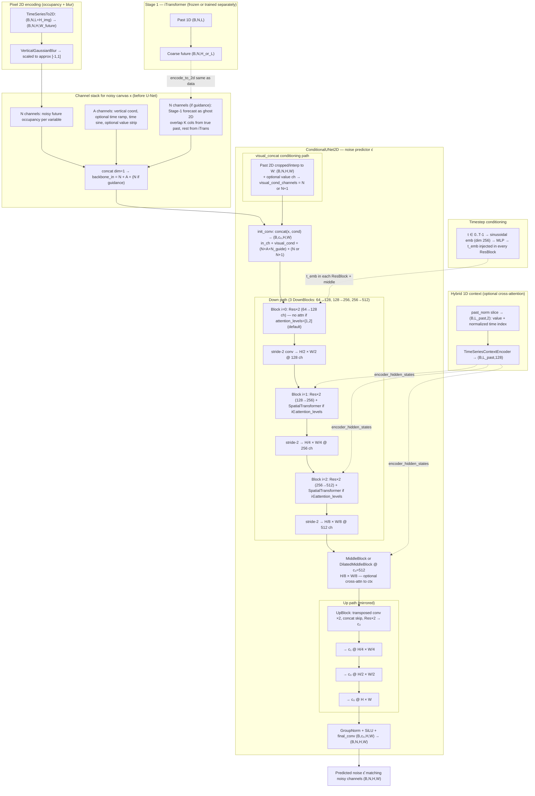
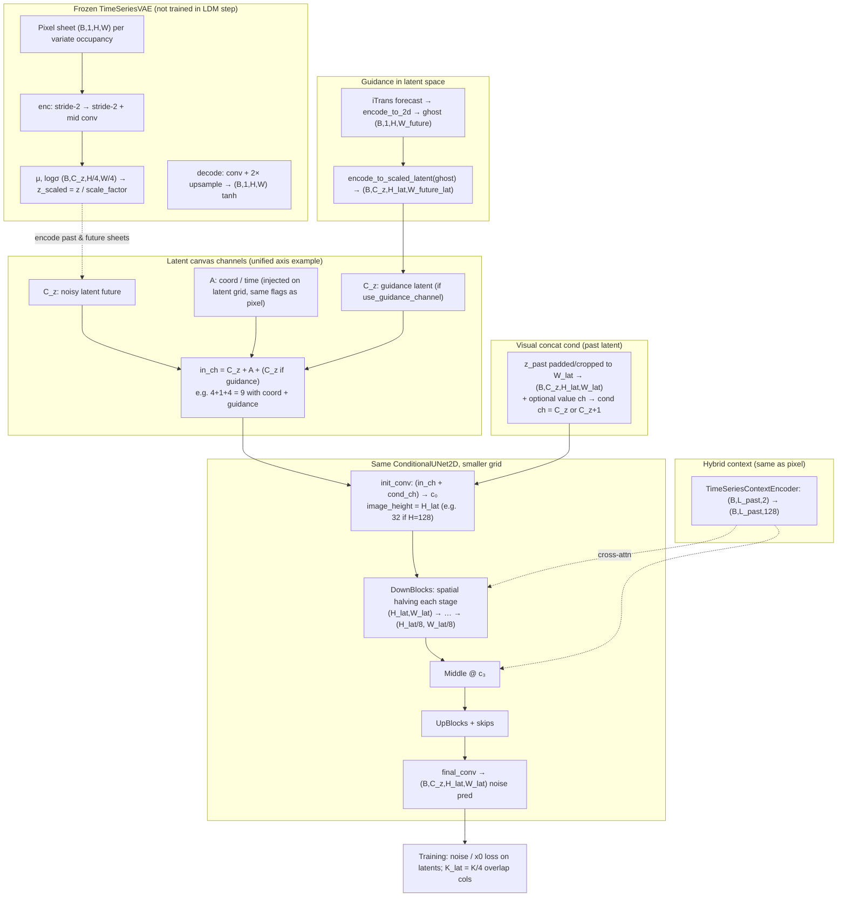

# Guided diffusion pipelines (Mermaid)

Notation: **N** = `num_variables`, **A** = `num_aux_channels` (coord ± ramp ± sine ± value), **H** = `image_height`, **W** = width on the time axis (future crop or full L+F canvas), **K** = `lookback_overlap`, **c₀…c₃** = `unet_channels` default `[64,128,256,512]`, **T_emb** = timestep embedding dim **256**. Downsampling uses **stride-2 conv on both height and width** at each U-Net level.

---

## 1. Pixel-space guided diffusion (`DiffusionTSF` + `ConditionalUNet2D`)

Default training path uses `conditioning_mode=visual_concat`, `use_hybrid_condition=True`, and optional `use_guidance_channel=True` (iTransformer ghost images).

**Shapes (example: N=7, A=3 with coord+ramp+sine, guidance on, H=128, W=200):**

| Tensor | Shape |
|--------|--------|
| Noisy + aux + guidance (x) | `(B, 7+3+7, 128, 200)` = `(B, 17, 128, 200)` |
| Visual cond (past stripe) | `(B, 7, 128, 200)` |
| After `init_conv` concat | `(B, 17+7, 128, 200)` → **`(B, 64, 128, 200)`** |
| Deepest features | `(B, 512, 16, 25)` |
| Output ε̂ | `(B, 7, 128, 200)` |

**Attention / hybrid:** `attention_levels` lists **indices i** of `DownBlock` / `UpBlock` in order (`i ∈ {0,1,2}` for three blocks). `use_attn = (i in attention_levels)`. Default `[1,2]` turns on **SpatialTransformerBlock** (self-attn + cross-attn to 1D context) only on **i=1 and i=2** (the **128→256** and **256→512** stages, before their stride-2), not on the first down block. Symmetric levels on the up path.

**CFG (training/inference):** Classifier-free guidance doubles the conditional path: null cond = zeros for visual concat; null context / null guidance when `cfg_scale > 1`.

---

## 2. Latent-space guided diffusion (`LatentDiffusionTSF` + frozen `TimeSeriesVAE`)

Diffusion runs on **VAE latents** with **4×** spatial compression: `H_lat = H/4`, `W_lat = W_pixel/4`, `C_z = latent_channels` (default **4**). Guidance ghosts are encoded in pixel space, then **the same VAE encoder** produces `cz`-channel latent guidance.

At inference, DDIM produces `z` then `decode_from_scaled_latent` → pixels (same `DEC` as in the VAE subgraph).

**Shapes (univariate, H=128 → H_lat=32, C_z=4, coord only A=1, guidance on, W_lat = W_pixel/4):**

| Stage | Shape |
|-------|--------|
| Pixel ghost / data | `(B, 1, 128, W_px)` |
| After VAE encode | `(B, 4, 32, W_px/4)` |
| Noisy + coord + guidance | `(B, 4+1+4, 32, W_lat)` = `(B, 9, 32, W_lat)` |
| Past cond | `(B, 4, 32, W_lat)` |
| After `init_conv` | `(B, 9+4, 32, W_lat)` → **`(B, 64, 32, W_lat)`** |
| ε̂ output | `(B, 4, 32, W_lat)` |

**CI multivariate (ETTh1 7-var):** the same per-variate shapes apply; runs use a **shared** univariate VAE + U-Net per variate (batch over variates), so channel counts stay **C_z**-based, not `N×C_z` in a single forward.

**Code refs:** `DiffusionTSF` / `ConditionalUNet2D` — `diffusion_model.py`, `unet.py`; latent — `latent_diffusion_model.py`, `vae.py`, `config.py` (`LatentDiffusionConfig.latent_image_height`, `latent_spatial_downsample=4`).
